# SensePath
### Ear-free, intuitive navigation indoors

🛠️ Built by **Sam Piryns**, **Titus Impens**, **Han Deburchgraeve**  
🔥 Supervised by `prof. dr. Bas Baccarne`, `Yannick Christiaens` & `Wouter Devriese`  
🌱 Grown at `Ghent University` 🏛️ `Industrial Design Engineering` ([project overview](https://github.com/basbaccarne/human-centered-design))

*19/01/2026*

---

## Introductie

Mensen die blind of slechtziend zijn navigeren buitenshuis relatief goed met GPS, maar in grote publieke gebouwen (stations, ziekenhuizen, campussen) valt die ondersteuning weg. Vooral op kruispunten, splitsingen en bij tijdelijke omleidingen leidt dit tot twijfel, extra mentale belasting en afhankelijkheid van hulp van anderen.

We onderzochten dit via deskresearch en benchmarking van bestaande (indoor) navigatieoplossingen, en via user interviews en feedbackmomenten met gebruikers en organisaties uit de blinden- en mobiliteitswereld. Daaruit kwamen duidelijke noden naar voren: betrouwbare "decision support" op keuzemomenten, zo weinig mogelijk telefoongebruik tijdens het stappen, en discrete feedback die ook in publieke context bruikbaar is.

Onze oplossing is **SensePath**: een **tweedelige witte stok** die wij volledig als systeem leveren. Het onderstuk volgt de conventionele opbouw van bestaande witte stokken (gewicht, lengte, verwisselbare pin-tip), maar heeft bovenaan een **ingebedde M3-schroef** in het uiteinde. Daarop wordt ofwel een **tech-handvat** geschroefd dat de elektronica voor haptische navigatiebegeleiding bevat, ofwel een **gewone handgreep** voor wanneer de route gekend is. Op die manier behoudt de gebruiker volledig zijn bestaande stok-ervaring en voegt SensePath alleen toe wat nodig is op onbekende trajecten. Het tech-handvat is gekoppeld aan een eenvoudige app-workflow en vertaalt route-informatie naar haptische begeleiding op het juiste moment (bv. bij keuzes en bochten), zodat de gebruiker "hands-free, heads-up" kan blijven bewegen met de stok als primair hulpmiddel. Zo maakt SensePath indoor navigatie zelfstandiger, rustiger en betrouwbaarder.

  
   <em><strong>SensePath</strong> → ① tech-handvat met geïntegreerde elektronica en M3-insert, ② sferisch kompaselement in de handpalm voor continue richtingsfeedback, ③ conventionele witte stok met verwisselbare pin-tip, ④ ingebedde M3-schroef in het stok-uiteinde, koppelt het tech-handvat aan de stok en is dagelijks omwisselbaar voor een standaard handgreep.</em>

---

## Inhoudstafel

1. [Conclusie](#conclusie)
2. [Methodologie](#methodologie)
3. [Discovery](#discovery)
4. [Definition](#definition)
5. [Design Requirements](#design-requirements)
6. [Develop 1](#develop-1)
7. [Develop 2](#develop-2)
8. [Develop 3](#develop-3)
9. [Deliver](#deliver)
10. [Kritische reflectie](#kritische-reflectie)
11. [Noot inzake het gebruik van AI](#noot-inzake-het-gebruik-van-ai)
12. [Bijlagen](#bijlagen)
13. [Bronnen](#bronnen)

---

## Conclusie

SensePath is een **tweedelige witte stok**: een conventioneel onderstuk met verwisselbare pin-tip en een **tech-handvat dat erop schroeft** via een M3-insert. Dezelfde schroefverbinding accepteert ook een gewone handgreep, zodat de gebruiker dagelijks kan kiezen tussen tech-grip (onbekende routes) en standaard-grip (gekende routes) zonder dat hij van stok hoeft te wisselen. Het tech-handvat vertaalt routebeslissingen naar discrete haptische signalen in de hand. Drie kerncomponenten dragen het concept: één trilmotor die drie onderscheidbare microinteracties (obstakel, koersafwijking, bocht-aankondiging) levert, een sferisch kompaselement in de laagste gleufpositie dat continue richting voelbaar maakt via een servo-aandrijving, en de modulaire schroefverbinding die het hele systeem omkeerbaar maakt.

Waarom dit het juiste antwoord is op het probleem uit Discovery, is geen kwestie van technologie maar van **positionering**. SensePath vervangt het stok-gebruik niet ; we behouden de conventionele stok-opbouw en voegen alleen toe wat nodig is. Het onderstuk blijft de primaire obstakeldetector, het tech-handvat levert wat de stok zelf niet kan: oriëntatie op keuzemomenten zonder dat het gehoor of de smartphone-aandacht ingezet moet worden in het default-gebruik. Een opt-in spraak-fallback (default uit) bestaat als noodvariant. Daarmee adresseert het ontwerp de drie pijnpunten die de Discovery-interviews scherp maakten: onzekerheid aan knooppunten, de wens om het gehoor vrij te houden in publieke context, en de minimale-telefoon-eis tijdens het stappen.

De keuzes die deze positionering dragen, zijn telkens empirisch onderbouwd: de evolutie van 3 motoren naar 1 trilmotor (Develop 2), de versmalde gleuf zodat het kompas in de handpalm blijft (Develop 2), de reductie van 9 naar 3 trilpatronen (Develop 3), de keuze voor TPE Shore 65A overmold (Develop 3 CMF-deepdive). Voor de eindvalidatie wordt het kompas via een mini-servo aangestuurd, die de doelrichting **draadloos** ontvangt van een **aparte controller-module** die de testleider bedient ; daarmee kan het geheel realistisch getest worden zonder dat eerst een autonoom GPS-systeem geïntegreerd moet zijn. Volledige onderbouwing in [docs/design_requirements.md](docs/design_requirements.md).

Het MVP-prototype bestaat uit **drie fysieke modules**: het stok-onderstuk, het tech-handvat dat erop schroeft, en een **aparte Wizard-of-Oz controller-module** (eigen XIAO ESP32-C3, batterij en KY-040 encoder) die draadloos via ESP-NOW met het handvat communiceert. Het rapport onderscheidt bewust **het beoogde eindproduct** (productie-vorm met hoog-nauwkeurige RTK GNSS via FLEPOS / WALCORS, smartphone-app, ToF-obstakeldetectie en productie-materialen) van **ons MVP-prototype** (academisch deliverable met PLA-print, aparte controller-module als Wizard-of-Oz vervanger voor GPS, en bewust geen obstakeldetectie). Beide niveaus en de vertaalstap ertussen worden uiteengezet in de [Deliver](#deliver)-sectie. Voor de open onderzoeksvragen en aanbevelingen voor vervolgwerk: zie [Kritische reflectie](#kritische-reflectie).

---

## Methodologie

Dit project volgt de **Double Diamond** aanpak (Discover, Define, Develop, Deliver), met nadruk op gebruikersgericht ontwerpen en iteratieve validatie. De tijdslijn hieronder toont de fasen, test-waves met sample-grootte (N) en de drie kritische pivots die het ontwerp stuurden.

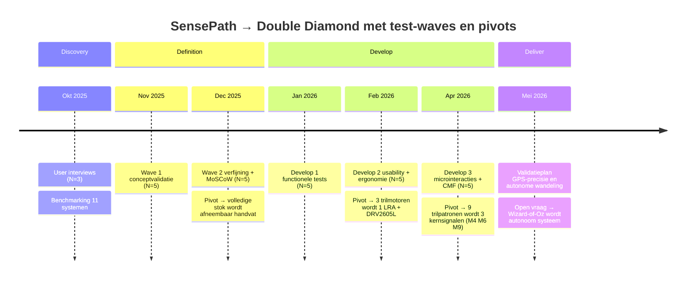

### Discovery (problem space)

In de discoveryfase werd de probleemruimte verkend via:

- **User interviews**: fricties, routines, copingstrategieën en contextfactoren identificeren (drukte, tijdelijke werken, knooppunten).
- **Deskresearch en benchmarking**: bestaande navigatie- en mobiliteitsoplossingen in kaart brengen en analyseren op feedbackmodaliteit, infrastructuurbehoefte, betrouwbaarheid en schaalbaarheid.

De resultaten werden samengebracht tot een probleemdefinitie, een eerste set **design requirements** en een initiële **PRD**.

### Definition (solution space)

In de definitionfase werd het concept getoetst en aangescherpt via **iteratief prototypen en testen** in twee waves:

- **Wave 1**: Vroege conceptvalidatie met low- tot mid-fidelity prototypes en Wizard-of-Oz scenario's. Focus op begrijpelijkheid, wenselijkheid en aanvaardbaarheid van de conceptrichting.
- **Wave 2**: Verfijning van interactie en feedback met nadruk op minimale smartphone-interactie, haptische feedback als primaire modaliteit, en een fail-safe workflow. Inclusief MoSCoW-prioritering en obstakeldetectie-observatietest.

### Develop (semester 2)

Technische uitwerking, interaction design, prototyping met oplopende fideliteit en usability testing in iteraties.

### Deliver (semester 2)

Finale validatie in realistische omgevingen, afronding prototype en documentatie.

📄 [Volledige methodologie](docs/methodologie.md)

---

## Discovery

### Doelstellingen

- Scherp beeld krijgen van waar blinde en ernstig slechtziende gebruikers vastlopen bij indoor navigatie in complexe publieke gebouwen.
- Begrijpen waarom knooppunten (junctions) de grootste frictie veroorzaken.
- Onderzoeken welke bestaande indoor wayfinding oplossingen bestaan en waar ze tekortschieten.
- Eindigen met een heldere "How Might We" en eerste design requirements.

### Onderzoeksvragen

- Welke ervaringen hebben personen met een visuele beperking bij het navigeren in publieke gebouwen, en waar ontstaat onzekerheid?
- Welke indoor wayfinding technologieën leveren aantoonbare meerwaarde, en waar liggen marktopportuniteiten?

### Doelgroep

**Primair:** Blinde en zeer slechtziende volwassenen die autonoom publieke gebouwen willen bezoeken. Vertrouwd met iPhone (VoiceOver) en gebruiken witte stok.

**Secundair:** Partner/begeleiders, baliemedewerkers, gebouwbeheerders, lokale overheid.

### Materiaal en methoden

| Methode | Type | N | Periode | Doel |
|---|---|---|---|---|
| User interviews | Semigestructureerde diepte-interviews (15-20 min) | 3 | 18/10 - 25/10/2025 | Contextuele inzichten over routines, frustraties en voorkeuren |
| Benchmarking | Systematische vergelijking bestaande oplossingen | 11 | n.v.t. | Sterktes → best practices, zwaktes → design opportuniteiten |

### Resultaten

#### User interviews: key findings

> *"Je volgt een lijn... probleem is dat je niet weet naar waar."*

- **Thuis vs. publiek**: Thuis is oriëntatie automatisme. In publieke gebouwen ontstaat onzekerheid, vooral aan knooppunten waar beslissingsinformatie ontbreekt.
- **Geleidelijnen: love-hate**: Ze helpen vooruit, maar op kruispunten ontbreekt informatie over richting.
- **Real world messiness**: Bezette geleidelijnen, slecht onderhoud, en vooral werken/omleidingen veroorzaken onzekerheid en tijdverlies.
- **Feedbackvoorkeur is contextgebonden**: In publieke context duidelijke voorkeur om gehoor vrij te houden → haptische feedback aantrekkelijk.

> *"Plots werken op het pad... niemand in de buurt, dan zoek je lang."*

**Korte conclusie:** De grootste pijn zit niet in "vooruit geraken", maar in keuzes maken aan knooppunten en omgaan met onbetrouwbare context.

#### Benchmarking: key findings

- Veel systemen steunen op **audio** (turn-by-turn), maar dat botst met de nood om het gehoor vrij te houden.
- **Infrastructuurgebaseerde oplossingen** (beacons/codes) zijn bewezen, maar vragen inzet van gebouwbeheerders en zijn minder schaalbaar.
- **Infra-vrije smartphone-only oplossingen** zijn schaalbaar, maar hebben trade-offs (mapping, kalibratie).
- **Haptische feedback** is discreet en laat oren vrij, maar vraagt een duidelijke "taal". Combinatie haptiek + korte spraak is meest robuust.
- **Form factor is cruciaal**: integratie in bestaande mobiliteitshulpmiddelen verlaagt drempel.

**Korte conclusie:** Duidelijke opportuniteit voor een hybride aanpak: haptisch eerst, handsfree, schaalbaar met minimale infrastructuur, doelgericht tot exacte bestemming.

### How Might We

> Hoe kunnen we blinde en ernstig slechtziende gebruikers in complexe publieke gebouwen betrouwbaar naar hun exacte doel leiden, met focus op knooppunten, minimale frictie en contextgevoelige feedback (haptisch en indien nodig korte spraak), zodat het ook werkt wanneer geleidelijnen bezet, onduidelijk of inconsistent zijn?

📄 [Volledig discovery-rapport](docs/discovery.md)

---

## Definition

### Doelstellingen

- Inzicht krijgen in hoe gebruikers zich vandaag verplaatsen en welke rol technologie hierin mag spelen.
- Verschillende haptische en fysieke concepten uittesten en vergelijken.
- Bepalen welke functies en feedbackvormen als logisch, betrouwbaar en aanvaardbaar worden ervaren.
- De belangrijkste design requirements definiëren.

### Wave 1: Vroege conceptvalidatie

**Doel:** Nagaan of de conceptrichting (slimme handgreep op bestaande witte stok met discrete feedback) begrijpelijk, wenselijk en geloofwaardig aanvoelt.

**Aanpak:** Low-fidelity prototypes met verschillende haptische principes (mechanisch, vibratie, beweging, tactiel) werden getest via Wizard-of-Oz met ervaren stokgebruikers (N=5).

  
  
  
  
   <em>Wave 1 conceptvalidatie-prototypes (N=5). Gebruikt om de hoofdvraag te beantwoorden of een afneembaar handvat met discrete feedback geloofwaardig is.</em>

**Key findings:**

- Alle respondenten wezen een **volledige slimme stok** af. Een **afneembaar handvat** werd unaniem aanvaard.
- **Auditieve feedback** werd als storend ervaren; gehoor is cruciaal tijdens navigatie.
- **Mechanische en bewegingsgebaseerde feedback** werd spontaan en correct geïnterpreteerd.
- Abstracte/symbolische patronen werden als te complex ervaren tijdens het stappen.
- **Vertrouwen** is cruciaal: zelfs kleine vormen van instabiliteit leiden tot onmiddellijke afwijzing.

### Wave 2: Verfijning en prioritering

**Doel:** Feedbackwijze optimaliseren, fysieke integratie evalueren, en design requirements prioriteren via MoSCoW-analyse.

**Aanpak:** Fitting-prototypes met klemmechanismes + verfijnde haptische varianten, getest met dezelfde respondenten (N=5). Inclusief obstakeldetectie-observatietest.

  
  
  
  
   <em>Wave 2 verfijnings-prototypes (N=5). Focus op klem-stabiliteit en MoSCoW-prioritering van de design requirements.</em>

**Key findings:**

- **Stabiliteit en "één geheel"-gevoel** zijn essentieel; zelfs kleine speling leidde tot afwijzing.
- **Continue, rustige bewegingsfeedback** werd als geruststellend en betrouwbaar ervaren.
- **Vibratie** werd enkel aanvaard als aanvullende feedback (bevestiging), niet continu.
- Bij obstakeldetectie: **graduele toename** van het signaal werd als ondersteunend ervaren. Te snelle/dwingende waarschuwingen verhoogden stress.
- Technologie moet ondersteunen op beslismomenten, maar **nooit de controle overnemen**.

### Conclusies

SensePath heeft het meeste potentieel als:

- Een **afneembaar, modulair handvat** compatibel met meerdere witte stokken.
- Een hulpmiddel met **haptische feedback als primaire informatiedrager**.
- Een systeem met **rustige, intuïtieve bewegingsfeedback** in plaats van complexe signalen.
- Een oplossing die **bestaande routines respecteert** en minimale extra handelingen vereist.

Gebruikers verwachten eerst en vooral **betrouwbaarheid, controle en mentale rust**.

📄 [Volledig definition-rapport](docs/definition.md)

---

## Design Requirements

> [!IMPORTANT]
> **Fysiek ontwerp**
>
> | ID | Requirement |
> |---|---|
> | D1.1 | SensePath wordt ontworpen als **tweedelig systeem** met conventioneel stok-onderstuk en verwisselbaar tech-handvat (geen volledige slimme stok ; afneembaar via schroefverbinding) |
> | D1.2 | De stok moet beschikbaar zijn in **meerdere lengtes** |
> | D1.3 | De gebruiker moet **kunnen switchen tussen lengtes** (modulair systeem) |
> | D1.4 | De lengte-verbinding(en) moeten **mechanisch stabiel** zijn (geen speling/rotatie) |

> [!IMPORTANT]
> **Feedback & detectie**
>
> | ID | Requirement |
> |---|---|
> | D2.1 | Haptische feedback moet de **primaire informatiedrager** zijn (boven audio) |
> | D2.2 | Richtinginformatie moet **intuïtief** zijn (geen codes/patronen die je moet aanleren) |
> | D2.3 | Bewegingsgebaseerde haptiek moet **duidelijk en consistent** aanvoelen |
> | D2.4 | Vibratie mag enkel dienen als **secundaire feedback** (bevestiging/waarschuwing), niet continu |
> | D2.5 | Het systeem moet **obstakeldetectie op hoofdhoogte** ondersteunen |
> | D2.6 | Het systeem moet **obstakeldetectie voor putten en niveauverschillen** ondersteunen |

> [!IMPORTANT]
> **Interactie & controle**
>
> | ID | Requirement |
> |---|---|
> | D3.1 | De gebruiker moet **controle behouden** (duidelijk start/stop; geen onverwachte automatische acties) |
> | D3.2 | Interactie tijdens het stappen moet **minimaal** blijven |
> | D3.3 | De smartphone mag enkel een **ondersteunende rol** hebben (instellen/starten) |
> | D3.4 | De gebruiker moet op een bewust gekozen moment een **volledig overzicht** kunnen opvragen |
> | D3.5 | Overzichtsinformatie mag **niet continu aanwezig** zijn, maar enkel op vraag |

> [!IMPORTANT]
> **Betrouwbaarheid & compatibiliteit**
>
> | ID | Requirement |
> |---|---|
> | D4.1 | Het systeem mag het **normale stokgebruik niet verstoren** (gewicht, balans, grip) |
> | D4.2 | Het systeem moet **betrouwbaar en voorspelbaar** aanvoelen in dagelijks gebruik |
> | D5.1 | Het navigatiesysteem moet zowel **indoor als outdoor** gebruikt kunnen worden, met automatische overgang |

📄 [Volledige design requirements](docs/design_requirements.md)

---

## Develop 1

### Doelstellingen

In de Develop 1-fase verschuift de focus van conceptvalidatie naar **functionele verfijning**. Het doel is om van concept naar een onderbouwde functionele architectuur te evolueren: onzekerheden wegnemen via gerichte onderzoeksvragen, het product ontleden in deelaspecten, en prototypevarianten bouwen en testen.

### Onderzoeksvragen

- Kan de gebruiker via een trilsignaal in het handvat correct en tijdig een afslag herkennen en uitvoeren (links, rechts, schuin)?
- Kan de gebruiker via continue kompasfeedback in het handvat een bocht volgen en op koers blijven?
- Hoe effectief is de combinatie van trilsignaal (event-cue) en kompasfeedback (continue koerscorrectie) bij een gecombineerd parcours?
- Hoe verhoudt de nauwkeurigheid (out-of-area proportion) zich tot vergelijkbare systemen in de literatuur, specifiek het Tactile Compass (Liu et al., CHI 2021)?
- Wat is de subjectieve ervaring (workload, vertrouwen, leerbaarheid) van de gebruiker bij elke conditie?

### Scenario & user flow (Norman's 7 stages of action)

Het kernscenario is: **van punt A naar punt B (bv. station → lokaal) wandelen met SensePath, zonder dat aandacht (auditief/mentaal) overbelast raakt.**

### Storyboard

  

De user flow werd geanalyseerd via Norman's 7 stages of action:

| Fase | Wat de gebruiker doet | Fricties & aandachtspunten |
|---|---|---|
| **Goal** | Veilig en zelfstandig aankomen, met rust/vertrouwen | Doel is breder dan "navigeren": ook veiligheid, vertrouwen, stress |
| **Plan** | Beslissen: SensePath gebruiken? Smartphone nodig? Haptiek-only of audio? | Te veel opties = keuzestress → overchoice-effect. Mental model mismatch: user verwacht "stok blijft stok" |
| **Specify** | "SensePath ON", route starten naar bestemming, mode kiezen | Onduidelijke signifiers: waar/hoe start ik? (knop, lang indrukken, dubbelklik) |
| **Perform** | Wandelen met stok + haptische richtingscue + evt. waarschuwing/confirmatie | Interactie mag niet "extra handelingen" vragen. Recall i.p.v. recognition = hogere load |
| **Perceive** | Haptiek voelen (primair), evt. audio horen, stokfeedback voelen | In echte context (wind, handschoenen, stress) kan haptiek minder onderscheidbaar zijn |
| **Interpret** | Cue → betekenis → actie (mentale mapping) | Ambiguïteit tussen soorten feedback. Mental model mismatch door verkeerde systeemimage |
| **Compare** | "Ben ik nog op koers? Voel ik me veiliger?" | Resultaat niet eenduidig te linken aan systeem. Emotie en stress domineren de evaluatie |

### User flow

  

### Functionele breakdown

Het product werd ontleed in 8 functionele deelgebieden:

**1) Locatie instellen + vertrekken**
Persoon krijgt afspraakgegevens, zet bestemming in app (spraak/typ), bevestigt routekeuze, pakt handvat van oplaadstation, klikt/lockt op stok, handvat gaat aan (auto-on), app koppelt (BT) en geeft "klaar om te vertrekken" (korte haptische ping).

**2) Buiten wandelen: "kompas"-feedback (draaiend bolletje in handpalm)**
Systeem bepaalt startpositie + richting (GPS/kompas/IMU), handvat geeft startsignaal, bolletje draait naar "juiste looprichting", persoon voelt bol-oriëntatie in handpalm en corrigeert lichaam/looplijn. Bij GPS drift/urban canyon → systeem schakelt naar "lage zekerheid" patroon.

**3) Kruispunt: links/rechts instructie via trillmotoren (duim/middelvinger)**
Systeem herkent aankomend kruispunt (route-data + positie), handvat "waarschuwt vooraf", persoon vertraagt/zoekt veilig punt. Afslaaninstructie: trilling duim = rechts, trilling middelvinger = links. Persoon bevestigt (optioneel): knop/knijp/voice "ok".

**4) Obstakel: detectie + audiofeedback**
Sensoren scannen vooruit (hoogte/afstand), systeem detecteert obstakel, classificatie "urgentie": ver weg → zachte waarschuwing, dichtbij/snel → dringende waarschuwing. Audiofeedback start (via telefoon of speaker/bone conduction). Zodra obstakel voorbij: audio stopt + korte haptische "clear".

**5) Gebouw binnen: overgang outdoor → indoor**
Systeem merkt "GPS weg / signaalpatroon verandert" of detecteert ingang (geo-fence), handvat geeft transitie-signaal, app schakelt naar indoor positioning (BLE/Wi-Fi/UWB/QR-kaart). Kalibratie: "sta 1 seconde stil" (haptische vraag) om heading/IMU te resetten.

**6) Binnen: preciezere navigatie door het gebouw**
Systeem bepaalt indoor startpunt (ingang node), route door gebouw wordt gekozen (corridors, deuren, obstakels, toegankelijkheid). Persoon wandelt rechtuit: bolletje haptiek voor koers (subtwieler dan buiten). Turn-instructie via duim/middelvinger (zoals kruispunt, maar korter).

**7) Trappen en liften: verticale navigatie**
Systeem detecteert "verticale keuze punt" (trap/lift in route), handvat geeft speciaal patroon. Trap = ritmisch oploppend patroon, lift = lang-kort-lang. Persoon nadert trap/lift en stopt op veilige positie. Systeem geeft keuze/advies (toegankelijkheid). Trap-flow: waarschuwing → tempo-haptiek voor op/af → "einde trap" signaal.

**8) Aankomst op locatie**
Systeem herkent "bestemming bereikt", handvat geeft duidelijk eindsignaal (uniek patroon), systeem geeft "precise cue": exacte deur/desk. Persoon verifieert bestemming (tast naambordje, vraagt hulp, luistert). Navigatie stopt automatisch of na bevestiging ("stop"). Handvat gaat naar idle (energie besparen).

### Productarchitectuur (I/O)

  

De technische architectuur is opgebouwd rond drie lagen:

**Voor gebruik (initiatie + interactie):**
- Input: movement input (presence sensor) + push input (push button)
- Processing: microcontroller (Arduino/ESP32) met BLE of WiFi Direct pairing stok ↔ app
- Output: bestemmingselectie via app

**Tijdens gebruik:**
- Montage op stok → behuizing → obstakeldfeedback (pulsfrequentie/intensiteit stijgt)
- Vibratie (vibratiemotor) + audio (speaker) als outputmodaliteiten
- Gevaarsdetectie via lasersensor + ultrasoon sensor → afstandsmeting → obstakel → microcontroller
- Koersfeedback via draaiend element (servo/stepper/brushless motor → motor driver)
- Afslagcue via trilmotor omhulsel (vibratiemotor)

**Energiemanagement:**
- Batterij: lithium (cilindrisch/plat) of AAA oplaadbaar
- Opladen: USB-C / draadloos / magnetisch
- Low battery detectie → batterij feedback (korte toon / piezo buzzer)

### MVP-definitie

De MVP wordt gedefinieerd als de minimale set functies die moet werken om de kernwaarde van het concept aan te tonen: dat een gebruiker via haptische feedback binnenshuis van A naar B begeleid kan worden, met minimale smartphone-interactie tijdens het stappen.

**Essentieel voor proof of interaction:**
1. Start/stop van guidance
2. Continue haptische koersfeedback (recht lopen)
3. Turn cue op beslissingspunten (links/rechts) met duidelijke mapping
4. Aankomst/stop signaal (afscheidsritueel) zodat het systeem "sluit"
5. Basis statuszekerheid (minimaal: "guidance is aan")

**Niet essentieel voor proof of interaction:**
- Automatische herberekening
- Obstakeldetectie (los van navigatie)
- Uitgebreide contextbeschrijvingen
- Geavanceerde personalisatie in real time

**MVP-gate: speaker ja of nee**
Speaker wordt als experimentele variant binnen de MVP-test behandeld:
- Variant A: haptiek-only (baseline)
- Variant B: haptiek + minimale audio (alleen status of arrival, niet continu)
- Variant C: audio-first benchmark (zoals veel bestaande systemen)

### Morfologische matrix

  
   <em>Morfologische matrix → de deelfuncties (input, feedback, montage, voeding) en hun varianten waaruit het Develop 1 ontwerp gecombineerd is.</em>

De morfologische matrix werd gebruikt om per functieblok een afweging te maken tussen wat vandaag het meest geschikt is voor het prototype, wat later het meest geschikt lijkt voor het eindproduct, en welke keuzes in beide fasen overeind blijven.

Volgens de legende betekent:
- **grijs** = keuze voor het prototype
- **lichtgroen** = keuze voor het eindproduct
- **donkergroen** = keuze voor beide

### Interpretatie van de keuzes

De matrix toont dat we voor het **prototype** vooral kozen voor oplossingen die snel testbaar, robuust en technisch haalbaar zijn binnen een iteratief ontwikkelproces. De nadruk ligt daar op het kunnen valideren van de kerninteractie en het betrouwbaar opzetten van experimenten.

Voor het **eindproduct** verschuiven de keuzes meer naar verfijning, compactheid, integratie en gebruikskwaliteit. Hier ligt de focus sterker op comfort, subtiliteit van feedback, toegankelijkheid en een meer afgewerkte gebruikerservaring.

De keuzes die voor **beide** gelden, tonen welke principes voor ons conceptueel fundamenteel zijn. Het gaat daarbij vooral om de basis van de interactie: hoe het systeem geactiveerd wordt, hoe de gebruiker begeleid wordt, hoe feedback wordt gegeven en welke referentiestructuur het systeem gebruikt om richting betekenisvol te maken.

### Interactieblokken & informatiehiërarchie

De MVP-interacties zijn opgedeeld in 5 blokken met oplopende pressure:

**A. Voor vertrek** (low pressure, smartphone toegestaan): route/bestemming selecteren, handle bevestigen, grip checken.

**B. Start guidance**: actie via fysieke input of gesture (knop duidelijk en robuust, gesture vereist filtering tegen accidental triggers).

**C. Tijdens wandelen** (high pressure, geen smartphone): continue koersfeedback voelen (background), omgeving scannen met stok (parallelle primaire taak), micro-correcties uitvoeren.

**D. Beslissingspunten**: turn cue detecteren en interpreteren (event), actie uitvoeren (links/rechts), korte bevestiging na turn (optioneel).

**E. Stop of aankomst**: arrival/stop cue (closure), guidance stopt en wordt stil.

**Informatiehiërarchie:**
- Background info: koersfeedback (mag niet opdringerig zijn)
- Event info: turn cue (hoog belang, korte duidelijke cue)
- Fail/status info: alleen wanneer nodig (bv. guidance aan/uit)

### Prototypes

Er werden twee prototypevarianten gebouwd op basis van de morfologische matrix:

**Prototype 1: Vibratie (afslagcue)**
3D-geprint handvat met drie trilmotoren (duim, wijsvinger, middelvinger) aangestuurd via ESP32 en een Wizard-of-Oz controller-app. De wizard triggert op het juiste moment links/rechts/rechtdoor signalen.

**Prototype 2: Kompas (koersfeedback)**
3D-geprint handvat met een draaiend bolletje in de handpalm dat continue richtingsfeedback geeft. De wizard stuurt de kompasrichting aan op basis van de gewenste looprichting.

  
  
  
  
   <em>Develop 1 prototypes (N=5) → Prototype 1 (vibratie-afslagcue) en Prototype 2 (continu kompas). Beide via Wizard-of-Oz aangestuurd.</em>

### User testing

**Sample (N=5):**

| Naam | Leeftijd | Relevantie | Locatie | Datum |
|---|---|---|---|---|
| Mario | 52 | Verloor zicht op 18-jarige leeftijd | Licht en Liefde | 04/03/2026 |
| Rory | 55 | Ernstig slechtziend | Licht en Liefde | 04/03/2026 |
| Herman | 65 | Blind sinds geboorte | Licht en Liefde | 06/03/2026 |
| Milo | 20 | Ziend (controle) | Thuis | 08/03/2026 |
| Milos | 20 | Ziend (controle) | Thuis | 08/03/2026 |

**Protocol:** Introductie & leerfase → Test 1 (kompas) → Interview & subjectieve scores → Test 2 (vibratie) → Interview & subjectieve scores → Test 3 (gecombineerd) → Reflectie. Alle tests via Wizard-of-Oz op een afgetaped parcours (60cm breedte).

### Test 1: Bocht via kompasfeedback

De wizard biedt continue feedback via het draaiende kompasbolletje in het handvat.

> *"Ik denk dat het zelfs zou lukken om niet buiten het pad te gaan."*

**Key findings:**
- **Grip bepaalt interpretatie**: Verschillende grip = links/rechts omgekeerd. Handoriëntatie is cruciaal.
- **Palmsensatie is zwak**: Meerdere deelnemers voelden het bolletje nauwelijks.
- **Ergonomie onvoldoende**: Handvat past niet bij elke hand. Bolletje is verkeerd gepositioneerd.
- **Rechtdoor lopen werkt**: Goede resultaten bij rechtdoor; bochten zijn moeilijker.
- **Winter = probleem**: Handschoenen en dikke jassen blokkeren de sensatie.

**Benchmark vergelijking Test 1:**

| Metric | Tactile Compass (Liu et al.) | SensePath |
|---|---|---|
| SIZ (% stappen in zone) | 92,6% | 83,78% |
| Leerbaarheid (1-7) | 6,67 | 5,67 |
| Soepelheid (1-7) | 6,06 | 5,50 |
| Cognitieve belasting (1-7) | 5,22 | 3,67 |
| Bereidheid (1-7) | 6,39 | 5,33 |
| Vertrouwen (1-7) | n.v.t. | 5,33 |

### Test 2: Afslag via trilsignaal

De wizard stuurt trilsignalen op het juiste moment via de controller-app.

> *"Die trilmotoren, dat ging wel goed."*
> *"Het voelde beter, minder concentreren dan het balletje."*

**Key findings:**
- **Vingertoppen voelen het best**: "Daar zitten de voelers."
- **Afslaan werkt goed**: Richtingssignalen worden snel begrepen en aangeleerd.
- **Rechtdoor is moeilijker**: Zonder continu signaal drijven gebruikers af.
- **Bevestigingssignaal nodig**: Gebruikers willen feedback dat ze rechtdoor lopen.
- **Niet te veel signalen**: "Begin niet met zevenhonderdachtendertig verschillende signalen."
- **Sensorpositie problematisch**: Links past goed = rechts past slecht, en omgekeerd. Handgrootte speelt een rol.

**Benchmark vergelijking Test 2:**

| Metric | Tactile Compass (Liu et al.) | SensePath |
|---|---|---|
| SIZ (% stappen in zone) | 92,6% | 79,85% |
| Leerbaarheid (1-7) | 6,67 | 6,50 |
| Soepelheid (1-7) | 6,06 | 6,33 |
| Cognitieve belasting (1-7) | 5,22 | 4,67 |
| Bereidheid (1-7) | 6,39 | 6,33 |
| Vertrouwen (1-7) | n.v.t. | 6,00 |

### Test 3: Gecombineerd parcours

Kompas (continue koersfeedback) + vibratie (afslagcue) samen op hetzelfde parcours.

> *"Ik ben wel onder indruk van deze keer."*
> *"Het was beter dan ik had verwacht."*

**Key findings:**
- **Vibratie interfereert met kompas**: Twee systemen tegelijk aflezen op één hand is moeilijk.
- **Ergonomie is de bottleneck**: Huidig prototype laat geen eerlijke evaluatie toe.
- **Concept heeft potentieel**: Vibratie als aankondiging + kompas voor koerscorrectie is logisch.
- **Hogere cognitieve belasting**: Scores dalen vergeleken met individuele tests.
- **Herpositionering bolletje**: Suggestie: naar de knokkels of hiel van de hand i.p.v. de palm.
- **Audio als back-up**: Speaker/bluetooth voor wanneer vibraties niet waarneembaar zijn.

**Benchmark vergelijking Test 3:**

| Metric | Tactile Compass (Liu et al.) | SensePath |
|---|---|---|
| SIZ (% stappen in zone) | 92,6% | **97,52%** |
| Leerbaarheid (1-7) | 6,67 | 6,00 |
| Soepelheid (1-7) | 6,06 | 4,67 |
| Cognitieve belasting (1-7) | 5,22 | 3,00 |
| Bereidheid (1-7) | 6,39 | 4,33 |
| Vertrouwen (1-7) | n.v.t. | 3,00 |

### Develop 1 conclusies

- **Vibratie is intuïtiever** dan kompas voor discrete navigatie-events (afslagen).
- **Kompas biedt superieure koersbewaking** maar lijdt onder perceptuele ambiguïteit.
- De **gecombineerde conditie scoorde het hoogst op nauwkeurigheid** (97,52% SIZ) maar het laagst op subjectieve ervaring.
- **Ergonomie is geen bijzaak**; het is de primaire confound in de data.
- SensePath houdt stand tegen de **Tactile Compass benchmark** onder moeilijkere condities (met stok, video-observatie i.p.v. OptiTrack, Wizard-of-Oz i.p.v. automatisch).
- **90% van alle fouten** is te wijten aan wizard-timing; bij automatisering worden minder fouten verwacht.
- Gebruikers memoriseren onbewust het pad over de drie tests heen, wat een confound vormt voor de SIZ-scores.

### Kritische reflectie Develop 1

De drie test-runs leverden zowel signaal als ruis op, en de scheidslijn ertussen bepaalt welke conclusies dragend zijn voor het verdere ontwerp.

Het sterkste signaal is de **convergentie tussen test 1 en test 2 op snellere foutcorrectie**: dat patroon bevestigt onze hypothese dat de gebruiker via herhaalde blootstelling een mentaal model opbouwt van de feedbacktaal. Implicatie voor Develop 2: de leerfase moet expliciet in de UX zitten (oefenmodus, kalibratie), niet impliciet via gebruik.

De **convergentie over test 1, 2 en 3 op path learning** is daarentegen een confound dat onze meetstrategie ondermijnt: deelnemers onthouden het parcours onbewust, waardoor SIZ-scores na test 2 niet meer de feedback meten maar het geheugen. Implicatie: Develop 2 en 3 moeten ofwel met verschillende parcours werken, ofwel het leereffect expliciet rapporteren.

Het meest design-kritische inzicht is dat **90% van de fouten herleidbaar is tot wizard-timing**, niet tot gebruikersgedrag. Dat betekent dat het huidige fout-percentage geen ondergrens is van wat het systeem kan, maar een bovengrens van wat Wizard-of-Oz kan meten. Implicatie: voor de finale validatie hebben we een geautomatiseerd systeem nodig dat dezelfde test reproduceerbaar uitvoert ; deze open vraag draagt door naar de [Deliver](#deliver)-fase.

Tot slot beïnvloedt **de testomgeving de cognitieve belasting** in een mate die we niet vooraf controleerden. Implicatie voor Develop 2: omgevingscontext meenemen als variabele in de test-opzet, niet als ruis.

---

## Develop 2

### Doelstellingen

In de Develop 2-fase verschuift de focus van **functionele verfijning** naar **usability en ergonomie**. Het doel is om de drie kernproblemen die uit Develop 1 naar boven kwamen aan te pakken via theoretisch onderbouwde herontwerpkeuzes en die te valideren met een nieuwe gebruikerstest. De drie pijlers zijn: **usability goals** (meetbaar maken van gebruiksvriendelijkheid), **antropometrie** (handvat afstemmen op de doelgroep) en **cognitieve & sensorische ergonomie** (mentale belasting verlagen via theoretische principes uit Norman, Gestalt en signifiers).

Concreet bouwen we voort op vier vaststellingen uit Develop 1: de gecombineerde conditie haalde 97,52% nauwkeurigheid maar slechts 3,00/7 op cognitieve belasting, de mentale mapping van het kompas brak bij andere grippatronen, het kompasbolletje in de handpalm werd nauwelijks gevoeld, en er ontbraken signifiers voor moduswisseling en systeemonzekerheid.

### Onderzoeksvragen

- Op welke hoogte binnen de gleuf van het handvat wordt het kompas het duidelijkst waargenomen?
- Welk contactoppervlak van het kompas (afgerond rechthoekig uitsteeksel, sferisch element, of schuin afgeronde overgangsvorm) brengt richtingsbeweging het duidelijkst over?
- Verlaagt de voorkeursconfiguratie de ervaren cognitieve belasting en verhoogt ze het vertrouwen ten opzichte van Develop 1?
- Blijft de padnauwkeurigheid (SIZ) minstens op het Develop 1-niveau met de nieuwe kompaspositie en aangepaste feedback?

### Usability goals

Voor Develop 2 werden zeven usability goals gedefinieerd volgens de ISO-benadering uit het cursusmateriaal Gebruiksgericht Ontwerpen, waarbij elk doel specifiek en meetbaar is en expliciet vermeld wordt of het om een **observed** (geobserveerde) of **perceived** (waargenomen) meting gaat. De Develop 1-resultaten dienen als kwantitatief referentiepunt.

**Effectiveness**

| ID | Doel | Type |
|---|---|---|
| UG1 | Padnauwkeurigheid: SIZ ≥ Develop 1 niveau (97,52%) op het benchmarkparcours | observed |
| UG2 | Aantal twijfelmomenten ≤ aantal in Develop 1, gemeten via video | observed |

**Satisfaction**

| ID | Doel | Type |
|---|---|---|
| UG3 | Cognitieve belasting (Likert): ≥ 4,50 (Develop 1 = 3,00) | perceived |
| UG4 | Vertrouwen (Likert): ≥ 5,00 (Develop 1 = 3,00) | perceived |
| UG5 | Bereidheid tot gebruik (Likert): ≥ 5,50 (Develop 1 = 4,33) | perceived |

**Preference ranking**

| ID | Doel | Type |
|---|---|---|
| UG6 | Voorkeursrangschikking gleufpositie over 5 posities | perceived |
| UG7 | Voorkeursrangschikking kompaselement over 5 elementen | perceived |

### Antropometrie

Een van de belangrijkste lessen uit Develop 1 was dat het handvat niet goed paste bij elke handgrootte en grip. De sensorpositie die voor de ene gebruiker comfortabel was, paste voor de andere slecht. Voor Develop 2 werd het handvat daarom antropometrisch onderbouwd via **Siemens NX** met de **ANSUR II-database**.

De ontwerpstrategie volgt de "gemiddelde gebruiker"-aanpak: de handvatdimensies werden gekalibreerd voor het **middelste 50% van de doelgroep** (P25 tot P75), zodat zowel gebruikers met kleinere als grotere handen het handvat comfortabel kunnen vasthouden zonder de grip te moeten forceren. Concreet werd er gewerkt met een mannelijke rechterhand, blote handen en een finger-press posture, met als referentiewaarden lengte 19,3 cm en breedte 8,8 cm (P50).

De diameter van het handvat werd zo bepaald dat de grip natuurlijk blijft over het hele percentielbereik. De lengte van de kompasgleuf werd zo gedimensioneerd dat alle 5 verticale posities binnen de actieve handpalmcontactzone van het middelste 50% vallen. De afstanden tussen de gleufposities werden afgeleid uit het finger-press contact mapping in NX, zodat elke positie effectief verschillend wordt waargenomen door de gebruiker.

De antropometrische output werd rechtstreeks gevoed in de prototype-CAD en empirisch gevalideerd tijdens Test 1 en Test 2 met Mario, Herman en Rory.

  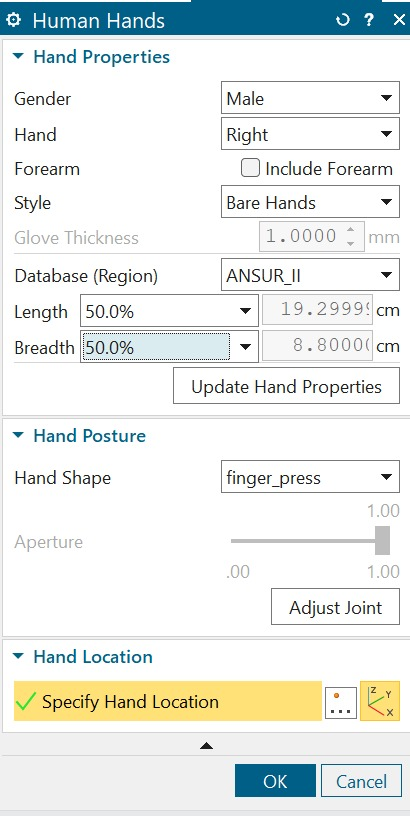

### Cognitieve & sensorische ergonomie

De cognitieve en sensorische analyse vormt het theoretische hart van Develop 2. Ze koppelt de problemen uit Develop 1 aan drie kaders uit het cursusmateriaal Gebruiksgericht Ontwerpen: **Norman's 7 Stages of Action**, de **Gestalt-wetten**, en het concept van **signifiers**. Elke theoretische vaststelling wordt vertaald naar een concrete ontwerpkeuze.

#### Norman's 7 Stages of Action

In Develop 1 braken drie van Norman's zeven fasen: Perceive, Interpret en Compare.

**Perceive (waarnemen)**: Het probleem was dat twee haptische kanalen (kompas en trilmotoren) tegelijk "gelezen" moesten worden op dezelfde hand. Het probleem was niet dat er te veel informatie was, maar dat de sensorische kanalen elkaar overlapten op dezelfde anatomische zone. Het ontwerpprincipe dat hieruit volgt is **ruimtelijke scheiding van feedbackkanalen**: kompas en trilmotoren moeten op anatomisch gescheiden zones zitten zodat ze niet interfereren. Concreet zijn de finger-mounted vibratiemotoren verwijderd ten gunste van één enkele in-handle motor, en is het kompas verplaatst naar de hypothenar (hiel van de hand).

**Interpret (interpreteren)**: De mentale mapping "balletje naar beneden = rechts draaien" bleek grip-afhankelijk in Develop 1. Verschillende gebruikers hielden het handvat anders vast, waardoor dezelfde beweging tegengestelde betekenissen kreeg. Norman noemt dit een **system image mismatch**: het conceptuele model van de ontwerper klopt niet met het mentale model dat de gebruiker opbouwt op basis van wat het systeem hem laat zien. Het ontwerpprincipe is dat de mapping robuust moet zijn ongeacht gripvariatie. Voor Develop 2 wordt dit opgelost via een **onboarding tutorial** die de oriëntatie kalibreert op de natuurlijke grip van de gebruiker, en een **IMU-gebaseerde fallback** die waarschuwt wanneer de griporiëntatie de mapping breekt.

**Compare (vergelijken)**: De gebruiker wil evalueren "ben ik nog op koers?" maar krijgt daar in Develop 1 onvoldoende bevestiging van. Dit is wat Norman de **Gulf of Evaluation** noemt: de afstand tussen de feedback die het systeem geeft en wat de gebruiker nodig heeft om zijn doel te toetsen. Het ontwerpprincipe is dat het systeem expliciet en eerlijk moet communiceren over zijn eigen status.

#### Gestalt-wetten

De Gestalt-wetten zijn klassiek beschreven voor visuele perceptie, maar gelden evengoed voor tactiele perceptie. Mensen groeperen sensorische input automatisch volgens dezelfde principes.

**Wet van figuur-grond**: Er moet altijd een duidelijk onderscheid zijn tussen wat de "figuur" is (opvallend, belangrijk) en wat de "grond" is (achtergrond, context). In Develop 1 was dit contrast te zwak: het kompas was te subtiel en de vibratie was niet duidelijk genoeg afgebakend van de continue koersfeedback. Het ontwerpprincipe is **versterk het intensiteitscontrast**: vibratie moet kort en krachtig zijn, kompas moet rustig en continu blijven, en beide moeten duidelijk onderscheidbaar zijn.

**Wet van continuïteit**: Mensen volgen liever een doorlopende sensorische stroom dan onderbroken brokstukken. Het kompas geeft continue feedback, vibratie is discreet. Wanneer beide tegelijk actief zijn, "wint" de continue stroom de aandacht en wordt de korte vibratiecue gemist. De ontwerpimplicatie is dat het **kompas kort pauzeert tijdens een vibratiecue**, zodat het korte event-signaal niet verdrinkt in de achtergrondstroom van de koersfeedback.

**Wet van proximity en common region**: Dingen die fysiek dicht bij elkaar zitten of in dezelfde anatomische zone, worden onbewust als één signaal gegroepeerd in plaats van als twee aparte informatiestromen. In Develop 1 zaten kompas en trilmotoren fysiek dicht bij elkaar op dezelfde hand, waardoor ze als één moeilijk te ontleden brij werden waargenomen. Door ze in verschillende anatomische zones te plaatsen creëer je twee aparte "common regions" die elk hun eigen informatie dragen.

#### Signifiers

Norman definieert signifiers als waarneembare aanwijzingen die de gebruiker vertellen wat er kan, gebeurt of fout is. Bij SensePath, een product zonder visuele interface, moeten signifiers volledig tactiel zijn. Uit Develop 1 bleken twee signifiers te ontbreken:

- **Transitiesignaal tussen modi**: Wanneer het systeem schakelt van buiten naar binnen, of van een modus naar een andere, is er geen signifier voor die overgang. De gebruiker merkt de verandering pas wanneer iets onverwachts gebeurt. Voorstel: een uniek kort trilpatroon dat de moduswissel aankondigt.
- **Fout-signifier**: Wanneer het systeem onzeker is over zijn eigen positie of de wizard-timing mist, is er geen feedback dat er iets onverwachts gebeurt. Dit ondergraaft het vertrouwen omdat de gebruiker een fout mental model opbouwt ("ik deed iets fout") terwijl het systeem zelf faalde. Voorstel: een specifiek "heroriënteer"-signaal dat duidelijk verschilt van navigatiecues.

#### Vertaling naar het prototype

De theoretische analyse leidt tot vier concrete ontwerpkeuzes voor Develop 2:

- **Ruimtelijke scheiding van kanalen**: finger-mounted vibratiemotoren verwijderd, één enkele in-handle motor met een beperkte set codes
- **Mental mapping veiliggesteld**: onboarding tutorial die kalibreert op de natuurlijke grip van de gebruiker, IMU-fallback die waarschuwt bij gripverandering
- **Figuur-grond contrast**: vibratie wordt kort en krachtig; kompas pauzeert tijdens een vibratiecue
- **Twee nieuwe signifiers**: uniek patroon voor moduswisseling en eerlijk fout-signaal voor systeemonzekerheid

### Prototypes

Voor Develop 2 werden drie prototypedimensies gevarieerd via **variety prototyping**, een methode die expliciet meerdere fysieke varianten naast elkaar test om confirmation bias te vermijden.

**Handle profile**: Drie verschillende handvatprofielen werden ontwikkeld om de algemene grip-ergonomie te onderzoeken. De vorm bepaalt hoe de hand zich rond het handvat sluit en beïnvloedt onbewust de handoriëntatie.

  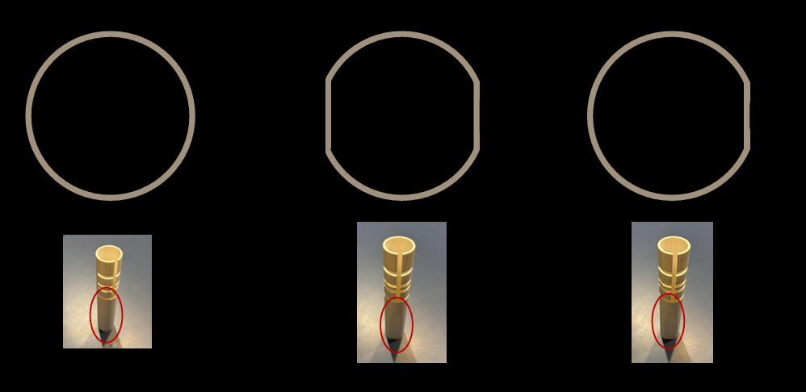

**Compass groove**: Het handvat werd voorzien van een verticale gleuf met **vijf posities** waarin het kompaselement geplaatst kon worden, van H1 (laagste, dicht bij de pols) tot H5 (hoogste, dicht bij de knokkels). Door dezelfde gleuf te gebruiken kon de positie systematisch gewisseld worden zonder andere variabelen te veranderen.

  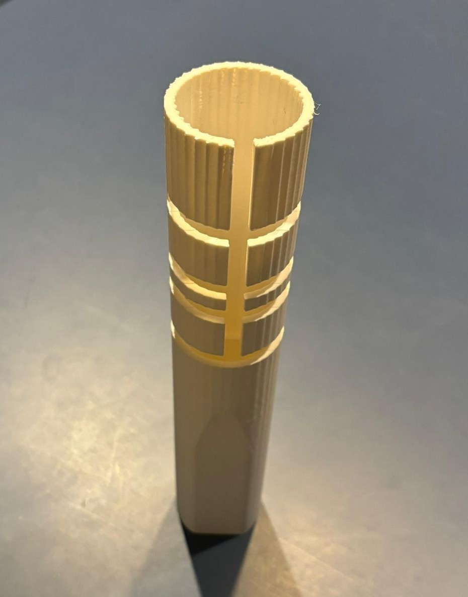

**Contact surface**: Vijf verschillende kompaselementen werden ontwikkeld die elk een combinatie zijn van **vorm én uitsteekselhoogte**. Drie afgeronde rechthoekige uitsteeksels op verschillende uitsteekselhoogtes (laag, midden, hoog), één sferisch element, en één schuin afgeronde overgangsvorm. Dat laatste element kwam voort uit een inzicht van Mario tijdens zijn sessie: een geleidelijke overgang van vlak naar verhoog vermindert het scherpe contactgevoel tegen de hand.

  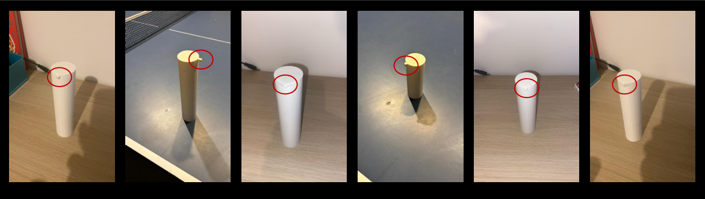

Belangrijk om te vermelden: deze tests werden uitgevoerd **zonder stok**. De focus lag puur op de ergonomie van het handvat zelf, los van de stok-feedback, om te vermijden dat één variabele de evaluatie van de andere zou vertroebelen. De stok werd parallel uitgewerkt door collega's binnen het maturity-spoor.

### User testing

**Sample (N=5):**

| Naam | Leeftijd | Relevantie | Locatie | Datum |
|---|---|---|---|---|
| Mario | 52 | Verloor zicht op 18-jarige leeftijd | Licht en Liefde | 07/04/2026 |
| Rory | 55 | Ernstig slechtziend | Licht en Liefde | 09/04/2026 |
| Herman | 65 | Blind sinds geboorte | Licht en Liefde | 08/04/2026 |
| Milo | 20 | Ziend (controle) | Thuis | 10/03/2026 |
| Milos | 20 | Ziend (controle) | Thuis | 10/03/2026 |

**Protocol:** Introductie & feedback implementatie → Test 1 (gleufpositie) → Test 2 (kompaselement) → Test 3 (volledig benchmarkparcours) → interview & subjectieve scores → reflectie. De drie tests volgen een **getrapt within-subjects design**: de voorkeur uit Test 1 wordt constant gehouden in Test 2, en de voorkeurscombinatie uit Test 1 en Test 2 wordt meegenomen in Test 3 als benchmarkconfiguratie. Zo wordt confirmation bias vermeden zonder dat alle 25 combinaties getest moeten worden.

  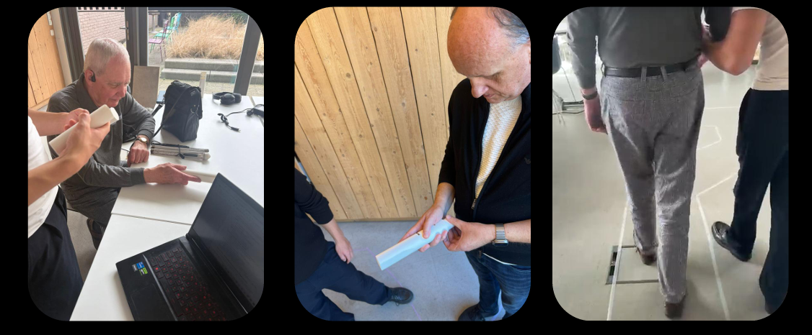

### Test 1: Compass grooves

In Test 1 werd onderzocht op welke gleufpositie het kompaselement het duidelijkst voelbaar is, gegeven de natuurlijke grip van de gebruiker. De vijf posities werden in stilstand gevoeld en daarna kort op een rechte loopstrook getest, met het referentie-element (afgerond rechthoekig uitsteeksel, middelhoge uitsteekselhoogte) constant gehouden over alle posities zodat alleen de gleufpositie varieerde.

> *"Daar voel ik het 't best, helemaal onderaan."*
> *"De bovenste was lastig, mijn vel kwam ertussen."*

**Key findings:**

- **Laagste gleufpositie (H1) gewonnen**: Zowel Mario als Herman kozen onafhankelijk de positie het dichtst bij de hiel van de hand.
- **Hypothenar als ankerpunt**: Op de laagste positie rust het element tegen het stevige vlezige deel van de handpalm bij de pols, waar de hand sowieso contact maakt ongeacht hoe ze het handvat vasthouden. Dit lost het Develop 1-probleem van handpalmcentrum (te zwak signaal) op.
- **Hoogste positie problematisch**: Bij de bovenste gleuf raakte de huid bekneld tussen het element en de gleufrand. Dit was een mechanisch probleem dat alleen bij dynamisch grijpen naar boven kwam.
- **Grip-onafhankelijkheid bevestigd**: De laagste gleufpositie werkt over verschillende grippatronen heen omdat het contactvlak anatomisch verankerd is, niet handpositie-afhankelijk. Dit is precies wat de Norman-analyse voorspelde over het belang van een grip-onafhankelijke mapping.

### Test 2: Contact surface

In Test 2 werd op de voorkeursgleufpositie uit Test 1 gezocht naar de combinatie van vorm en uitsteekselhoogte die de richtingsbeweging het duidelijkst en comfortabelst overbrengt. Vijf elementen werden in stilstand gevoeld en daarna kort op een rechte loopstrook getest, gevolgd door een rangschikking door de deelnemer.

**Varianten:**
- C1: Afgerond rechthoekig uitsteeksel, **lage** uitsteekselhoogte
- C2: Afgerond rechthoekig uitsteeksel, **middelhoge** uitsteekselhoogte
- C3: Afgerond rechthoekig uitsteeksel, **hoge** uitsteekselhoogte
- C4: **Sferisch** element
- C5: **Schuin afgeronde** overgangsvorm

> *"Het ronde voelt het zachtste, maar je weet duidelijk waar het naartoe gaat."*
> *"De middelste hoogte is precies goed, niet scherp, wel duidelijk."*

**Key findings:**

- **Middelhoge uitsteekselhoogte gewonnen**: Lage uitsteeksels voelden te subtiel, hoge voelden scherp en oncomfortabel. De middelhoge gaf de beste balans tussen voelbaarheid en comfort.
- **Sferisch element als voorkeursvorm**: Soepele overdracht van richtingsbeweging, geen scherpe randen tegen de huid, comfortabel over verschillende griprotaties. Dit komt rechtstreeks voort uit de Gestalt figuur-grond analyse: het sferische element levert een duidelijker afgebakend tactiel signaal.
- **Schuin afgeronde overgangsvorm (C5) als sterke tweede**: Vooral gewaardeerd voor de geleidelijke overgang van vlak naar verhoog, een idee dat Mario tijdens zijn sessie aanbracht en dat Rory bevestigde.
- **Glove-inzicht van Mario**: Mario merkte op dat in winterse omstandigheden met handschoenen het element nauwelijks voelbaar zou zijn. Dit triggerde het idee van een **uitwisselbare kompasmodule** met een robuustere wintervariant.

### Test 3: Turn via compass feedback

In Test 3 werd de voorkeurscombinatie uit Test 1 en Test 2 (laagste gleufpositie + middelhoge uitsteekselhoogte + sferisch element) gevalideerd op een volledig benchmarkparcours van 60 cm breed, gelijkaardig aan het Develop 1-parcours. De wizard biedt continue kompasfeedback waarbij het kompaselement volledig uitwijkt naar de doelrichting en geleidelijk terugkoppelt naar neutraal naarmate de deelnemer zich oriënteert.

  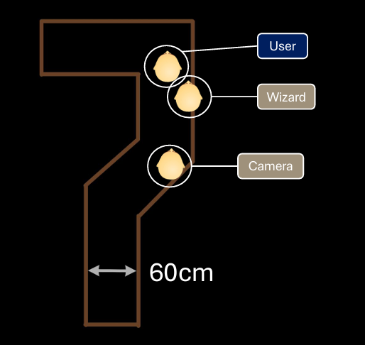

> *"Ik ben wel onder de indruk, het is echt beter dan de vorige keer."* (Mario)
>
> *"180 graden draaien is eigenlijk niet nodig, het stuurt continu bij."* (Rory)
>
> *"Het werkt, maar ik blijf voor mezelf liever met audio werken."* (Herman)

**Key findings:**

- **Single focus point bevestigt de keuze voor 1 LRA**: het loslaten van finger-mounted vibratiemotoren bevrijdt de gebruiker van een kunstmatige greep-restrictie. Design-implicatie: voor het Develop 3 ontwerp is dit een vergrendelende keuze ; geen terugkeer naar meerkanaals haptiek tenzij een nieuwe pijn dat afdwingt.
- **180° kompas-uitwijking is overdimensionering**: Mario's observatie dat het systeem continu corrigeert vóór de gebruiker de extreme hoek bereikt, weerlegt onze initiële aanname dat volledig richtingbereik nodig is. Design-implicatie: in de finale firmware kan de uitwijking begrensd worden tot de werkelijke gebruiksrange, wat de mechaniek vereenvoudigt en motorbelasting verlaagt.
- **Hand-aandacht is een bottleneck onder real-life parallelle taken**: Herman's waarschuwing dat stok-tikken, randvolging en omgevingsgeluid samen om aandacht concurreren, is geen kritiek op het prototype maar een doelgroep-afbakening. Design-implicatie: het systeem mag niet uitgaan van permanente hand-aandacht; het ontwerp moet werken op periodieke check-ins, niet op continue monitoring. Dit voedt de keuze voor scherp gelokaliseerde event-cues (M4/M6/M9) boven continue richtingsruis.

**Benchmark vergelijking Develop 1 vs Develop 2:**

| Metric | Develop 2 | Develop 1 |
|---|---|---|
| Walking zone width | 60 cm | 60 cm |
| SIZ (% Steps in zone) | **100%** | 97,52% |
| Apprenticeship | Av. 4 min | Av. 4 min |
| Learnability (1-7) | 6,33 | 6,00 |
| Smoothness (1-7) | 5,67 | 4,67 |
| Cognitive load (1-7) | **4,67** | 3,00 |
| Willingness (1-7) | 4,33 | 4,33 |
| Trust (1-7) | n.v.t. | n.v.t. |
| Positioning system | Video + observation | Video + observation |
| Stick used? | No (loose handle) | Yes |
| Context | Interior space Licht en Liefde | Interior space Licht en Liefde |

### Develop 2 design requirements

| ID | Requirement |
|---|---|
| D6.1 | Het kompaselement wordt geplaatst op de laagste gleufpositie (dichtbij de hypothenar) voor optimale tactiele waarneming |
| D6.2 | Het kompaselement gebruikt een sferisch contactoppervlak als standaardgeometrie |
| D6.3 | Het kompaselement heeft een middelhoge uitsteekselhoogte: hoog genoeg om duidelijk voelbaar te zijn, laag genoeg om huidbeknelling of scherpe druk te vermijden |
| D6.4 | Het kompas gedraagt zich met volledige uitwijking naar de doelrichting en koppelt geleidelijk terug naar neutraal naarmate de gebruiker zich oriënteert |
| D6.5 | Het kompas pauzeert kort tijdens een vibratiecue om de figuur-grond scheiding tussen de twee haptische kanalen te bewaren |
| D6.6 | De vibratieset blijft beperkt tot een klein aantal korte, krachtige codes (richtingsaankondiging, buiten-naar-binnen transitie, fallback) |
| D6.7 | De kompasmodule is uitwisselbaar zodat gebruikers kunnen wisselen naar een robuustere variant voor handschoengebruik in koude omstandigheden |
| D6.8 | De handvatdimensies accommoderen het middelste 50% van de doelgroep (ANSUR II, P25-P75) zoals gevalideerd in NX |
| D6.9 | Het systeem voorziet een IMU-gebaseerd fallbacksignaal wanneer de griporiëntatie van de gebruiker de kompas-mapping breekt, gecommuniceerd via een onderscheidend trilpatroon |
| D6.10 | Er worden geen vibratiemotoren geplaatst op individuele vingerposities, om afhankelijkheid van gripvariatie weg te nemen |

### Develop 2 conclusies

- **Eén in-handle vibratiemotor met beperkte codeset** verwijdert de grip-afhankelijkheid die finger-mounted vibratie in Develop 1 brak.
- **Laagste gleufpositie (hypothenar contact)** is de optimale locatie voor het kompaselement, onafhankelijk gevalideerd door alle drie de blinde/slechtziende deelnemers.
- **Sferisch contactoppervlak met middelhoge uitsteekselhoogte** levert de duidelijkste richtingsperceptie zonder oncomfortabel of scherp aan te voelen.
- **Cognitieve belasting daalt met 1,67 punten** op een 7-puntsschaal (van 3,00 naar 4,67), het sterkste bewijs dat ergonomische herontwerpkeuzes direct de mentale belasting verlagen. UG3 (≥4,50) is hiermee gehaald.
- **Continue closed-loop kompasfeedback** (volledige uitwijking naar de doelrichting, geleidelijke terugkoppeling naar neutraal) sluit de Gulf of Evaluation die in Develop 1 de Compare-fase brak.
- **Antropometrische verankering in NX (ANSUR II, P25-P75)** zorgt dat het handvat past bij het middelste 50% van de doelgroep en niet meer afhangt van individuele handgrootte.
- **Bereidheid blijft het open vraagstuk**: Develop 2 bevestigt dat sommige gebruikers (audio-eerst navigators zoals Herman) buiten de kerndoelgroep van SensePath vallen, wat de gebruikerssegmentatie scherper maakt voor Develop 3.
- **Een uitwisselbare kompasmodule** is de logische volgende stap, met ruimte voor persoonlijke voorkeur en een robuuste wintervariant voor handschoengebruik.

### Kritische reflectie Develop 2

De Develop 2-resultaten zijn op zich positief, maar er moeten een aantal eerlijke nuances bij geplaatst worden.

Ten eerste was de **sample beperkt**. Met N=3 blinde/slechtziende deelnemers (Mario, Herman, Rory) en N=2 ziende controles is de statistische zeggingskracht klein. De convergentie tussen Mario en Herman op de voorkeursgleufpositie en het voorkeurselement is op zich sterk, maar moet in Develop 3 met een grotere groep bevestigd worden.

Ten tweede is de **stok bewust weggelaten** in deze testopzet. De focus lag puur op de ergonomie van het handvat zelf, om te vermijden dat de stok-feedback de evaluatie van het handvat zou vertroebelen. Dit is methodisch verdedigbaar voor deze fase, maar betekent ook dat de gecombineerde belasting van stok + handvat + omgevingsperceptie pas in Develop 3 echt getest kan worden. Herman wees daar zelf op tijdens het interview, en die opmerking weegt zwaar omdat zij precies aangeeft waar de praktijksituatie afwijkt van de testomgeving.

Ten derde werd de **elektronica niet empirisch gevalideerd**. De drie nieuwe ontwerpelementen die uit de cognitieve ergonomie-analyse kwamen (de twee signifiers voor moduswisseling en systeemonzekerheid, en de IMU-fallback voor gripverandering) konden niet gedemonstreerd worden omdat het handvat in deze fase nog geen geïntegreerde elektronica had. Deze zaken werden verbaal aan de deelnemers voorgelegd en positief ontvangen, maar dat is geen empirische validatie. Develop 3 zal deze concepten met geïntegreerde hardware moeten testen.

Ten vierde was **Test 2 minder gestructureerd dan oorspronkelijk gepland**. De vijf varianten van het kompaselement werden niet allemaal in dezelfde volgorde aan elke deelnemer voorgelegd, en de schuin afgeronde overgangsvorm (C5) ontstond pas tijdens de eerste sessie met Mario en werd daarna meegenomen bij Herman. Dit is enerzijds een teken van iteratief ontwerpen in actie, maar anderzijds een methodische zwakte voor de directe vergelijkbaarheid tussen deelnemers.

Ten vijfde verdient **Herman's lage willingness-score (2/7)** een aparte kanttekening. Zijn lage score komt niet voort uit een tekortkoming van het prototype, maar uit zijn persoonlijke voorkeur voor audio-navigatie en zijn jarenlange ervaring met echolocalisatie. Dit zegt iets over de doelgroepafbakening van SensePath, niet over de kwaliteit van de huidige iteratie. Voor Develop 3 betekent dit dat de kerngebruiker scherper gedefinieerd moet worden: SensePath richt zich op gebruikers die haptische feedback prefereren boven audio en die hun gehoor willen vrijhouden voor omgevingswaarneming.

---

## Develop 3

Develop 3 is de laatste iteratieve fase van het project en bouwt voort op de ergonomische winst uit Develop 2 (versmalde gleuf, voorkeurshoogte van het kompas, sferisch contactoppervlak). Waar Develop 1 de kerninteractie valideerde en Develop 2 de fysieke ergonomie aanscherpte, focust Develop 3 op drie complementaire lagen: de **emotionele en service-laag (UX)**, een **CMF-deepdive** per onderdeel, en een **finale validatie in real-life context** in plaats van de gecontroleerde labosetting van Develop 2.

📄 [Develop 3 → UX & Service Design (uitgebreid document)](docs/develop_3.md)

### UX & Service Design Challenges

De UX-laag van Develop 3 is theoretisch onderbouwd in een afzonderlijk document dat vier ankers behandelt: de **emotionele kern** van het product (kalmte, vertrouwen, autonomie, discretie), **Norman's drie lagen** (visceral, behavioral, reflective), de set **microinteracties** volgens Saffer's trigger / rules / feedback / loops & modes-model, en de **service-context** rond het fysieke product. Drie visualisaties brengen die service-context in kaart en zijn opgenomen als infographics in [docs/develop_3/](docs/develop_3/):

| Visualisatie | Doel | Centraal inzicht |
|---|---|---|
| **Stakeholder map** ([PNG](docs/develop_3/img/stakeholder_map.png)) | Vijf concentrische ringen, van kerngebruiker tot platform-actoren | Ring 3-4 (infrastructuur + institutioneel) levert ~40 % van de value delivery maar heeft nul fysiek contact met de gebruiker. De service moet werken zonder dat de gebruiker die backstage-actoren ooit ontmoet. |
| **Customer Journey Map** ([PNG](docs/develop_3/img/customer_journey.png)) | Vijf fases (oriëntatie, onboarding, eerste gebruik, routine, hergebruik) × vier rijen (touchpoints, acties, emotie-curve, pains/opportunities) | Drie expliciete Moments of Truth: eerste 30 s na unboxing (visceral), eerste fail-safe in publiek (reflective), eerste zelfstandige routeafsluiting zonder hulp (autonomie). |
| **Service Blueprint** ([PNG](docs/develop_3/img/service_blueprint.png)) | Vijf rijen × vier fases met expliciete *line of interaction*, *line of visibility* en *line of internal interaction* | Indoor wayfinding kan niet zonder gebouwbeheerder-POI-data (B2G-afhankelijkheid), schaalbare onboarding hangt af van een mobiliteitstrainer-netwerk, en lange-termijn vertrouwen wordt bepaald door invisible firmware- en mapping-updates. |

  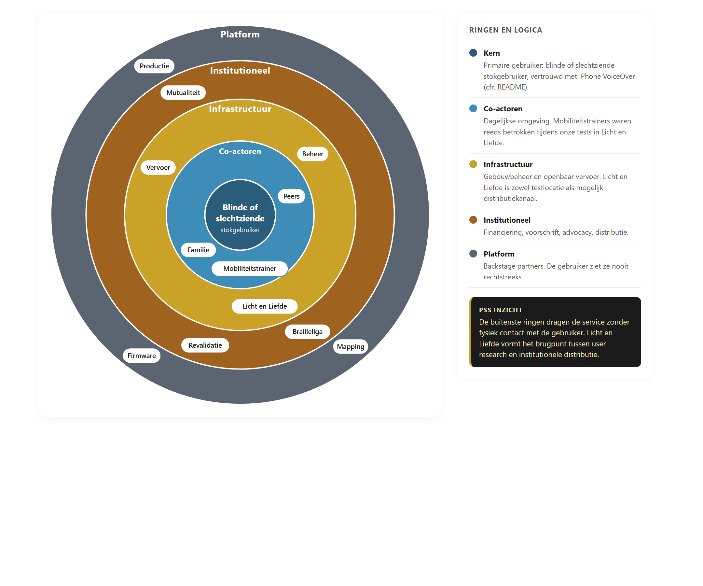
   <em>Stakeholder map → vijf concentrische ringen van kerngebruiker tot platform.</em>

  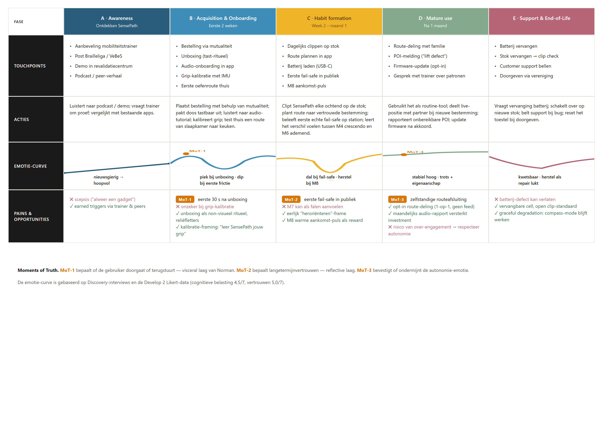
   <em>Customer Journey Map → vijf fases met emotie-curve en drie Moments of Truth.</em>

  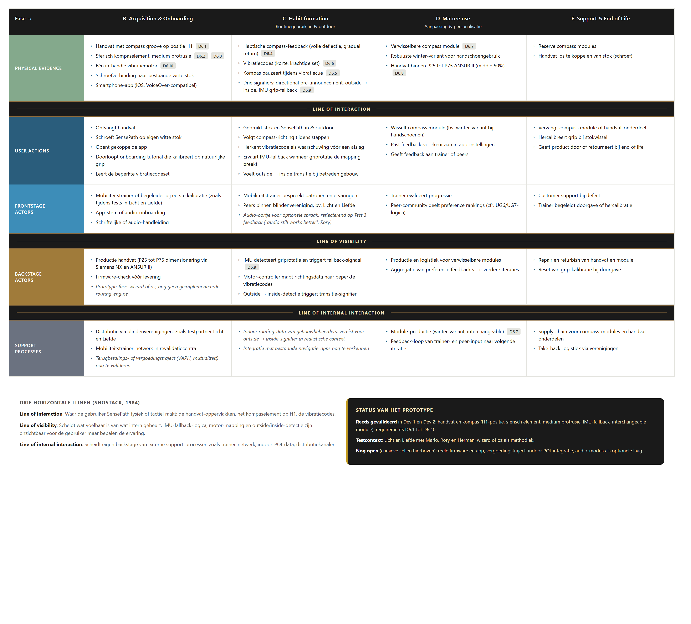
   <em>Service Blueprint → frontstage en backstage interacties van het volledige PSS-systeem.</em>

### Onderzoeksvragen Develop 3

- Welke set trilpatronen (max. drie tot vier signalen via één trilmotor) is voldoende **onderscheidbaar en intuïtief** om obstakel, route-afwijking en aankondiging van een afslag te communiceren zonder cognitieve overload?
- Op welk **moment vóór een afslag** wenst de gebruiker een voorbereidende trilling (uitgedrukt in stappen, meters of seconden)?
- Wensen gebruikers één neutraal richtings-aankondigingssignaal in combinatie met het kompas, of een **expliciet onderscheid links/rechts** in het patroon zelf?
- Welk **handvatmateriaal** (harde standaardstok, zachter indrukbaar handvat, kurk-element) wordt geprefereerd qua tactiliteit en bruikbaarheid in alle weersomstandigheden?
- Welke **kleurkeuze** voor het handvat sluit aan bij de behoefte aan contrast voor slechtzienden en bij de externe zichtbaarheid in publieke ruimte?
- Verschilt de ervaren **cognitieve belasting en het vertrouwen in real-life context** (verkeer, voetgangers, gidslijnen, niveauverschillen) significant van de labosetting in Develop 2?
- Wensen gebruikers **persoonlijke instelbaarheid** van trilpatronen en aankondigingsafstanden, of volstaat een vaste default?

### Methode & sample

De test combineert drie opeenvolgende blokken in één sessie van ± 75 minuten per deelnemer: een **binnenblok** met CMF-bevraging en haptische leerfase, een **buitenblok** met Wizard-of-Oz wandeling in het Citadelpark, en een **stedelijk blok** vertrekkend vanuit Licht en Liefde naar het station Gent-Sint-Pieters. Tijdens de wandeling stuurt de testleider via een telefoon-app de microcontroller in het handvat, die op zijn beurt het kompas en de trilmotor aanstuurt. Na afloop volgt een aparte evaluatieronde met Likert-scoring en een open reflectiegesprek over instelbaarheid, fallback en algemene indruk.

📄 [Protocol Develop 3](reports%20and%20protocols/protocol_sensepath_develop3_PDF.pdf) · 📄 [Rapport Develop 3](reports%20and%20protocols/rapport_sensepath_develop3.pdf)

| Deelnemer | Leeftijd | Profiel | Locatie | Datum |
|---|---|---|---|---|
| Mario | 52 | Verloor zicht op leeftijd 30 | Licht en Liefde | 07/05/2026 |
| Jelle | 22 | Blind van geboorte | Licht en Liefde | 07/05/2026 |
| Herman | 65 | Verloor zicht op leeftijd 18 | Licht en Liefde | 08/05/2026 |
| Milo | 20 | Ziende controle (geblinddoekt) | Thuis | 08/05/2026 |
| Milos | 20 | Ziende controle (geblinddoekt) | Thuis | 08/05/2026 |

### Prototypes

**Handvat met geïntegreerde elektronica.** Het Develop 3 prototype is een 3D-geprint handvat met de uit Develop 2 geselecteerde voorkeurshoogte en sferisch contactoppervlak van het kompas. De gleuf is verkleind zodat het kompas binnen de handpalm blijft draaien in plaats van eruit te wijken. In het handvat zit een **XIAO ESP32-S3 microcontroller** gekoppeld aan een **DRV2605L haptische driver** die de **trilmotor (LRA)** aanstuurt. De microcontroller maakt een eigen WiFi-acces point ("SensePath") aan, waardoor de testleider via een webpagina op zijn telefoon (`http://192.168.4.1`) de trilpatronen kan aansturen tijdens de Wizard-of-Oz sessie.

  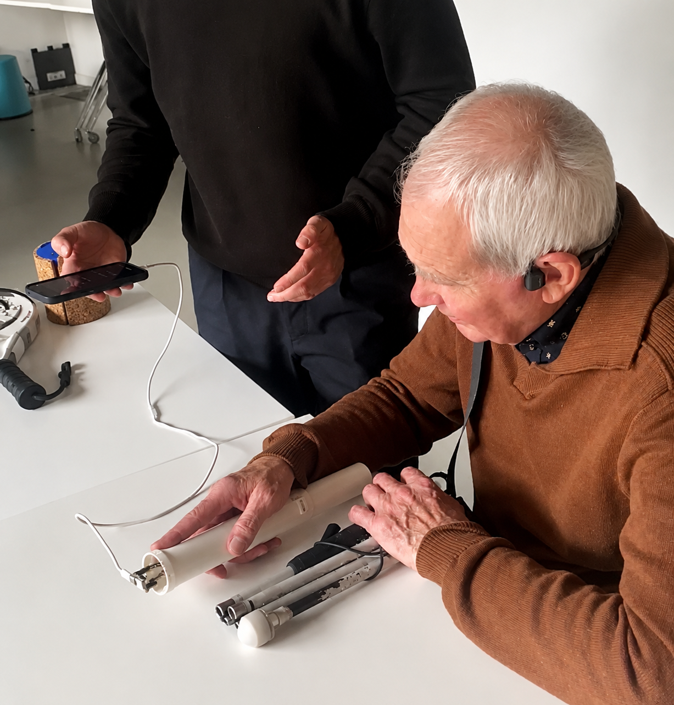
   <em>Geïntegreerde XIAO ESP32-S3 + DRV2605L + LRA in het handvat.</em>

**Trilpatronen.** Het uitgebreide microinteractie-overzicht in [docs/develop_3.md](docs/develop_3.md) documenteert tien kandidaat-momenten (M1 → M10) verspreid over de hele user journey (route gestart, koers oké, bocht nadert, bocht correct genomen, afwijking, fail-safe, bestemming bereikt, batterij low, clip-bevestiging). Voor de Develop 3 user-test werden de **drie meest kritieke MVP-signalen** geselecteerd, omdat zij de kern van de navigatie-interactie dragen:

| MVP-signaal | Scenario | Pulslogica getest |
|---|---|---|
| **M4** | Obstakel recht vooruit | Twee korte scherpe trillingen na elkaar (Strong Click #12) |
| **M6** | Route-afwijking, je loopt uit je geplande koers | Drie snelle trillingen achter elkaar (Strong Buzz #14) |
| **M9** | Bocht nadert, voorbereidend signaal | Eén langere oplopende trilling (Buzz 1 #47) |

Tijdens de leerfase kregen de deelnemers ook een aantal alternatieve patronen uit de bredere set te voelen (Soft Bump, Double Click, Triple Click, Transition Ramp variantes). Vervolgens werd hen gevraagd om per scenario een voorkeurspatroon te kiezen, om te valideren of de drie MVP-koppelingen voor blinde gebruikers ook intuïtief zijn (zie UG7 onder Resultaten).

**Wizard-of-Oz aansturing via telefoon.** Een eenvoudige webpagina op de telefoon van de testleider biedt knoppen om elk patroon real-time te triggeren. De deelnemer ziet of hoort de telefoon niet en interpreteert de trilling als systeem-output, wat de illusie van een werkend GPS-systeem creëert.

**CMF-referentiemonsters voor de bevraging.** Naast het functionele handvat werden twee fysieke referenties meegebracht ter vergelijking: een **padel-racket** als voorbeeld van een zachter indrukbaar handvat met soft-touch overmold, en een **kurk-cilinder** als voorbeeld van een natuurlijk grip-materiaal zoals dat bij hedendaagse fietsstuurlinten wordt gebruikt.

  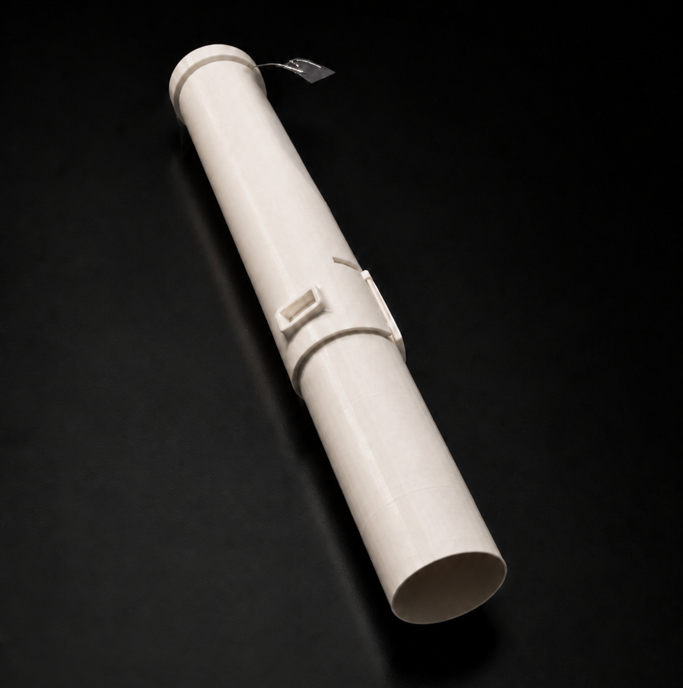
   <em>Handvat-prototype met sferisch contactoppervlak, voorkeursconfiguratie uit Develop 2.</em>

### Resultaten

#### UX-feedback

**Mario** (52, blind sinds 30 jaar). De eerste obstakel-puls werd te kort en te zwak gevoeld om duidelijk op te merken; aankondiging en obstakel werden meermaals verward. Mario verwoordt expliciet de behoefte aan een richtingsindicatie in het patroon zelf: *"Ik ben er nog altijd niet mee akkoord dat je in je pulsen niet aangeeft welke kant je uit moet."* De aankondiging hoeft volgens hem maar twee stappen voor de bocht te komen. De buitencontext is merkbaar zwaarder qua concentratie dan de Develop 2 binnen-test.

**Jelle** (22, blind van geboorte). Bevestigt dat de versmalde gleuf werkt: *"Op deze hoogte heb ik duidelijker contact."* Voor hem zou het contactelement nog 1 mm hoger mogen. Aankondiging op ± 2 meter vooraf is voldoende. Hij heeft geen behoefte aan apart links/rechts in het patroon, het kompas volstaat voor hem. De terugkoppel-logica (terugdraaien naar midden = je staat juist) was niet meteen intuïtief, maar oplosbaar via uitleg. Cognitieve belasting buiten viel hem mee. Hij vraagt expliciet om een audio-fallback voor wanneer haptiek vastloopt.

**Herman** (65, blind sinds 18 jaar). Het contactelement is volgens hem te klein, met name in winteromstandigheden met handschoenen. Bij langere wandelingen (één uur en meer) maakt hij zich zorgen over tactiele vermoeidheid en aandachtsverlies in de hand. Hij wenst een aankondigingsafstand rond ± 50 m, zoals zijn huidige GPS, en wil de richting al in het patroon zelf herkennen.

#### CMF-feedback

Alle drie de blinde testers reageerden positief op een **zachter, lichtjes indrukbaar handvat** (referentie padel-racket). Het standaard harde handvat van een witte stok wordt niet als ideaal ervaren wanneer er een zachter alternatief naast ligt. **Kurk** werd door Jelle en Herman aanvaard als materiaal, maar enkel onder voorwaarde van duurzaamheid in weer en straatgebruik. Mario was kritisch over slijtage- en vervuilingsrisico van kurk.

Over **kleur** benadrukte Mario expliciet dat het handvat moet contrasteren met de witte stok zodat slechtzienden de stok terugvinden als die ergens ligt: *"Het handvat hier is zwart, gewoon als de stok openligt, dat je het handvat kan zien."* Een wit handvat wordt afgewezen wegens vuilgevoeligheid en gebrek aan contrast. Fluo of rood is bespreekbaar voor externe zichtbaarheid in verkeer en publieke ruimte. Jelle (geboorte-blind) heeft geen kleurvoorkeur, Herman besprak kleur niet expliciet.

#### Subjectieve scores op Likert-schaal (1-7)

Na afloop van de drie testblokken werd elke deelnemer gevraagd om de voorkeursconfiguratie te scoren op een Likert-schaal van 1 (helemaal niet akkoord) tot 7 (helemaal akkoord). De scores worden hieronder vergeleken met de Develop 2 referentie.

| Metric | Develop 3 (avg) | Develop 2 (avg) |
|---|---|---|
| Learnability (1-7) | **6,33** | 6,33 |
| Smoothness (1-7) | **5,33** | 5,67 |
| Cognitive load (1-7, hoog = weinig concentratie) | **4,33** | 4,67 |
| Willingness (1-7) | **4,67** | 4,33 |

**UG5 → Cognitieve belasting** daalde licht ten opzichte van Develop 2 (4,33 vs 4,67), volledig toe te schrijven aan Mario's score (3/7) die de buitencontext beduidend zwaarder ervaart dan de gecontroleerde labosetting. Dit valt binnen de protocol-marge "maximaal 1 punt lager", dus UG5 wordt gehaald. Jelle en Herman bleven op het Develop 2 niveau (5/7), wat bevestigt dat de cognitieve belasting voor de kerndoelgroep (audio-vrije navigatoren) hanteerbaar blijft in real-life.

**UG6 → Bereidheid tot gebruik** stijgt van 4,33 (Develop 2) naar 4,67. De gemiddelde stijging is bescheiden door Herman's lage score (3/7), die consistent blijft met zijn Develop 2 willingness van 2/7 en zijn voorkeur voor audio-navigatie. Mario en Jelle scoren 5 en 6, wat een duidelijke stijging is en UG6 (behoud of stijging) bevestigt.

#### Rangschikking trilpatronen (UG7)

Na de leerfase werden de deelnemers gevraagd om per scenario uit de bredere set (M1 → M10) hun top-3 te kiezen. De resultaten bevestigen de drie MVP-koppelingen, maar leggen wel een ontwerpprobleem bloot: de patronen liggen onderling te dicht bij elkaar in waargenomen sterkte.

| Scenario | 1ste keuze | 2de keuze | 3de keuze |
|---|---|---|---|
| Obstakel recht vooruit | **M4** (kort scherp dubbel) | M5 (dubbele tick na bocht) | M9 (drie korte ticks) |
| Afwijking van route | **M6** (ademende pulsreeks) | M7 (lange zachte trilling) | M2 (zachte heartbeat) |
| Bocht nadert | **M9** (drie korte ticks oplopend) | M4 (crescendo voor bocht) | M1 (zachte dubbele puls) |

De drie geselecteerde MVP-koppelingen (M4, M6, M9) staan unaniem op de eerste plaats, wat bevestigt dat ze intuïtief aansluiten bij hun scenario. De tweede en derde keuzes komen wel uit de bredere kandidatenset, wat aantoont dat alternatieve patronen voor verschillende deelnemers ook denkbaar zijn. Mario en Jelle gaven echter beide aan dat het verschil in sterkte tussen de patronen onderling te klein is, waardoor obstakel en bocht nadert in twijfelgevallen verwisseld werden. Dit onderbouwt de design implicatie "scherper differentiëren in lengte of ritme".

#### Rangschikking handvatmateriaal (UG8)

De deelnemers rangschikten drie tactiele referenties van beste naar slechtste op tactiliteit en draagcomfort.

| Plaats | Materiaal (consensus) |
|---|---|
| 1ste | Zachter handvat (padelracket-textuur) |
| 2de | Eigen huidige stok (harde standaard) |
| 3de | Kurk |

Twee van de drie deelnemers (Mario, Jelle) plaatsen het zachter handvat op de eerste plek, met hun eigen stok als tweede en kurk als derde. Herman wijkt af door zijn eigen stok bovenaan te plaatsen, omdat die voor hem de tactiele tikfeedback het zuiverste doorgeeft, maar zet het zachter alternatief eveneens op de tweede plek. Kurk wordt door alle drie als minst geschikt beoordeeld omwille van duurzaamheid en onderhoud. Dit bevestigt UG8 en de design implicatie om TPE Shore 65A overmold als hoofdmateriaal te kiezen, met de huidige harde stok-textuur als optie voor de eindgebruikers die dat verkiezen.

#### Kleurkeuze en contrast (UG9)

Zoals in de CMF-feedback hierboven beschreven, wijst UG9 in dezelfde richting: contrast tussen handvat en de witte stok is leidend, niet één specifieke kleur. Zwart of rood worden door Mario expliciet aanvaard, wit wordt afgewezen wegens vuilgevoeligheid en gebrek aan contrast.

### CMF-Deepdive

Het handvat is in Develop 3 ontleed in vijf functionele componenten, elk afzonderlijk geanalyseerd op CMF-relevante criteria. De volledige weegtabellen, materiaalvergelijkingen en literatuur-onderbouwingen staan in het [Rapport Develop 3](reports%20and%20protocols/rapport_sensepath_develop3.pdf). De geselecteerde combinaties zijn:

| Component | Geselecteerd materiaal | Onderbouwing |
|---|---|---|
| **Structural core** | PA6 unfilled | Beste totaalscore (49/60) op rigiditeit, TPE-overmold-adhesie en productiekost. Ondersteunt de elektronica en draagt het schroefdraad voor stokmontage. |
| **Soft-touch overmold** | TPE Shore 65A | Beste totaalscore (62/75) op tactiel comfort, 2K-overmold-compatibiliteit en productiekost. Recyclebaar en thermisch warm bij eerste aanraking, in lijn met de visceral-laag uit het UX-document. |
| **Grip texture** | Fijne radiale ribbels (pitch 0,8 mm) | Beste totaalscore (63/70). Boven tactiele drempel voor blinde gebruikers (Alary 2008), leesbaar voor oudere handen (Skedung 2018), goede grip in natte omstandigheden, lage vuilophoping. |
| **Buttons (cap)** | POM (Delrin) + TPE 50A overlay | Beste totaalscore (57/65). Click feel blijft consistent na 10.000 cycli, tactiel onderscheidbaar van de grip (Norman 2011). |
| **Pin tip / kompas-indicator** | TPE 50A op aluminium kern | Beste totaalscore (64/75). Thermisch comfort op koude ochtenden, hoge tactiele leesbaarheid van de richtings-uitwijking, premium-gevoel. Uitwisselbaar zodat winterhandschoen-versie mogelijk is. |

De **stok zelf** volgt de standaard ISO 9999:2016 (code 12 39 03 Tactile sticks): aluminium of fiberglass shaft, ±12 mm diameter, lengte op basis van gebruikerslengte (122-152 cm), nylon of TPU tip 2-3 cm, wettelijk wit gekleurd met rode onderzone, minstens 2 jaar levensduur (WHO APS24).

### Design implicaties

**UX**

- **Aankondiging vs obstakel scherper differentiëren** in lengte of ritme. Mario's verwarring is een early warning die in een drukke straatcontext zal breken.
- **Richtingsinformatie (links/rechts) in het trilpatroon zelf** integreren als default, mét mogelijkheid om dit via app uit te schakelen voor power-users zoals Jelle die het kompas voldoende vinden.
- **Aankondigingsafstand parametriseren** in software. De spread tussen 2 stappen (Mario), 2 meter (Jelle) en 50 meter (Herman) toont dat één universele default onhaalbaar is.
- **Stille default**: het systeem mag niet ingrijpen bij elke micro-correctie, alleen bij echte gebeurtenissen. Dit is consistent met het *kalmte*-principe uit het UX-document.
- **Onboarding-flow** als verplicht productonderdeel. Alle drie de testers benoemden onafhankelijk dat de kompas-terugkoppellogica niet self-evident is bij eerste gebruik. Korte training via Licht en Liefde of via app is noodzakelijk.
- **Audio-fallback** via gekoppelde app voor situaties waar haptiek vastloopt of bij overgang naar onbekende contexten (Jelle's expliciete vraag).

**CMF**

- **Zachter handvatmateriaal** (TPE Shore 65A overmold) als hoofdkeuze. Afwijken van het standaard harde stokhandvat is gerechtvaardigd door de unanieme positieve reactie op de padelracket-referentie.
- **Kurk hoogstens als grip-accent**, niet als hoofdmateriaal. Duurzaamheid in weer en straatgebruik weegt zwaarder dan tactiele appeal.
- **Kleurregel**: contrasterend met de witte stok (zwart of rood handvat). Wit uitgesloten wegens vuilgevoeligheid en gebrek aan contrast.
- **De stok blijft wit** conform wettelijke vereisten in de meeste landen (ISO 9999, nationale verkeerswetten).
- **Vervangbare pin** is randvoorwaarde, niet een latere optimalisatie. Herman's winter-zorg combineert met Jelle's millimeter-finetuning tot één gedeelde noodzaak.

### Develop 3 conclusies

- **De versmalde gleuf werkt** → expliciete bevestiging door Jelle dat het kompas op de juiste plek zit, geen heropening van die ontwerpkeuze nodig.
- **De drie trilpatronen zijn principieel onderscheidbaar** maar de ruimte tussen aankondiging en obstakel is op de grens en moet aangescherpt worden voor de eindversie.
- **Twee van de drie testers willen richtingsinformatie in het patroon zelf** → de Develop 1 hypothese dat het kompas alleen volstaat is door de meerderheid weerlegd.
- **De optimale aankondigingsafstand bestaat niet als universele waarde** → personalisering via settings is geen luxe-extra maar een design requirement.
- **Real-life cognitieve belasting blijft hanteerbaar** voor de kerndoelgroep (audio-vrije navigatoren), de Develop 2 winst houdt stand in een complexere context.
- **Zachter handvatmateriaal wint unaniem** → Develop 3 levert een eenduidige CMF-richting op voor het overmold (TPE Shore 65A), de grip-textuur (fijne radiale ribbels), de buttons (POM + TPE) en de pin-tip (TPE op aluminium).
- **Kleur-keuze volgt een regel, geen voorkeur**: contrast met de witte stok is leidend (zwart of rood), niet esthetiek.
- **Vervangbare pin** is noodzakelijk om winterse handschoen-condities te dekken en individuele tactiele drempels te accommoderen.

### Kritische reflectie Develop 3

De Develop 3 resultaten zijn richtinggevend, maar verdienen een aantal eerlijke nuances.

Ten eerste blijft de **sample beperkt** met N=3 blinde of slechtziende deelnemers en N=2 ziende controles (geblinddoekt). De convergentie tussen Mario en Herman op de behoefte aan richting-in-patroon is sterk genoeg om een design-implicatie te trekken, maar Jelle's tegengestelde voorkeur toont dat de doelgroep intern heterogeen is. Een grotere sample zou de instelbaarheids-vraag verder kunnen kwantificeren.

Ten tweede was de **trilmotor in deze sessie nog niet op de finale plek** in het handvat geïntegreerd. Deelnemers voelden de patronen wel, maar in het eindproduct zal de motorpositie tegen de hypothenar liggen waar de demping minder is. Dit kan de perceptiekwaliteit beïnvloeden ten goede of ten kwade, en moet in een laatste validatie-iteratie hertest worden.

Ten derde was de **stok in deze sessie nog steeds niet permanent op het handvat bevestigd**. De focus lag op het handvat zelf en op de signalen, maar dat betekent dat de gecombineerde belasting van stok-tikken + handvat-vibratie + omgevingsperceptie nog niet integraal getest is. Mario en Herman wezen er beide expliciet op tijdens de sessies dat de stok-feedback in de praktijk parallel doorloopt en dat het systeem moet samenwerken met die bestaande tactiele input.

Ten vierde is de **CMF-deepdive grotendeels analytisch en literatuurgedreven**, niet empirisch via prototyping. De geselecteerde materialen (TPE Shore 65A, PA6 unfilled, fijne radiale ribbels) scoren hoog op de weegtabellen, maar zijn nog niet als gecombineerd prototype getest met eindgebruikers. Een 1-op-1 fysieke variant testen zou de finale CMF-keuzes verder kunnen valideren.

Ten vijfde blijft **stations-navigatie als gerichte use-case** een open strategische vraag. Alle drie de blinde testers wezen spontaan op stations als de plek waar haptische navigatie het meeste verschil zou maken. Dit suggereert dat een toekomstige product-go-to-market gerichter zou kunnen zijn dan de algemene "indoor wayfinding"-positionering, maar deze pivot ligt buiten de scope van Develop 3.

---

## Deliver

De Deliver-fase sluit de Double Diamond door alle inzichten uit Discovery, Definition en Develop 1 → 3 te bundelen tot een samenhangend ontwerp. Bewust onderscheiden we twee niveaus: **het beoogde eindproduct** (de definitieve vorm die SensePath in een real-world deployment zou hebben) en **ons prototype** (de MVP die we als academisch deliverable opleveren om de essentiële interacties te testen). De ontwerpredenen blijven dezelfde; wat verschilt is de scope van de implementatie.

### Het beoogde eindproduct

#### Wat SensePath in productie zou zijn

SensePath in zijn definitieve vorm is een **tweedelige witte stok**. Het onderstuk volgt de conventionele opbouw van bestaande witte stokken (gewicht, lengte-opties, verwisselbare pin-tip), maar heeft bovenaan een **ingebedde M3-schroef** in het uiteinde. Het **tech-handvat** heeft een matching M3-insert en wordt erop geschroefd. Dezelfde schroefverbinding accepteert ook een conventionele handgreep zonder elektronica, zodat de gebruiker dagelijks kan kiezen tussen tech-grip (onbekende routes) en standaard-grip (gekende routes) zonder dat hij van stok hoeft te wisselen.

In het tech-handvat zit een mechanisch kompaselement met sferisch contactoppervlak dat continue richting voelbaar maakt, aangedreven door een mini-servo en gestuurd door een hoog-nauwkeurige route-engine. Een geïntegreerde trilmotor levert drie haptische microsignalen op de cruciale beslismomenten (obstakel, koersafwijking, bocht-aankondiging). Een ingebouwde obstakeldetectie via ToF-sensoren op hoofd- en voethoogte vangt obstakels op die buiten het bereik van de stok vallen. Een smartphone-app via BLE verzorgt route-input en monitoring. Een interne accu met USB-C opladen maakt de unit autonoom inzetbaar, en een opt-in audio-fallback (speaker of Bluetooth-oortje) staat default uit voor reguliere gebruikers en kan worden ingeschakeld als noodvariant.

#### Hoog-nauwkeurige positionering via FLEPOS / WALCORS

De kerninteractie van SensePath, een continu meedraaiend mechanisch kompas, vereist een positionering binnen ~1 meter rond kruispunten en draaipunten. Standaard smartphone-GPS levert in stedelijke canyons 5 → 10 m foutmarge en is daarvoor onvoldoende. De productie-vorm gebruikt daarom **RTK GNSS-correcties** via de Belgische infrastructuur: **FLEPOS** (Flemish Positioning Service, beheerd door Digitaal Vlaanderen) in Vlaanderen en **WALCORS** in Wallonië. Beide netwerken leveren via NTRIP cm- tot sub-meter-precisie en worden vandaag al gebruikt voor surveying en autonoom rijden. Voor blinde mobiliteit zou een sociale-tarief-licentie (bv. via VLAIO of RIZIV-erkenning) de drempel kunnen wegnemen.

#### Architectuur van het eindproduct

**Hardware**
- 1× microcontroller met BLE 5.0 + WiFi (productie-equivalent van XIAO ESP32-S3)
- 1× DRV2605L haptische driver
- 1× LRA-trilmotor (200 Hz resonance, productie-grade)
- 1× MG90S-equivalente servo voor mechanisch kompas
- 1× sferisch kompaselement, laagste gleufpositie, vervangbare aluminium pin met optionele TPE-tip
- 2× ToF-sensoren (VL53L0X of vergelijkbaar) voor obstakeldetectie op hoofd- en voethoogte
- 1× drukknop + harde aan/uit-switch
- 1× speaker + I2S-versterker voor opt-in audio
- 1× Li-ion accu (1500-2500 mAh) met USB-C laadcircuit + battery management

**Behuizing**
- 3D-geprinte of injectie-geperste tech-handvat-core in PA6 unfilled
- TPE Shore 65A overmold met fijne radiale ribbels
- POM-knoppen met visueel-tactiele differentiatie
- Heatset-insert M3 in het tech-handvat voor de schroefverbinding met de stok
- Antraciet of contrasterend rood tech-handvat, witte stok blijft wit (ISO 9999 + verkeerswetten)

**Stok-onderstuk**
- Conventioneel ontworpen lange witte stok in productie-grade aluminium of glasvezel
- Ingebedde M3-schroef in het top-uiteinde, conform M3-insert in het tech-handvat
- Verwisselbare pin-tip aan het loop-uiteinde, exact zoals bij conventionele witte stokken
- Lengte-opties volgens antropometrie (D1.2)

**Software**
- BLE-app (iOS + Android) met VoiceOver / TalkBack voor route-input, monitoring, batterij-feedback
- Route-engine met FLEPOS / WALCORS NTRIP-correcties
- Drie haptische micropatronen (M4, M6, M9) via DRV2605L
- Servo-aansturing op basis van GPS-route + heading
- Battery feedback via M9-puls bij low-battery
- Opt-in audio-pipeline (default uit)
- Deep-sleep tussen pulses voor batterij-efficiëntie

#### Waarom dit het juiste eindproduct is

Drie principes dragen de productie-vorm:

1. **Conventionele stok-ervaring blijft de basis** ; het onderstuk volgt de bestaande witte-stok-conventie (gewicht, lengte, verwisselbare tip) en blijft primaire obstakeldetector. SensePath voegt via de schroef-modulariteit alleen toe wat nodig is op onbekende routes en vangt via ToF-sensoren obstakels op die buiten het stok-bereik vallen.
2. **Hands-free, heads-up, ear-by-default-free** ; geen smartphone-aandacht tijdens het stappen, geen audio in default-modus.
3. **Minimale cognitive load** ; één tactiel aandachtspunt voor continue feedback, drie maximaal onderscheidbare event-signalen.

Volledige onderbouwing in [docs/design_requirements.md](docs/design_requirements.md).

### Ons prototype → MVP voor academische deliverable

Wat we werkelijk gebouwd hebben, ligt bewust onder de productie-scope. Een academisch project van één semester moet de **essentiële design-hypothesen** kunnen testen, niet het volledige product realiseren. Onze prototype-keuzes weerspiegelen die scope-beperking, met telkens een verantwoording voor de versimpeling.

#### Drie fysieke modules

Het MVP-prototype is opgesplitst in drie afzonderlijke onderdelen:

1. **Stok-onderstuk** ; conventionele lange witte stok waarin we bovenaan een **M3-stud epoxy-vast hebben geïntegreerd**. De pin-tip aan het loop-uiteinde blijft verwisselbaar zoals bij elke commerciële witte stok.
2. **Tech-handvat** ; schroeft via M3 heatset-insert op het stok-onderstuk. Bevat alle handvat-elektronica (zie hieronder).
3. **Wizard-of-Oz controller-module** ; fysiek apart, draadloos via ESP-NOW gekoppeld aan het handvat. Bevat een XIAO ESP32-C3, KY-040 encoder, eigen batterij en oplaadkanaal.

#### Hardware-realisatie tech-handvat

- **3D-print in PLA** in plaats van PA6 + TPE-overmold ; sneller iteratie en lagere kost. De vormfactor en grip-textuur zijn behouden, alleen de materiaal-feel verschilt. CMF-keuzes zijn onderbouwd in Develop 3 maar niet als gecombineerd prototype getest.
- **XIAO ESP32-S3** als microcontroller, ontvangt richting-updates via ESP-NOW van de controller-module.
- **Coin vibratiemotor** in plaats van LRA ; goedkoper en breder beschikbaar. Wordt aangedreven door dezelfde DRV2605L (in ERM-modus); de drie haptische microsignalen blijven herkenbaar.
- **MG90S mini-servo** voor aansturing van het mechanisch kompas. Identiek aan de productie-vision.
- **Geen obstakeldetectie** in het prototype. Methodische keuze: het stok-onderstuk blijft de primaire detector, en het toevoegen van ToF-sensors zou een confounding variabele introduceren in de haptische-navigatie-tests die we willen doen. Voor productie is obstakeldetectie volwaardig opgenomen (D2.5 + D2.6).
- **Speaker + MAX98357A I2S-versterker** voor opt-in audio-fallback (default uit via SD-pin door XIAO D10 gegated; MT3608 boost staat altijd aan voor de servo, en SD-pin laag houdt enkel de audio-amp in stand-by).
- **HOTUT IP67 metalen drukknop** met dubbele rol: short-press = start/stop route, double-press = "geef overzicht", long-press (≥3 s) = XIAO gaat in deep-sleep ("uit"-stand), druk uit deep-sleep = wake via EXT0 op RTC-GPIO 4. Geen rocker-switch op het handvat (physical-design constraint in de cap-geometrie); deep-sleep "off" trekt nog ~10 mA quiescent (~4 dagen autonomie in opslag).
- **Interne Li-Po 1000 mAh** + **TP4056 USB-C laadcircuit** ; aparte USB-C laad-poort, firmware-flashen via de eigen USB-C poort van de XIAO.

#### Hardware-realisatie Wizard-of-Oz controller (aparte module)

- **XIAO ESP32-C3** als microcontroller, eigen firmware. Verstuurt encoder-deltas via ESP-NOW naar het handvat.
- **KY-040 roterende encoder** met geïntegreerde drukknop. De testleider draait de encoder; elke positie-update gaat draadloos naar het handvat dat op zijn beurt de servo aanstuurt.
- **Eigen Li-Po 1000 mAh + TP4056 USB-C laadcircuit + rocker-switch + USB-C laad-poort** ; identieke voedingsschema als het handvat, zonder MT3608 (geen audio nodig op de controller).
- **3D-print PLA case** (~60 × 40 × 25 mm) met encoder bovenaan en switch + USB-C op de zijkant.

Daarmee voelt de testleider mechanische rotatie alsof hij een echte stuurinterface in handen heeft, en is de bridge naar een toekomstig autonoom GPS-systeem cleaner gedefinieerd: de wijziging zit niet in het handvat zelf maar in wie/wat de richtingsdata genereert (controller-encoder vs GPS-engine).

#### Waarom dit voldoende is om de essentiële interacties te valideren

Het prototype test wat het ontwerp daadwerkelijk uniek maakt: de combinatie van een mechanisch kompas in de handpalm met drie discrete haptische signalen op beslismomenten, in samenspel met het stok-onderstuk via de modulaire schroefverbinding. De Wizard-of-Oz controller-module simuleert de toekomstige autonome richtingsbron zonder dat we eerst RTK GNSS hoeven te integreren. De stappen die het prototype overslaat (RTK GNSS-pipeline, productie-materialen, obstakeldetectie, BLE-app) zijn onafhankelijke engineering-uitdagingen die het ontwerp niet veranderen ; alleen de implementatie ervan opschalen naar productie-niveau.

#### Reproduceerbaarheid van het prototype

| Document | Inhoud |
|---|---|
| [docs/bom.md](docs/bom.md) | BOM voor de drie modules (handvat, controller, stok-onderstuk) met productlinks en prijs |
| [docs/wiring.md](docs/wiring.md) | Schakelschema per module + ESP-NOW link + power budget |
| [docs/build_guide.md](docs/build_guide.md) | Stap-voor-stap bouwinstructies (handvat + controller + integratie-test) |
| [Project context/sensepath_wiring_schematic.html](Project%20context/sensepath_wiring_schematic.html) | Visueel wiring-schema in browser, met beide modules en de draadloze link |
| [cad/](cad/) | CAD-bronbestanden Siemens NX + STL/STEP exports in [cad/exports/](cad/exports/) |
| [src/firmware/sensepath_esp32/](src/firmware/sensepath_esp32/) | Arduino firmware voor het handvat (ESP-NOW receiver + servo + audio); controller-firmware staat in een aparte sketch nog te schrijven |

### Vertaalstap → prototype tegenover eindproduct

Voor elke ontwerpbeslissing maakt de tabel hieronder helder wat **design** is (blijft constant tussen prototype en eindproduct) en wat **scope-keuze** is (verschilt tussen beide).

| Inzicht uit onderzoek | Keuze in eindproduct | Realisatie in ons prototype |
|---|---|---|
| Modulariteit zonder afstand te doen van conventionele stok-ervaring | Tweedelige witte stok: conventioneel onderstuk + ingebedde M3-schroef + tech-handvat (of standaard handgreep) met M3-insert | Conventionele witte stok met epoxy-vast geïntegreerde M3-stud + PLA tech-handvat met heatset M3-insert (zelfde mechanisch principe) |
| Continue koersfeedback in handpalm | Mechanisch kompas, servo-aangedreven, gestuurd door RTK GNSS-route uit smartphone-app | Mechanisch kompas, servo-aangedreven, gestuurd door een **aparte controller-module** (XIAO ESP32-C3 + KY-040 encoder) die draadloos via ESP-NOW met het handvat verbonden is |
| Sferisch contactoppervlak in laagste gleufpositie | Identiek | Identiek |
| 1 trilmotor + DRV2605L met 3 microinteracties | LRA + DRV2605L (cleaner onset/offset) | Coin vibratiemotor + DRV2605L (zelfde driver, ERM-actuator om kost) |
| 3 kernsignalen M4 / M6 / M9 | Identiek | Identiek |
| PA6 unfilled core + TPE Shore 65A overmold + fijne radiale ribbels | Productie-materialen, injectie-geperst | PLA 3D-print zonder overmold (vorm + textuur identiek, materiaal-feel anders) |
| Hoog-nauwkeurige positionering | RTK GNSS via FLEPOS / WALCORS infrastructuur | Niet aanwezig ; vervangen door encoder-aansturing |
| Smartphone-app voor route-input | Native iOS / Android met VoiceOver / TalkBack | Niet aanwezig ; testleider neemt rol over via fysieke encoder op de aparte controller-module |
| Geïntegreerde obstakeldetectie (D2.5 + D2.6) | ToF-sensoren op hoofd- en voethoogte | Niet in prototype; methodische keuze om confounding te vermijden |
| Battery management + low-power modes | Productie-firmware met deep-sleep, batterij-feedback via M9 | Basisuitvoering: deep-sleep tussen pulses; geen battery-feedback aan gebruiker |
| BLE 5.0 link | Native gekoppeld aan smartphone-app | Hardware aanwezig (XIAO ESP32-S3), nog niet geïmplementeerd in firmware |
| Opt-in audio-fallback | Speaker of Bluetooth-oortje | Speaker + MAX98357A in het handvat, default uit |
| Bediening: 1 drukknop + harde aan/uit | POM-knop met visueel-tactiele differentiatie (CMF Develop 3) + soft-latch power-circuit (smartphone-style) | HOTUT IP67 metalen drukknop met dubbele rol via firmware (short = functie, long = deep-sleep) ; geen aparte rocker omwille van cap-geometrie. Trade-off: ~10 mA quiescent in "uit"-stand i.p.v. echte 0 mA |
| Voeding | Li-ion (1500 → 2500 mAh) + custom PCB met USB-C | Per module: Li-Po 1000 mAh + TP4056 USB-C laad-poort (apart laden van handvat en controller) |
| Wizard-of-Oz aansturing tijdens testen | n.v.t. (in productie GPS-autonoom) | Aparte controller-module: XIAO ESP32-C3 + KY-040 encoder + eigen batterij, ESP-NOW link met het handvat |
| Vervangbare aluminium pin met optionele TPE-tip | Productie-pin + TPE-tip set | Aluminium pin (TPE-tip nog niet gefabriceerd) |
| Witte stok blijft wit, contrast-handvat | Antraciet of contrasterend rood, ISO 9999 conform | PLA in beschikbare kleur, geen finale CMF |

Zie [docs/design_requirements.md](docs/design_requirements.md) voor de formele requirement-mapping.

### Finale validatie van het prototype

Drie tests bepalen of het prototype zijn doel haalt: aantonen dat het feedback-circuit werkt onder real-life condities. De **aparte Wizard-of-Oz controller-module** (XIAO ESP32-C3 + KY-040 encoder + ESP-NOW link met het handvat) maakt deze tests mogelijk zonder eerst een GPS-pipeline te moeten bouwen.

1. **Geïntegreerde wandeling met stok + handvat + microsignalen + kompas.** Tot nu toe werd het handvat los van de stok getest. Eindtest: de gebruiker stapt een onbekende route met de stok-tikken én het haptisch kompas in de handpalm én de drie microsignalen via de coin motor, terwijl de testleider de controller-module bedient en zo de richting bijstuurt. Vraag: kan de gebruiker alle drie de inputs parallel verwerken op natuurlijke wandelsnelheid?
2. **Indoor-validatie in een station.** Alle drie de blinde testers wezen spontaan op stations als doel-context. De huidige tests vonden plaats in residentiële omgevingen. Open: kan het systeem bij metro-style ruisniveau bruikbaar blijven, en blijft het haptisch kompas onderscheidbaar wanneer omgevingsgeluid de oren al belast?
3. **Cognitive load over een volledige wandeling.** Onze huidige tests waren 5 → 15 minuten. Open: kan de gebruiker 45+ minuten lang de hand-aandacht volhouden zonder dat de microsignalen of het kompas in de achtergrond verdwijnen?

Wat deze drie tests gemeen hebben, is dat ze de **integratie van alle inzichten samen onder real-life condities** meten, niet de individuele ontwerpkeuzes (die zijn al onderbouwd in Develop 1 → 3).

### Wat open blijft voor het beoogde eindproduct

Niet getest in dit project, vereist voor productie-deployment:

- **RTK GNSS-pipeline**: subscription en NTRIP-koppeling met FLEPOS / WALCORS, route-engine in smartphone-app, fail-over wanneer correcties uitvallen.
- **Obstakeldetectie**: keuze ToF vs ultrasoon, sensor-positionering, integratie met haptische taal (eventueel een nieuwe microinteractie M11/M12).
- **Productie-materialen**: overstap PLA → PA6 + TPE-overmold, herhalen CMF-tests met finale materialen.
- **BLE-app**: iOS / Android implementatie, koppeling met VoiceOver / TalkBack, route-input + monitoring.
- **Battery management**: low-power modes, batterij-feedback aan gebruiker via M9, langere autonomie (1500 → 2500 mAh).
- **Certificering**: ISO 9999 + nationale verkeerswetten + medische hulpmiddel-classificatie indien van toepassing.
- **Business case**: subsidie-traject (VLAIO, RIZIV), distributiemodel via Licht en Liefde / Brailleliga, sociale tariefkans op FLEPOS / WALCORS-licentie.

De vijf overkoepelende open onderzoeksvragen staan in de [Kritische reflectie](#kritische-reflectie).

---

## Kritische reflectie

Dit project levert een prototype af dat zijn kerninteractie heeft gevalideerd, maar laat tegelijk vijf open vragen achter die mee bepalen hoe SensePath zich vanaf hier verder kan ontwikkelen. Per-fase reflecties staan binnen [Develop 1](#kritische-reflectie-develop-1), [Develop 2](#kritische-reflectie-develop-2) en [Develop 3](#kritische-reflectie-develop-3) ; deze synthese trekt ze samen tot aanbevelingen voor vervolgwerk.

**Sample-grootte en doelgroep-heterogeniteit**. De cumulatieve N over alle Develop-fasen blijft beperkt (Develop 1 N=5, Develop 2 N=5, Develop 3 N=3 blinde + N=2 geblinddoekte ziende controles). De convergentie tussen Mario en Herman op richtinginformatie-in-patroon is sterk, maar Jelle's tegengestelde voorkeur toont dat de doelgroep heterogeen is. Aanbeveling: een vervolgstudie met N=15 → 20 over verschillende leeftijdscategorieën en tech-affiniteitsniveaus om de instelbaarheids-vraag te kwantificeren.

**De Wizard-of-Oz ↔ autonoom systeem vertaling**. 90% van de gemeten fouten in Develop 1 was herleidbaar tot wizard-timing, niet tot gebruikersgedrag of feedbackkwaliteit. Onze test-instrumentatie zit daarmee tussen het ontwerp en de waarheid. Aanbeveling: de finale validatie moet plaatsvinden met een autonoom systeem (GPS- of opgenomen-route-gestuurd) zodat het foutpercentage de feedbackkwaliteit reflecteert in plaats van de wizard-snelheid.

**CMF-deepdive analytisch, niet empirisch**. De keuzes voor TPE Shore 65A overmold, fijne radiale ribbels, POM-knoppen en aluminium pin scoren hoog op weegtabellen onderbouwd met literatuur, maar werden niet als gecombineerd prototype getest met eindgebruikers. Aanbeveling: één-op-één fysieke variant 3D-printen in finale materialen en blind laten beoordelen door dezelfde testers, om de CMF-keuzes empirisch te bevestigen.

**Indoor-focus vs outdoor-robuustheid**. De huidige use case is indoor wayfinding, maar GPS-precisie is buiten de scope van Develop 3 niet getoetst en regen/handschoenen evenmin. Herman's winter-zorg ("ik vrees dat ons pinnetje in de winter niet voelbaar zal zijn") en zijn vraag over uur-plus wandelingen zijn onbewezen aannames. Aanbeveling: outdoor field-test in wisselende weersomstandigheden met sessies van minstens 45 minuten, plus een vervangbare pin-tip uit verschillende materialen (TPE-soft, TPE-hard, rubber).

**Stations als gerichte use-case**. Alle drie de blinde testers wezen spontaan op stations als doel-context. Dit suggereert dat een gerichte go-to-market (stations + ziekenhuizen + campussen) sterker is dan een algemene indoor-positionering. Deze pivot ligt buiten de academische scope van dit project maar verdient verkenning bij een eventuele product-vervolg-traject (VLAIO, RIZIV-terugbetaling, samenwerking NMBS-toegankelijkheid).

Deze vijf punten zijn niet beperkingen van het ontwerp, maar van de manier waarop we het tot nu hebben kunnen valideren. Ze definiëren mee de onderzoeksagenda voor wie dit project zou verderzetten.

---

## Noot inzake het gebruik van AI

Binnen dit project werden meerdere AI-tools ingezet als ondersteunend hulpmiddel:

- **Tekst en rapportage**: Claude (Anthropic) werd gebruikt om ruwe notities en onderzoeksdata te structureren tot leesbare paragrafen en om teksten taalkundig te verfijnen. De inhoudelijke keuzes, analyses en conclusies zijn steeds door het team zelf gemaakt.
- **Benchmarking en analyse**: AI werd ingezet om publiek beschikbare informatie samen te vatten, vergelijkingscriteria te structureren en eerste analyses te genereren. Alle bevindingen werden handmatig geverifieerd.
- **Storyboard**: Het script werd geschreven met Claude Code, image direction via ChatGPT (GPT-4o), en de uiteindelijke beeldgeneratie via NanoBanana (Gemini 3 Pro Image).
- **Codering**: Claude en Gemini werden gebruikt voor ondersteuning bij de ESP32-firmware en de Wizard-of-Oz controller-app.

AI werd **niet** ingezet voor het uitvoeren of analyseren van user interviews, het nemen van ontwerpbeslissingen, of het formuleren van design requirements. Deze zijn volledig gebaseerd op eigen gebruikersonderzoek en teamreflectie.

> *"All content in this document has been reviewed and approved by the author. AI tools were used solely to support text processing, coding, and image editing, not for generating research data or conclusions."*

---

## Bijlagen

### Discovery

| Document | Link |
|---|---|
| Interview protocol | [Interview - protocol - SensePath.docx](reports%20and%20protocols/Interview%20-%20protocol%20-%20SensePath.docx) |
| Onderzoeksrapport interviews | [Onderzoeksrapport_user_interviews_SensePath.docx](reports%20and%20protocols/Onderzoeksrapport_user_interviews_SensePath.docx) |
| Benchmarking protocol | [Benchmarkingprotocol_SensePath.docx](reports%20and%20protocols/Benchmarkingprotocol_SensePath.docx) |
| Benchmarking rapport | [Benchmarkingrapport_SensePath.docx](reports%20and%20protocols/Benchmarkingrapport%20_SensePath.docx) |

### Definition

| Document | Link |
|---|---|
| Wave 1 → Protocol | [testprotocol_define_WAVE1.pdf](reports%20and%20protocols/testprotocol_define_WAVE1.pdf) |
| Wave 1 → Rapport | [Report_define_WAVE1.pdf](reports%20and%20protocols/Report_define_WAVE1.pdf) |
| Wave 2 → Protocol | [testprotocol_define_WAVE2.pdf](reports%20and%20protocols/testprotocol_define_WAVE2.pdf) |
| Wave 2 → Rapport | [Report wave 2.pdf](reports%20and%20protocols/Report%20wave%202.pdf) |

### Develop

| Document | Link |
|---|---|
| Develop 1 → Rapport | [Report_SensePath_Develop_1.pdf](reports%20and%20protocols/Report_SensePath_Devolop_1.pdf) |
| Develop 1 → Protocol | [protocol_sensepath_develop1.docx](reports%20and%20protocols/protocol_sensepath_develop1.docx) |
| Develop 2 → Protocol | [protocol_sensepath_develop2_PDF.pdf](reports%20and%20protocols/protocol_sensepath_develop2_PDF.pdf) |
| Develop 2 → Rapport | [Rapport_Dev2_PDF.pdf](reports%20and%20protocols/Rapport_Dev2_PDF.pdf) |
| Develop 3 → Protocol | [protocol_sensepath_develop3_PDF.pdf](reports%20and%20protocols/protocol_sensepath_develop3_PDF.pdf) |
| Develop 3 → Rapport | [rapport_sensepath_develop3.pdf](reports%20and%20protocols/rapport_sensepath_develop3.pdf) |
| Develop 3 → UX & Service Design uitwerking | [develop_3.md](docs/develop_3.md) |
| Develop 3 → Service Blueprint | [service_blueprint.png](docs/develop_3/img/service_blueprint.png) |
| Develop 3 → Customer Journey Map | [customer_journey.png](docs/develop_3/img/customer_journey.png) |
| Develop 3 → Stakeholder Map | [stakeholder_map.png](docs/develop_3/img/stakeholder_map.png) |
| Develop 3 → Norman's drie lagen | [norman_layers.png](docs/develop_3/norman_layers.png) |
| Develop 3 → Emotion Map | [emotion_map.png](docs/develop_3/emotion_map.png) |
| Develop 3 → Microinteractions overzicht | [microinteractions.png](docs/develop_3/microinteractions.png) |

### Deliver

| Document | Link |
|---|---|
| Bill of Materials | [docs/bom.md](docs/bom.md) |
| Schakelschema | [docs/wiring.md](docs/wiring.md) |
| Build guide | [docs/build_guide.md](docs/build_guide.md) |
| CAD-bestanden | [cad/](cad/) |
| CAD-exports (STL/STEP) | [cad/exports/](cad/exports/) |
| Firmware | [src/firmware/sensepath_esp32/](src/firmware/sensepath_esp32/) |

### Overige documenten

- [Methodologie](docs/methodologie.md)
- [Discovery](docs/discovery.md)
- [Definition](docs/definition.md)
- [Design Requirements](docs/design_requirements.md)

---

## Bronnen

- Liu, G., Yu, T., Yu, C., Xu, H., Xu, S., Yang, C., Wang, F., Mi, H., & Shi, Y. (2021). Tactile Compass: Enabling visually impaired people to follow a path with continuous directional feedback. *Proceedings of the 2021 CHI Conference on Human Factors in Computing Systems*. ACM. https://doi.org/10.1145/3411764.3445644
- Guerreiro, J., Ahmetovic, D., Sato, D., Kitani, K., & Asakawa, C. (2019). Airport accessibility and navigation assistance for people with visual impairments. *Proceedings of the 2019 CHI Conference on Human Factors in Computing Systems*, 1-14.
- Slade, P., Tambe, A., & Kochenderfer, M. J. (2021). Multimodal sensing and intuitive steering assistance improve navigation and mobility for people with impaired vision. *Science Robotics, 6*(59), eabg6594.
- Norman, D. A. (2013). *The Design of Everyday Things: Revised and Expanded Edition.* Basic Books.
- World Health Organization. (2023). *Blindness and vision impairment.* Geraadpleegd van https://www.who.int/news-room/fact-sheets/detail/blindness-and-visual-impairment
- Design Council. (2005). *The Double Diamond: A universally accepted depiction of the design process.* Geraadpleegd van https://www.designcouncil.org.uk/double-diamond
- Anthropic. (2026). Claude (Claude Opus 4.7) [Groot taalmodel]. https://claude.ai
- OpenAI. (2026). ChatGPT (GPT-4o) [Groot taalmodel]. https://chat.openai.com
- Google DeepMind. (2026). Nano Banana Pro (Gemini 3 Pro Image) [AI-beeldgeneratiemodel].

---

## Licentie

This repository contains both software and design materials created as part of an industrial design engineering project at Ghent University.

- **Software and code:** [MIT License](LICENSE-MIT)
- **Design, documentation, CAD, and media:** [CC BY 4.0 License](LICENSE)

You are free to reuse and build upon this work, both commercially and non-commercially, as long as proper attribution is given to the original authors.
