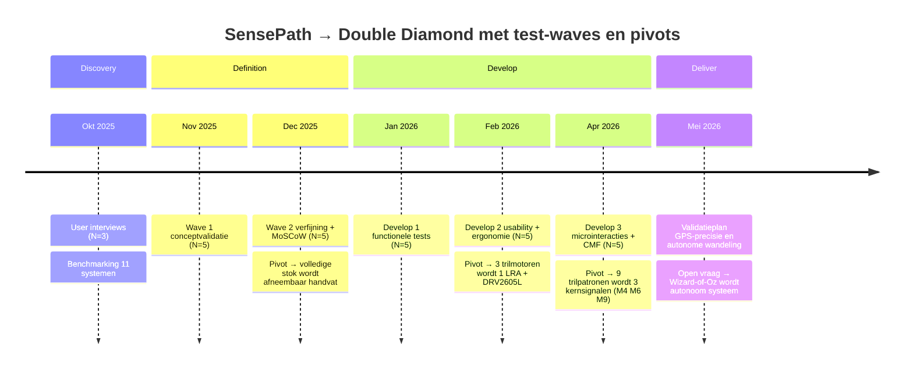

# SensePath
### Ear-free, intuitive navigation indoors

🛠️ Built by **Sam Piryns**, **Titus Impens**, **Han Deburchgraeve**  
🔥 Supervised by `prof. dr. Bas Baccarne`, `Yannick Christiaens` & `Wouter Devriese`  
🌱 Grown at `Ghent University` 🏛️ `Industrial Design Engineering` ([project overview](https://github.com/basbaccarne/human-centered-design))

*19/01/2026*

---

## Introductie

Mensen die blind of slechtziend zijn navigeren buitenshuis relatief goed met GPS, maar in grote publieke gebouwen (stations, ziekenhuizen, campussen) valt die ondersteuning weg. Vooral op kruispunten, splitsingen en bij tijdelijke omleidingen leidt dit tot twijfel, extra mentale belasting en afhankelijkheid van hulp van anderen.

We onderzochten dit via deskresearch en benchmarking van bestaande (indoor) navigatieoplossingen, en via user interviews en feedbackmomenten met gebruikers en organisaties uit de blinden- en mobiliteitswereld. Daaruit kwamen duidelijke noden naar voren: betrouwbare "decision support" op keuzemomenten, zo weinig mogelijk telefoongebruik tijdens het stappen, en discrete feedback die ook in publieke context bruikbaar is.

Onze oplossing is **SensePath**: een **tweedelige witte stok** die wij volledig als systeem leveren. Het onderstuk volgt de conventionele opbouw van bestaande witte stokken (gewicht, lengte, verwisselbare pin-tip), maar heeft bovenaan een **ingebedde M3-schroef** in het uiteinde. Daarop wordt ofwel een **tech-handvat** geschroefd dat de elektronica voor haptische navigatiebegeleiding bevat, ofwel een **gewone handgreep** voor wanneer de route gekend is. Op die manier behoudt de gebruiker volledig zijn bestaande stok-ervaring en voegt SensePath alleen toe wat nodig is op onbekende trajecten. Het tech-handvat is gekoppeld aan een eenvoudige app-workflow en vertaalt route-informatie naar haptische begeleiding op het juiste moment (bv. bij keuzes en bochten), zodat de gebruiker "hands-free, heads-up" kan blijven bewegen met de stok als primair hulpmiddel. Zo maakt SensePath indoor navigatie zelfstandiger, rustiger en betrouwbaarder.

  
   <em><strong>SensePath</strong> → ① tech-handvat met geïntegreerde elektronica en M3-insert, ② sferisch kompaselement in de handpalm voor continue richtingsfeedback, ③ conventionele witte stok met verwisselbare pin-tip, ④ ingebedde M3-schroef in het stok-uiteinde, koppelt het tech-handvat aan de stok en is dagelijks omwisselbaar voor een standaard handgreep.</em>

---

## Inhoudstafel

**Op deze pagina**

1. [Introductie](#introductie)
2. [Methodologie](#methodologie)
3. [Conclusie](#conclusie)
4. [Kritische reflectie](#kritische-reflectie)
5. [Noot inzake het gebruik van AI](#noot-inzake-het-gebruik-van-ai)
6. [Bijlagen](#bijlagen)
7. [Bronnen](#bronnen)
8. [Licentie](#licentie)

**Verdieping per fase** (Double Diamond)

| # | Fase | Pagina |
|---|---|---|
| 1 | Discovery | 📄 [docs/discovery.md](docs/discovery.md) |
| 2 | Definition | 📄 [docs/definition.md](docs/definition.md) |
| 3 | Design Requirements | 📄 [docs/design_requirements.md](docs/design_requirements.md) |
| 4 | Develop 1 → functionele verfijning | 📄 [docs/develop_1.md](docs/develop_1.md) |
| 5 | Develop 2 → usability & ergonomie | 📄 [docs/develop_2.md](docs/develop_2.md) |
| 6 | Develop 3 → UX, CMF & real-life validatie | 📄 [docs/develop_3_overzicht.md](docs/develop_3_overzicht.md) |
| 7 | Deliver → eindproduct & MVP-prototype | 📄 [docs/deliver.md](docs/deliver.md) |

---

## Methodologie

Dit project volgt de **Double Diamond** aanpak (Discover, Define, Develop, Deliver), met nadruk op gebruikersgericht ontwerpen en iteratieve validatie. De tijdslijn hieronder toont de fasen, test-waves met sample-grootte (N) en de drie kritische pivots die het ontwerp stuurden.

### Discovery (problem space)

In de discoveryfase werd de probleemruimte verkend via:

- **User interviews**: fricties, routines, copingstrategieën en contextfactoren identificeren (drukte, tijdelijke werken, knooppunten).
- **Deskresearch en benchmarking**: bestaande navigatie- en mobiliteitsoplossingen in kaart brengen en analyseren op feedbackmodaliteit, infrastructuurbehoefte, betrouwbaarheid en schaalbaarheid.

De resultaten werden samengebracht tot een probleemdefinitie, een eerste set **design requirements** en een initiële **PRD**. → 📄 [Volledige Discovery](docs/discovery.md)

### Definition (solution space)

In de definitionfase werd het concept getoetst en aangescherpt via **iteratief prototypen en testen** in twee waves:

- **Wave 1**: Vroege conceptvalidatie met low- tot mid-fidelity prototypes en Wizard-of-Oz scenario's. Focus op begrijpelijkheid, wenselijkheid en aanvaardbaarheid van de conceptrichting.
- **Wave 2**: Verfijning van interactie en feedback met nadruk op minimale smartphone-interactie, haptische feedback als primaire modaliteit, en een fail-safe workflow. Inclusief MoSCoW-prioritering en obstakeldetectie-observatietest.

→ 📄 [Volledige Definition](docs/definition.md)

### Develop (semester 2)

Technische uitwerking, interaction design, prototyping met oplopende fideliteit en usability testing in iteraties, verspreid over drie develop-iteraties. → 📄 [Develop 1](docs/develop_1.md) · [Develop 2](docs/develop_2.md) · [Develop 3](docs/develop_3_overzicht.md)

### Deliver (semester 2)

Finale validatie in realistische omgevingen, afronding prototype en documentatie. → 📄 [Volledige Deliver](docs/deliver.md)

📄 [Volledige methodologie](docs/methodologie.md)

---

## Conclusie

SensePath is een **tweedelige witte stok**: een conventioneel onderstuk met verwisselbare pin-tip en een **tech-handvat dat erop schroeft** via een M3-insert. Dezelfde schroefverbinding accepteert ook een gewone handgreep, zodat de gebruiker dagelijks kan kiezen tussen tech-grip (onbekende routes) en standaard-grip (gekende routes) zonder dat hij van stok hoeft te wisselen. Het tech-handvat vertaalt routebeslissingen naar discrete haptische signalen in de hand. Drie kerncomponenten dragen het concept: één trilmotor die drie onderscheidbare microinteracties (obstakel, koersafwijking, bocht-aankondiging) levert, een sferisch kompaselement in de laagste gleufpositie dat continue richting voelbaar maakt via een servo-aandrijving, en de modulaire schroefverbinding die het hele systeem omkeerbaar maakt.

Waarom dit het juiste antwoord is op het probleem uit Discovery, is geen kwestie van technologie maar van **positionering**. SensePath vervangt het stok-gebruik niet ; we behouden de conventionele stok-opbouw en voegen alleen toe wat nodig is. Het onderstuk blijft de primaire obstakeldetector, het tech-handvat levert wat de stok zelf niet kan: oriëntatie op keuzemomenten zonder dat het gehoor of de smartphone-aandacht ingezet moet worden in het default-gebruik. Een opt-in spraak-fallback (default uit) bestaat als noodvariant. Daarmee adresseert het ontwerp de drie pijnpunten die de Discovery-interviews scherp maakten: onzekerheid aan knooppunten, de wens om het gehoor vrij te houden in publieke context, en de minimale-telefoon-eis tijdens het stappen.

De keuzes die deze positionering dragen, zijn telkens empirisch onderbouwd: de evolutie van 3 motoren naar 1 trilmotor (Develop 2), de versmalde gleuf zodat het kompas in de handpalm blijft (Develop 2), de reductie van 9 naar 3 trilpatronen (Develop 3), de keuze voor TPE Shore 65A overmold (Develop 3 CMF-deepdive). Voor de eindvalidatie wordt het kompas via een mini-servo aangestuurd, die de doelrichting **draadloos** ontvangt van een **aparte controller-module** die de testleider bedient ; daarmee kan het geheel realistisch getest worden zonder dat eerst een autonoom GPS-systeem geïntegreerd moet zijn. Volledige onderbouwing in [docs/design_requirements.md](docs/design_requirements.md).

Het MVP-prototype bestaat uit **drie fysieke modules**: het stok-onderstuk, het tech-handvat dat erop schroeft, en een **aparte Wizard-of-Oz controller-module** (eigen XIAO ESP32-C3, batterij en KY-040 encoder) die draadloos via ESP-NOW met het handvat communiceert. Het rapport onderscheidt bewust **het beoogde eindproduct** (productie-vorm met hoog-nauwkeurige RTK GNSS via FLEPOS / WALCORS, smartphone-app, ToF-obstakeldetectie en productie-materialen) van **ons MVP-prototype** (academisch deliverable met PLA-print, aparte controller-module als Wizard-of-Oz vervanger voor GPS, en bewust geen obstakeldetectie). Beide niveaus en de vertaalstap ertussen worden uiteengezet in de [Deliver](docs/deliver.md)-sectie. Voor de open onderzoeksvragen en aanbevelingen voor vervolgwerk: zie [Kritische reflectie](#kritische-reflectie).

---

## Kritische reflectie

Dit project levert een prototype af dat zijn kerninteractie heeft gevalideerd, maar laat tegelijk vijf open vragen achter die mee bepalen hoe SensePath zich vanaf hier verder kan ontwikkelen. Per-fase reflecties staan binnen [Develop 1](docs/develop_1.md#kritische-reflectie-develop-1), [Develop 2](docs/develop_2.md#kritische-reflectie-develop-2) en [Develop 3](docs/develop_3_overzicht.md#kritische-reflectie-develop-3) ; deze synthese trekt ze samen tot aanbevelingen voor vervolgwerk.

**Sample-grootte en doelgroep-heterogeniteit**. De cumulatieve N over alle Develop-fasen blijft beperkt (Develop 1 N=5, Develop 2 N=5, Develop 3 N=3 blinde + N=2 geblinddoekte ziende controles). De convergentie tussen Mario en Herman op richtinginformatie-in-patroon is sterk, maar Jelle's tegengestelde voorkeur toont dat de doelgroep heterogeen is. Aanbeveling: een vervolgstudie met N=15 → 20 over verschillende leeftijdscategorieën en tech-affiniteitsniveaus om de instelbaarheids-vraag te kwantificeren.

**De Wizard-of-Oz ↔ autonoom systeem vertaling**. 90% van de gemeten fouten in Develop 1 was herleidbaar tot wizard-timing, niet tot gebruikersgedrag of feedbackkwaliteit. Onze test-instrumentatie zit daarmee tussen het ontwerp en de waarheid. Aanbeveling: de finale validatie moet plaatsvinden met een autonoom systeem (GPS- of opgenomen-route-gestuurd) zodat het foutpercentage de feedbackkwaliteit reflecteert in plaats van de wizard-snelheid.

**CMF-deepdive analytisch, niet empirisch**. De keuzes voor TPE Shore 65A overmold, fijne radiale ribbels, POM-knoppen en aluminium pin scoren hoog op weegtabellen onderbouwd met literatuur, maar werden niet als gecombineerd prototype getest met eindgebruikers. Aanbeveling: één-op-één fysieke variant 3D-printen in finale materialen en blind laten beoordelen door dezelfde testers, om de CMF-keuzes empirisch te bevestigen.

**Indoor-focus vs outdoor-robuustheid**. De huidige use case is indoor wayfinding, maar GPS-precisie is buiten de scope van Develop 3 niet getoetst en regen/handschoenen evenmin. Herman's winter-zorg ("ik vrees dat ons pinnetje in de winter niet voelbaar zal zijn") en zijn vraag over uur-plus wandelingen zijn onbewezen aannames. Aanbeveling: outdoor field-test in wisselende weersomstandigheden met sessies van minstens 45 minuten, plus een vervangbare pin-tip uit verschillende materialen (TPE-soft, TPE-hard, rubber).

**Stations als gerichte use-case**. Alle drie de blinde testers wezen spontaan op stations als doel-context. Dit suggereert dat een gerichte go-to-market (stations + ziekenhuizen + campussen) sterker is dan een algemene indoor-positionering. Deze pivot ligt buiten de academische scope van dit project maar verdient verkenning bij een eventuele product-vervolg-traject (VLAIO, RIZIV-terugbetaling, samenwerking NMBS-toegankelijkheid).

Deze vijf punten zijn niet beperkingen van het ontwerp, maar van de manier waarop we het tot nu hebben kunnen valideren. Ze definiëren mee de onderzoeksagenda voor wie dit project zou verderzetten.

---

## Noot inzake het gebruik van AI

Binnen dit project werden meerdere AI-tools ingezet als ondersteunend hulpmiddel:

- **Tekst en rapportage**: Claude (Anthropic) werd gebruikt om ruwe notities en onderzoeksdata te structureren tot leesbare paragrafen en om teksten taalkundig te verfijnen. De inhoudelijke keuzes, analyses en conclusies zijn steeds door het team zelf gemaakt.
- **Benchmarking en analyse**: AI werd ingezet om publiek beschikbare informatie samen te vatten, vergelijkingscriteria te structureren en eerste analyses te genereren. Alle bevindingen werden handmatig geverifieerd.
- **Storyboard**: Het script werd geschreven met Claude Code, image direction via ChatGPT (GPT-4o), en de uiteindelijke beeldgeneratie via NanoBanana (Gemini 3 Pro Image).
- **Codering**: Claude en Gemini werden gebruikt voor ondersteuning bij de ESP32-firmware en de Wizard-of-Oz controller-app.

AI werd **niet** ingezet voor het uitvoeren of analyseren van user interviews, het nemen van ontwerpbeslissingen, of het formuleren van design requirements. Deze zijn volledig gebaseerd op eigen gebruikersonderzoek en teamreflectie.

> *"All content in this document has been reviewed and approved by the author. AI tools were used solely to support text processing, coding, and image editing, not for generating research data or conclusions."*

---

## Bijlagen

### Verdieping per fase

| Fase | Pagina |
|---|---|
| Discovery | [docs/discovery.md](docs/discovery.md) |
| Definition | [docs/definition.md](docs/definition.md) |
| Design Requirements | [docs/design_requirements.md](docs/design_requirements.md) |
| Develop 1 | [docs/develop_1.md](docs/develop_1.md) |
| Develop 2 | [docs/develop_2.md](docs/develop_2.md) |
| Develop 3 (overzicht) | [docs/develop_3_overzicht.md](docs/develop_3_overzicht.md) |
| Develop 3 (UX & Service Design) | [docs/develop_3.md](docs/develop_3.md) |
| Deliver | [docs/deliver.md](docs/deliver.md) |
| Methodologie | [docs/methodologie.md](docs/methodologie.md) |

### Discovery

| Document | Link |
|---|---|
| Interview protocol | [Interview - protocol - SensePath.docx](reports%20and%20protocols/Interview%20-%20protocol%20-%20SensePath.docx) |
| Onderzoeksrapport interviews | [Onderzoeksrapport_user_interviews_SensePath.docx](reports%20and%20protocols/Onderzoeksrapport_user_interviews_SensePath.docx) |
| Benchmarking protocol | [Benchmarkingprotocol_SensePath.docx](reports%20and%20protocols/Benchmarkingprotocol_SensePath.docx) |
| Benchmarking rapport | [Benchmarkingrapport_SensePath.docx](reports%20and%20protocols/Benchmarkingrapport%20_SensePath.docx) |

### Definition

| Document | Link |
|---|---|
| Wave 1 → Protocol | [testprotocol_define_WAVE1.pdf](reports%20and%20protocols/testprotocol_define_WAVE1.pdf) |
| Wave 1 → Rapport | [Report_define_WAVE1.pdf](reports%20and%20protocols/Report_define_WAVE1.pdf) |
| Wave 2 → Protocol | [testprotocol_define_WAVE2.pdf](reports%20and%20protocols/testprotocol_define_WAVE2.pdf) |
| Wave 2 → Rapport | [Report wave 2.pdf](reports%20and%20protocols/Report%20wave%202.pdf) |

### Develop

| Document | Link |
|---|---|
| Develop 1 → Rapport | [Report_SensePath_Develop_1.pdf](reports%20and%20protocols/Report_SensePath_Devolop_1.pdf) |
| Develop 1 → Protocol | [protocol_sensepath_develop1.docx](reports%20and%20protocols/protocol_sensepath_develop1.docx) |
| Develop 2 → Protocol | [protocol_sensepath_develop2_PDF.pdf](reports%20and%20protocols/protocol_sensepath_develop2_PDF.pdf) |
| Develop 2 → Rapport | [Rapport_Dev2_PDF.pdf](reports%20and%20protocols/Rapport_Dev2_PDF.pdf) |
| Develop 3 → Protocol | [protocol_sensepath_develop3_PDF.pdf](reports%20and%20protocols/protocol_sensepath_develop3_PDF.pdf) |
| Develop 3 → Rapport | [rapport_sensepath_develop3.pdf](reports%20and%20protocols/rapport_sensepath_develop3.pdf) |
| Develop 3 → UX & Service Design uitwerking | [develop_3.md](docs/develop_3.md) |
| Develop 3 → Service Blueprint | [service_blueprint.png](docs/develop_3/img/service_blueprint.png) |
| Develop 3 → Customer Journey Map | [customer_journey.png](docs/develop_3/img/customer_journey.png) |
| Develop 3 → Stakeholder Map | [stakeholder_map.png](docs/develop_3/img/stakeholder_map.png) |
| Develop 3 → Norman's drie lagen | [norman_layers.png](docs/develop_3/norman_layers.png) |
| Develop 3 → Emotion Map | [emotion_map.png](docs/develop_3/emotion_map.png) |
| Develop 3 → Microinteractions overzicht | [microinteractions.png](docs/develop_3/microinteractions.png) |

### Deliver

| Document | Link |
|---|---|
| Bill of Materials | [docs/bom.md](docs/bom.md) |
| Schakelschema | [docs/wiring.md](docs/wiring.md) |
| Build guide | [docs/build_guide.md](docs/build_guide.md) |
| CAD-bestanden | [cad/](cad/) |
| CAD-exports (STL/STEP) | [cad/exports/](cad/exports/) |
| Firmware | [src/firmware/sensepath_esp32/](src/firmware/sensepath_esp32/) |

---

## Bronnen

- Liu, G., Yu, T., Yu, C., Xu, H., Xu, S., Yang, C., Wang, F., Mi, H., & Shi, Y. (2021). Tactile Compass: Enabling visually impaired people to follow a path with continuous directional feedback. *Proceedings of the 2021 CHI Conference on Human Factors in Computing Systems*. ACM. https://doi.org/10.1145/3411764.3445644
- Guerreiro, J., Ahmetovic, D., Sato, D., Kitani, K., & Asakawa, C. (2019). Airport accessibility and navigation assistance for people with visual impairments. *Proceedings of the 2019 CHI Conference on Human Factors in Computing Systems*, 1-14.
- Slade, P., Tambe, A., & Kochenderfer, M. J. (2021). Multimodal sensing and intuitive steering assistance improve navigation and mobility for people with impaired vision. *Science Robotics, 6*(59), eabg6594.
- Norman, D. A. (2013). *The Design of Everyday Things: Revised and Expanded Edition.* Basic Books.
- World Health Organization. (2023). *Blindness and vision impairment.* Geraadpleegd van https://www.who.int/news-room/fact-sheets/detail/blindness-and-visual-impairment
- Design Council. (2005). *The Double Diamond: A universally accepted depiction of the design process.* Geraadpleegd van https://www.designcouncil.org.uk/double-diamond
- Anthropic. (2026). Claude (Claude Opus 4.7) [Groot taalmodel]. https://claude.ai
- OpenAI. (2026). ChatGPT (GPT-4o) [Groot taalmodel]. https://chat.openai.com
- Google DeepMind. (2026). Nano Banana Pro (Gemini 3 Pro Image) [AI-beeldgeneratiemodel].

---

## Licentie

This repository contains both software and design materials created as part of an industrial design engineering project at Ghent University.

- **Software and code:** [MIT License](LICENSE-MIT)
- **Design, documentation, CAD, and media:** [CC BY 4.0 License](LICENSE)

You are free to reuse and build upon this work, both commercially and non-commercially, as long as proper attribution is given to the original authors.
