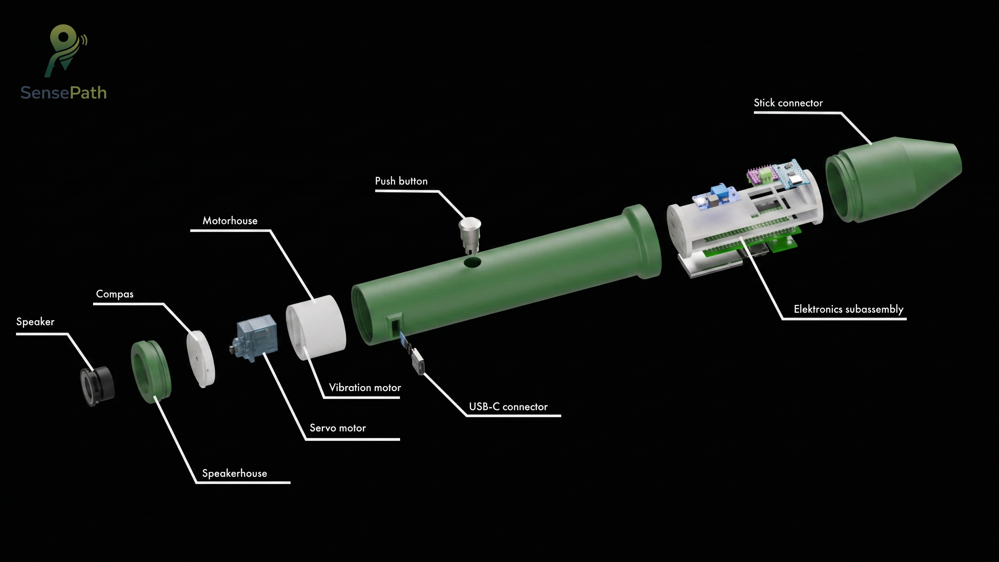

# SensePath → Deliver

[← Terug naar hoofdpagina](../README.md)

---

## Deliver

De Deliver-fase sluit de Double Diamond door alle inzichten uit Discovery, Definition en Develop 1 → 3 te bundelen tot een samenhangend ontwerp. Bewust onderscheiden we twee niveaus: **het beoogde eindproduct** (de definitieve vorm die SensePath in een real-world deployment zou hebben) en **ons prototype** (de MVP die we als academisch deliverable opleveren om de essentiële interacties te testen). De ontwerpredenen blijven dezelfde; wat verschilt is de scope van de implementatie.

### Het beoogde eindproduct

#### Wat SensePath in productie zou zijn

SensePath in zijn definitieve vorm is een **tweedelige witte stok**. Het onderstuk volgt de conventionele opbouw van bestaande witte stokken (gewicht, lengte-opties, verwisselbare pin-tip), maar heeft bovenaan een **3D-geprinte schroefdraad** op het uiteinde. Het **tech-handvat** heeft een matching mee-geprinte schroefdraad en wordt erop geschroefd. Dezelfde schroefverbinding accepteert ook een conventionele handgreep zonder elektronica, zodat de gebruiker dagelijks kan kiezen tussen tech-grip (onbekende routes) en standaard-grip (gekende routes) zonder dat hij van stok hoeft te wisselen.

In het tech-handvat zit een mechanisch kompaselement met sferisch contactoppervlak dat continue richting voelbaar maakt, aangedreven door een mini-servo en gestuurd door een hoog-nauwkeurige route-engine. Een geïntegreerde trilmotor levert drie haptische microsignalen op de cruciale beslismomenten (obstakel, koersafwijking, bocht-aankondiging). Een ingebouwde obstakeldetectie via ToF-sensoren op hoofd- en voethoogte vangt obstakels op die buiten het bereik van de stok vallen. Een smartphone-app via BLE verzorgt route-input en monitoring. Een interne accu met USB-C opladen maakt de unit autonoom inzetbaar, en een opt-in audio-fallback (speaker of Bluetooth-oortje) staat default uit voor reguliere gebruikers en kan worden ingeschakeld als noodvariant.

#### Hoog-nauwkeurige positionering via FLEPOS / WALCORS

De kerninteractie van SensePath, een continu meedraaiend mechanisch kompas, vereist een positionering binnen ~1 meter rond kruispunten en draaipunten. Standaard smartphone-GPS levert in stedelijke canyons 5 → 10 m foutmarge en is daarvoor onvoldoende. De productie-vorm gebruikt daarom **RTK GNSS-correcties** via de Belgische infrastructuur: **FLEPOS** (Flemish Positioning Service, beheerd door Digitaal Vlaanderen) in Vlaanderen en **WALCORS** in Wallonië. Beide netwerken leveren via NTRIP cm- tot sub-meter-precisie en worden vandaag al gebruikt voor surveying en autonoom rijden. Voor blinde mobiliteit zou een sociale-tarief-licentie (bv. via VLAIO of RIZIV-erkenning) de drempel kunnen wegnemen.

#### Architectuur van het eindproduct

  
   <em>Assembly-overzicht van het beoogde eindproduct: tech-handvat, kompasmechanisme en stok-onderstuk.</em>

**Hardware**
- 1× microcontroller met BLE 5.0 + WiFi (productie-equivalent van XIAO ESP32-S3)
- 1× Adafruit DRV2605L haptische motordriver (ADA2305)
- 1× LRA-trilmotor (200 Hz resonance, productie-grade)
- 1× MG90S-equivalente servo voor mechanisch kompas
- 1× sferisch kompaselement, laagste gleufpositie, vervangbare aluminium pin met optionele TPE-tip
- 2× ToF-sensoren (VL53L0X of vergelijkbaar) voor obstakeldetectie op hoofd- en voethoogte
- 1× drukknop + harde aan/uit-switch
- 1× speaker + I2S-versterker voor opt-in audio
- 1× Li-ion accu (1500-2500 mAh) met USB-C laadcircuit + battery management
- 1× MT3608-equivalente boost converter voor de 5 V rail (servo + audio-versterker)

**Behuizing**
- 3D-geprinte of injectie-geperste tech-handvat-core in PA6 unfilled
- TPE Shore 65A overmold met fijne radiale ribbels
- POM-knoppen met visueel-tactiele differentiatie
- Mee-geprinte schroefdraad in het tech-handvat voor de schroefverbinding met de stok
- Olijfgroen (olive green) tech-handvat, contrasterend met de witte stok die wit blijft (ISO 9999 + verkeerswetten)

**Stok-onderstuk**
- Conventioneel ontworpen lange witte stok in productie-grade aluminium of glasvezel
- 3D-geprinte schroefdraad op het top-uiteinde, conform de mee-geprinte schroefdraad in het tech-handvat
- Verwisselbare pin-tip aan het loop-uiteinde, exact zoals bij conventionele witte stokken
- Lengte-opties volgens antropometrie (D1.2)

**Software**
- BLE-app (iOS + Android) met VoiceOver / TalkBack voor route-input, monitoring, batterij-feedback
- Route-engine met FLEPOS / WALCORS NTRIP-correcties
- Drie haptische micropatronen (M4, M6, M9) via DRV2605L
- Servo-aansturing op basis van GPS-route + heading
- Battery feedback via M9-puls bij low-battery
- Opt-in audio-pipeline (default uit)
- Deep-sleep tussen pulses voor batterij-efficiëntie

#### Waarom dit het juiste eindproduct is

Drie principes dragen de productie-vorm:

1. **Conventionele stok-ervaring blijft de basis** ; het onderstuk volgt de bestaande witte-stok-conventie (gewicht, lengte, verwisselbare tip) en blijft primaire obstakeldetector. SensePath voegt via de schroef-modulariteit alleen toe wat nodig is op onbekende routes en vangt via ToF-sensoren obstakels op die buiten het stok-bereik vallen.
2. **Hands-free, heads-up, ear-by-default-free** ; geen smartphone-aandacht tijdens het stappen, geen audio in default-modus.
3. **Minimale cognitive load** ; één tactiel aandachtspunt voor continue feedback, drie maximaal onderscheidbare event-signalen.

Volledige onderbouwing in [design_requirements.md](design_requirements.md).

### Ons prototype → MVP voor academische deliverable

  
   <em>Productfoto van ons MVP-prototype: tech-handvat op de witte stok.</em>

Wat we werkelijk gebouwd hebben, ligt bewust onder de productie-scope. Een academisch project van één semester moet de **essentiële design-hypothesen** kunnen testen, niet het volledige product realiseren. Onze prototype-keuzes weerspiegelen die scope-beperking, met telkens een verantwoording voor de versimpeling.

#### Drie fysieke modules

Het MVP-prototype is opgesplitst in drie afzonderlijke onderdelen:

1. **Stok-onderstuk** ; conventionele lange witte stok waarop we bovenaan een **3D-geprint draadstuk vast hebben geïntegreerd**. De pin-tip aan het loop-uiteinde blijft verwisselbaar zoals bij elke commerciële witte stok.
2. **Tech-handvat** ; schroeft via een mee-geprinte schroefdraad op het stok-onderstuk. Bevat alle handvat-elektronica (zie hieronder).
3. **Wizard-of-Oz controller-module** ; fysiek apart, draadloos via ESP-NOW gekoppeld aan het handvat. Bevat een XIAO ESP32-C3, KY-040 encoder, eigen batterij en oplaadkanaal.

#### Hardware-realisatie tech-handvat

  
   <em>Elektronica-assembly van het tech-handvat: XIAO ESP32-S3, DRV2605L, coin vibratiemotor, MG90S servo, MAX98357A audio-amp, MT3608 boost en Li-Po.</em>

- **3D-print in PLA** in plaats van PA6 + TPE-overmold ; sneller iteratie en lagere kost. De vormfactor en grip-textuur zijn behouden, alleen de materiaal-feel verschilt. CMF-keuzes zijn onderbouwd in Develop 3 maar niet als gecombineerd prototype getest.
- **XIAO ESP32-S3** als microcontroller, ontvangt richting-updates via ESP-NOW van de controller-module.
- **Adafruit DRV2605L haptische motordriver** (ADA2305) ; I2C-gekoppeld aan de XIAO, bevat 123 ingebouwde haptische effecten en stuurt de coin vibratiemotor aan in ERM-modus.
- **Coin vibratiemotor** in plaats van LRA ; goedkoper en breder beschikbaar. Wordt aangedreven door dezelfde DRV2605L (in ERM-modus); de drie haptische microsignalen blijven herkenbaar.
- **MG90S mini-servo** voor aansturing van het mechanisch kompas. Identiek aan de productie-vision.
- **Geen obstakeldetectie** in het prototype. Methodische keuze: het stok-onderstuk blijft de primaire detector, en het toevoegen van ToF-sensors zou een confounding variabele introduceren in de haptische-navigatie-tests die we willen doen. Voor productie is obstakeldetectie volwaardig opgenomen (D2.5 + D2.6).
- **Speaker + MAX98357A I2S-versterker** voor opt-in audio-fallback (default uit via SD-pin door XIAO D10 gegated; MT3608 boost staat altijd aan voor de servo, en SD-pin laag houdt enkel de audio-amp in stand-by).
- **HOTUT IP67 metalen drukknop** met dubbele rol: short-press = start/stop route, double-press = "geef overzicht", long-press (≥3 s) = XIAO gaat in deep-sleep ("uit"-stand), druk uit deep-sleep = wake via EXT0 op RTC-GPIO 4. Geen rocker-switch op het handvat (physical-design constraint in de cap-geometrie); deep-sleep "off" trekt nog ~10 mA quiescent (~4 dagen autonomie in opslag).
- **Interne Li-Po 1000 mAh** + **TP4056 USB-C laadcircuit** ; aparte USB-C laad-poort, firmware-flashen via de eigen USB-C poort van de XIAO.
- **MT3608 boost converter** ; verzorgt de 5 V rail voor de servo en de audio-versterker (staat altijd aan; de audio-amp wordt apart via zijn SD-pin in stand-by gezet).

#### Hardware-realisatie Wizard-of-Oz controller (aparte module)

  
   <em>De aparte Wizard-of-Oz controller-module: XIAO ESP32-C3 + KY-040 encoder in een 3D-geprinte PLA-behuizing, draadloos via ESP-NOW gekoppeld aan het handvat.</em>

- **XIAO ESP32-C3** als microcontroller, eigen firmware. Verstuurt encoder-deltas via ESP-NOW naar het handvat.
- **KY-040 roterende encoder** met geïntegreerde drukknop. De testleider draait de encoder; elke positie-update gaat draadloos naar het handvat dat op zijn beurt de servo aanstuurt.
- **Eigen Li-Po 1000 mAh + TP4056 USB-C laadcircuit + rocker-switch + USB-C laad-poort** ; identieke voedingsschema als het handvat, zonder MT3608 (geen audio nodig op de controller).
- **3D-print PLA case** (~60 × 40 × 25 mm) met encoder bovenaan en switch + USB-C op de zijkant.

Daarmee voelt de testleider mechanische rotatie alsof hij een echte stuurinterface in handen heeft, en is de bridge naar een toekomstig autonoom GPS-systeem cleaner gedefinieerd: de wijziging zit niet in het handvat zelf maar in wie/wat de richtingsdata genereert (controller-encoder vs GPS-engine).

#### Waarom dit voldoende is om de essentiële interacties te valideren

Het prototype test wat het ontwerp daadwerkelijk uniek maakt: de combinatie van een mechanisch kompas in de handpalm met drie discrete haptische signalen op beslismomenten, in samenspel met het stok-onderstuk via de modulaire schroefverbinding. De Wizard-of-Oz controller-module simuleert de toekomstige autonome richtingsbron zonder dat we eerst RTK GNSS hoeven te integreren. De stappen die het prototype overslaat (RTK GNSS-pipeline, productie-materialen, obstakeldetectie, BLE-app) zijn onafhankelijke engineering-uitdagingen die het ontwerp niet veranderen ; alleen de implementatie ervan opschalen naar productie-niveau.

#### Reproduceerbaarheid van het prototype

| Document | Inhoud |
|---|---|
| [bom.md](bom.md) | BOM voor de drie modules (handvat, controller, stok-onderstuk) met productlinks en prijs |
| [wiring.md](wiring.md) | Schakelschema per module + ESP-NOW link + power budget |
| [build_guide.md](build_guide.md) | Stap-voor-stap bouwinstructies (handvat + controller + integratie-test) |
| [Project context/sensepath_wiring_schematic.html](../Project%20context/sensepath_wiring_schematic.html) | Visueel wiring-schema in browser, met beide modules en de draadloze link |
| [cad/](../cad/) | CAD-bronbestanden Siemens NX, het volledige 3D-model van het handvat [Finaal Prototype.stp](../cad/Finaal%20Prototype.stp) (STEP), en STL-exports per onderdeel in [cad/exports/](../cad/exports/) |
| [docs/software.md](software.md) | Software-architectuur: handvat-firmware, controller-firmware en telefoon-app |
| [src/firmware/handle/main.cpp](../src/firmware/handle/main.cpp) | Firmware van het handvat (ESP32-S3): servo-kompas, haptiek, audio en webserver |
| [src/firmware/controller/main.cpp](../src/firmware/controller/main.cpp) | Firmware van de Wizard-of-Oz controller (ESP32-C3): encoder + afslagknop via ESP-NOW |
| [src/app/](../src/app/) | Toegankelijke telefoon-app (browser) voor bestemming, navigatie, live kompas en instellingen |

### Vertaalstap → prototype tegenover eindproduct

Voor elke ontwerpbeslissing maakt de tabel hieronder helder wat **design** is (blijft constant tussen prototype en eindproduct) en wat **scope-keuze** is (verschilt tussen beide).

| Inzicht uit onderzoek | Keuze in eindproduct | Realisatie in ons prototype |
|---|---|---|
| Modulariteit zonder afstand te doen van conventionele stok-ervaring | Tweedelige witte stok: conventioneel onderstuk + 3D-geprinte schroefdraad + tech-handvat (of standaard handgreep) met matching schroefdraad | Conventionele witte stok met 3D-geprint draadstuk + PLA tech-handvat met mee-geprinte schroefdraad (zelfde mechanisch principe) |
| Continue koersfeedback in handpalm | Mechanisch kompas, servo-aangedreven, gestuurd door RTK GNSS-route uit smartphone-app | Mechanisch kompas, servo-aangedreven, gestuurd door een **aparte controller-module** (XIAO ESP32-C3 + KY-040 encoder) die draadloos via ESP-NOW met het handvat verbonden is |
| Sferisch contactoppervlak in laagste gleufpositie | Identiek | Identiek |
| 1 trilmotor + DRV2605L met 3 microinteracties | LRA + DRV2605L (cleaner onset/offset) | Coin vibratiemotor + DRV2605L (zelfde driver, ERM-actuator om kost) |
| 3 kernsignalen M4 / M6 / M9 | Identiek | Identiek |
| PA6 unfilled core + TPE Shore 65A overmold + fijne radiale ribbels | Productie-materialen, injectie-geperst | PLA 3D-print zonder overmold (vorm + textuur identiek, materiaal-feel anders) |
| Hoog-nauwkeurige positionering | RTK GNSS via FLEPOS / WALCORS infrastructuur | Niet aanwezig ; vervangen door encoder-aansturing |
| Smartphone-app voor route-input | Native iOS / Android met VoiceOver / TalkBack | Niet aanwezig ; testleider neemt rol over via fysieke encoder op de aparte controller-module |
| Geïntegreerde obstakeldetectie (D2.5 + D2.6) | ToF-sensoren op hoofd- en voethoogte | Niet in prototype; methodische keuze om confounding te vermijden |
| Battery management + low-power modes | Productie-firmware met deep-sleep, batterij-feedback via M9 | Basisuitvoering: deep-sleep tussen pulses; geen battery-feedback aan gebruiker |
| BLE 5.0 link | Native gekoppeld aan smartphone-app | Hardware aanwezig (XIAO ESP32-S3), nog niet geïmplementeerd in firmware |
| Opt-in audio-fallback | Speaker of Bluetooth-oortje | Speaker + MAX98357A in het handvat, default uit |
| Bediening: 1 drukknop + harde aan/uit | POM-knop met visueel-tactiele differentiatie (CMF Develop 3) + soft-latch power-circuit (smartphone-style) | HOTUT IP67 metalen drukknop met dubbele rol via firmware (short = functie, long = deep-sleep) ; geen aparte rocker omwille van cap-geometrie. Trade-off: ~10 mA quiescent in "uit"-stand i.p.v. echte 0 mA |
| Voeding | Li-ion (1500 → 2500 mAh) + custom PCB met USB-C | Per module: Li-Po 1000 mAh + TP4056 USB-C laad-poort (apart laden van handvat en controller) |
| Wizard-of-Oz aansturing tijdens testen | n.v.t. (in productie GPS-autonoom) | Aparte controller-module: XIAO ESP32-C3 + KY-040 encoder + eigen batterij, ESP-NOW link met het handvat |
| Vervangbare aluminium pin met optionele TPE-tip | Productie-pin + TPE-tip set | Aluminium pin (TPE-tip nog niet gefabriceerd) |
| Witte stok blijft wit, contrast-handvat | Olijfgroen (olive green), contrasterend met de witte stok, ISO 9999 conform | PLA in olijfgroen (olive green) |

Zie [design_requirements.md](design_requirements.md) voor de formele requirement-mapping.

### Finale validatie van het prototype

Drie tests bepalen of het prototype zijn doel haalt: aantonen dat het feedback-circuit werkt onder real-life condities. De **aparte Wizard-of-Oz controller-module** (XIAO ESP32-C3 + KY-040 encoder + ESP-NOW link met het handvat) maakt deze tests mogelijk zonder eerst een GPS-pipeline te moeten bouwen.

1. **Geïntegreerde wandeling met stok + handvat + microsignalen + kompas.** Tot nu toe werd het handvat los van de stok getest. Eindtest: de gebruiker stapt een onbekende route met de stok-tikken én het haptisch kompas in de handpalm én de drie microsignalen via de coin motor, terwijl de testleider de controller-module bedient en zo de richting bijstuurt. Vraag: kan de gebruiker alle drie de inputs parallel verwerken op natuurlijke wandelsnelheid?
2. **Indoor-validatie in een station.** Alle drie de blinde testers wezen spontaan op stations als doel-context. De huidige tests vonden plaats in residentiële omgevingen. Open: kan het systeem bij metro-style ruisniveau bruikbaar blijven, en blijft het haptisch kompas onderscheidbaar wanneer omgevingsgeluid de oren al belast?
3. **Cognitive load over een volledige wandeling.** Onze huidige tests waren 5 → 15 minuten. Open: kan de gebruiker 45+ minuten lang de hand-aandacht volhouden zonder dat de microsignalen of het kompas in de achtergrond verdwijnen?

Wat deze drie tests gemeen hebben, is dat ze de **integratie van alle inzichten samen onder real-life condities** meten, niet de individuele ontwerpkeuzes (die zijn al onderbouwd in Develop 1 → 3).

### Wat open blijft voor het beoogde eindproduct

Niet getest in dit project, vereist voor productie-deployment:

- **RTK GNSS-pipeline**: subscription en NTRIP-koppeling met FLEPOS / WALCORS, route-engine in smartphone-app, fail-over wanneer correcties uitvallen.
- **Obstakeldetectie**: keuze ToF vs ultrasoon, sensor-positionering, integratie met haptische taal (eventueel een nieuwe microinteractie M11/M12).
- **Productie-materialen**: overstap PLA → PA6 + TPE-overmold, herhalen CMF-tests met finale materialen.
- **BLE-app**: iOS / Android implementatie, koppeling met VoiceOver / TalkBack, route-input + monitoring.
- **Battery management**: low-power modes, batterij-feedback aan gebruiker via M9, langere autonomie (1500 → 2500 mAh).
- **Certificering**: ISO 9999 + nationale verkeerswetten + medische hulpmiddel-classificatie indien van toepassing.
- **Business case**: subsidie-traject (VLAIO, RIZIV), distributiemodel via Licht en Liefde / Brailleliga, sociale tariefkans op FLEPOS / WALCORS-licentie.

De vijf overkoepelende open onderzoeksvragen staan in de [Kritische reflectie](../README.md#kritische-reflectie).

---

[← Terug naar hoofdpagina](../README.md)
