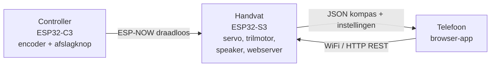
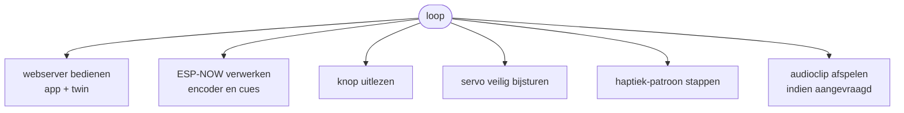
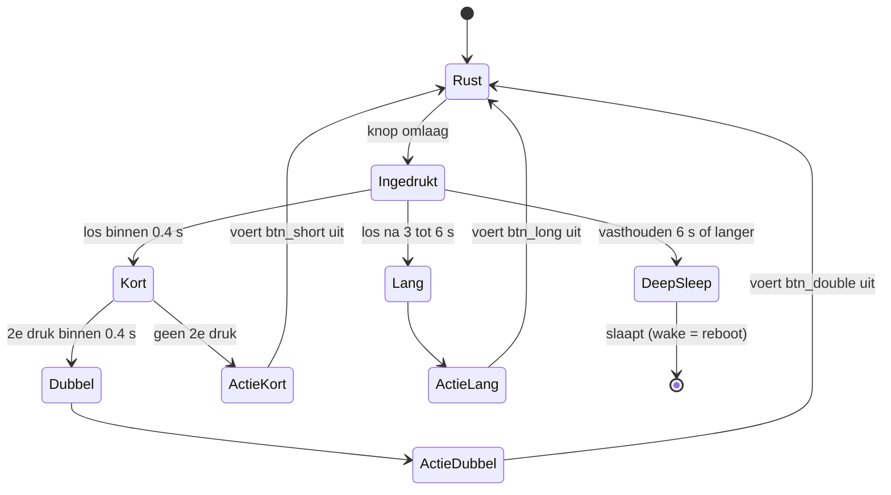
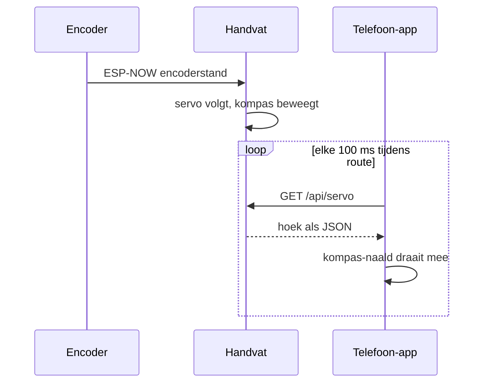
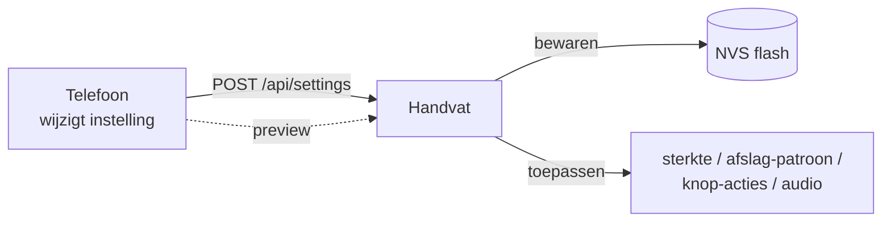

# Software-architectuur (SensePath)

Dit document beschrijft de **software-laag** van het SensePath-prototype: de
firmware van het handvat en de controller, en de telefoon-app. Voor de fysieke
bedrading en onderdelen, zie [bom.md](bom.md), [build_guide.md](build_guide.md)
en [wiring.md](wiring.md). De broncode staat in [`src/`](../src/).

> SensePath is een Wizard-of-Oz-prototype: de navigatie wordt nog door een
> begeleider/app gestuurd in plaats van door echte indoor-positionering. De
> software is zo gebouwd dat de gebruikerservaring (haptiek, kompas, audio,
> bediening) volledig echt aanvoelt.

---

## 1. Systeemoverzicht: drie apparaten

SensePath bestaat uit drie apparaten die samenwerken. Het **handvat** is het
centrale knooppunt: het stuurt de fysieke feedback aan én serveert de app.



| Apparaat | Chip | Rol |
|---|---|---|
| **Handvat** | XIAO ESP32-S3 | Servo-kompas, trilmotor (haptiek), speaker (audio), WiFi-webserver die de app serveert |
| **Controller** | XIAO ESP32-C3 | Leest de rotary-encoder (richting) en de afslagknop; stuurt draadloos naar het handvat |
| **Telefoon** | (browser) | Toegankelijke app: bestemming zoeken, navigatie, live kompas, instellingen |

---

## 2. Het handvat (firmware, ESP32-S3)

Bestand: [`src/firmware/handle/main.cpp`](../src/firmware/handle/main.cpp).
Dit is het hart van het systeem. Het combineert vijf taken in één non-blocking
hoofdlus:



**Belangrijkste onderdelen**

- **Servo-kompas** - vertaalt de encoderstand naar een hoek. De servo is
  gekalibreerd (begrensd µs-bereik) en heeft drie beveiligingen tegen
  oververhitting: auto-loskoppelen bij stilstand, een watchdog, en slew-rate
  -begrenzing (nooit springen).
- **Haptiek-engine** - speelt instelbare trilpatronen via de DRV2605L-driver.
  Werkt met realtime-aansturing zodat de coin-motor lange, voelbare pulsen geeft.
  De **sterkte-instelling** schaalt elke trilling.
- **Audio** - speelt ingebedde spraakclips (ETA, locatie) via I2S naar de speaker.
- **Webserver** - serveert de telefoon-app en de `/api/`-endpoints (zie §5).
- **Deep-sleep** - zet het toestel volledig uit (ook WiFi); wekken gebeurt met de
  knop en is een volledige herstart.

### Knop-gedrag (state machine)

De fysieke knop op het handvat herkent vier soorten druk. Wat elke druk doet, is
**instelbaar via de app** (zie §6); deep-sleep bij lang vasthouden blijft altijd
als veilige noodgreep bestaan.



---

## 3. De controller (firmware, ESP32-C3)

Bestand: [`src/firmware/controller/main.cpp`](../src/firmware/controller/main.cpp).
Een eenvoudig, robuust apparaat zonder eigen scherm of webserver:

- **Rotary-encoder** - bepaalt de richting/heading; via een transitietabel
  bounce-vrij uitgelezen.
- **Afslagknop** - 1 keer klikken = afslag rechts, 2 keer klikken = afslag links.
- **ESP-NOW-zender** - stuurt ~50x per seconde de encoderstand en eventuele
  afslag-cue naar het handvat.

De controller joint enkel de WiFi (zelfde netwerk als het handvat) om op het
juiste ESP-NOW-kanaal te komen; hij host verder niets.

---

## 4. De telefoon-app

Bron: [`src/app/index.html`](../src/app/index.html) (zie ook
[`src/app/README.md`](../src/app/README.md)). Eén HTML/CSS/JS-bestand dat het
handvat als web-app serveert - geen installatie nodig.

- **Toegankelijkheid-first** (het kernontwerp voor blinde gebruikers):
  - 1 tik = label voorlezen
  - 2 tikken = activeren
  - lang indrukken = hint
  - two-finger-swipe omhoog = hele scherm voorlezen
  - alle spraak via de Web Speech API (`nl-NL`)
- **Bestemming zoeken** via Google Maps (autocomplete, looproute, GPS-voortgang).
- **Digital twin** - een SVG-kompasnaald die live meedraait met de fysieke servo.
- **Instellingen** die het handvat aansturen (§6).

De app draait als een gewoon `index.html`-bestand. Voor de firmware wordt het
omgezet naar een C-string (`handle/webapp.h`) met
[`tools/html2header.py`](../src/firmware/tools/html2header.py); je kunt de app
ook los op je laptop testen met `src/app/mock_server.py`.

---

## 5. Communicatie

### 5.1 Controller -> handvat: ESP-NOW

ESP-NOW is een lichte, draadloze peer-to-peer-verbinding (geen router nodig voor
de link zelf). De controller stuurt de encoderstand; het handvat laat de servo
volgen. Cues (afslag links/rechts) gaan mee als een ophogend `cueId`, zodat een
verloren pakket niet leidt tot een gemiste of dubbele trilling.

### 5.2 Telefoon <-> handvat: WiFi + HTTP REST

De app praat met het handvat over gewone HTTP. De twee belangrijkste stromen:



**Endpoints op het handvat** (poort 80):

| Methode | Pad | Doel |
|---|---|---|
| GET | `/` | de app (HTML) |
| GET/POST | `/api/settings` | instellingen lezen / opslaan (NVS) |
| POST | `/api/settings/reset` | terug naar default |
| GET | `/api/servo` | huidige kompashoek (digital twin) |
| GET | `/api/pending` | knop-events ophalen (consume-on-read) |
| POST | `/api/trigger-effect` | trilling/sterkte-preview |
| POST | `/api/turn-preview` | afslag-patroon-preview |
| GET/POST | `/api/destinations`, `/api/route/start|stop`, `/api/state` | route/bestemmingen |

### 5.3 WiFi-presets en vindbaarheid

Beide ESP's proberen een **lijst voorkeursnetwerken** (presets, in `secrets.h`)
van boven naar beneden en verbinden met het eerste dat bereikbaar is. Zo werkt
het systeem op meerdere netwerken (bv. een telefoon-hotspot of de atelier-router)
zonder herflashen. Lukt geen enkel netwerk, dan opent het handvat zijn eigen
toegangspunt `SensePath` (de twin blijft werken, geen internet).

Belangrijk: beide ESP's moeten **dezelfde presetlijst** hebben, zodat ze op
hetzelfde WiFi-kanaal komen - ESP-NOW vereist dat. Het handvat is op het netwerk
bereikbaar via **mDNS** als `http://sensepath.local/`.

> Alleen 2,4 GHz (ESP32 kan geen 5 GHz). iPhone-hotspot: "Maximaliseer
> compatibiliteit" aanzetten.

---

## 6. Instellingen sturen het handvat aan

Elke wijziging in de app wordt als JSON naar het handvat gestuurd, daar
**persistent opgeslagen** (NVS-flash) en meteen toegepast.



| Instelling | Effect op het handvat |
|---|---|
| **Sterkte** (laag/medium/hoog) | schaalt elke trilling (medium = standaard) |
| **Afslag rechts / links** | kies per richting een trilpatroon (1/2/3 trillingen, lang, ...) |
| **Korte / dubbele / lange druk** | wat de fysieke knop doet (spraak via speaker, noodhulp, slaapstand, ...) |
| **Audio** | poort voor de spraakclips op het handvat |
| **Noodcontact** | nummer dat de app belt bij de noodhulp-actie |

De spraak-acties van de knop komen **uit de speaker van het handvat** (clips),
niet via de telefoon. Bij het wisselen van een trilling-instelling speelt het
handvat meteen een **preview**, zodat je voelt wat je kiest.

---

## 7. Bestandsstructuur

```
src/
├── app/                      ← de telefoon-app
│   ├── index.html               de app (bewerk dit)
│   ├── mock_server.py           laptop-test zonder hardware
│   └── README.md
└── firmware/
    ├── handle/               ← handvat (ESP32-S3)
    │   ├── main.cpp
    │   ├── webapp.h             (auto-gegenereerd uit ../../app/index.html)
    │   ├── audio_clips.h        (auto-gegenereerd uit de WAV's)
    │   └── audio/
    ├── controller/           ← controller (ESP32-C3)
    │   └── main.cpp
    ├── shared/
    │   └── protocol.h          gedeeld ESP-NOW-berichtformaat
    ├── tools/
    │   ├── html2header.py       index.html  -> webapp.h
    │   └── wav2header.py        WAV-bestanden -> audio_clips.h
    └── platformio.ini          build-configuratie
```

> `secrets.h` (WiFi-wachtwoorden + Google-key) staat in elk firmware-onderdeel,
> is **gitignored** en wordt nooit meegecommit. Gebruik `secrets.h.example` als
> sjabloon.

---

## 8. Bouwen en flashen

Gebouwd met [PlatformIO](https://platformio.org/). Vanuit `src/firmware/`:

```bash
# Handvat (ESP32-S3) via USB flashen
pio run -e handle_usb -t upload

# Controller (ESP32-C3) via USB flashen
pio run -e controller_usb -t upload

# App gewijzigd? Eerst webapp.h opnieuw genereren:
python tools/html2header.py
```

De app los testen op de laptop (zonder hardware):

```bash
cd src/app && python mock_server.py     # http://localhost:8080/
```

---

## 9. Wat nog open is voor het eindproduct

- **Echte indoor-navigatie** in plaats van Wizard-of-Oz-aansturing.
- **Dynamische spraak** op het handvat (nu vaste opgenomen clips).
- **Native app** voor o.a. direct bellen zonder systeem-bevestiging (een web-app
  mag op iOS niet ongevraagd bellen).
- **Stroombeheer / batterij-indicatie** voor langdurig gebruik.
