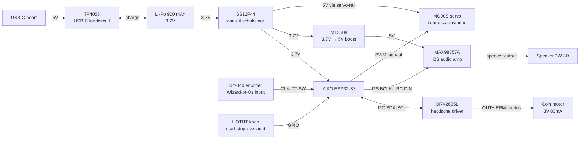
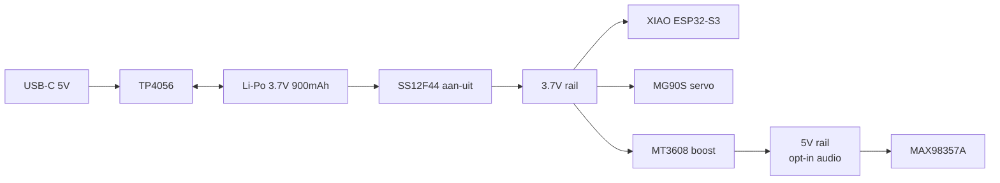

# Schakelschema → SensePath MVP-prototype

> Documentatie van **ons MVP-prototype**, niet van het beoogde eindproduct. De productie-vorm zou onder andere RTK GNSS-ontvangst, BLE-app-koppeling en ToF-obstakeldetectie toevoegen ; zie de [Deliver-sectie in de hoofdrapportage](../README.md#deliver) voor de vertaalstap.

Dit document beschrijft hoe de elektronica in het MVP-prototype onderling verbonden is. Het is bedoeld om een externe bouwer toe te laten het systeem te reproduceren zonder reverse-engineering. Zie [bom.md](bom.md) voor de stuklijst en [build_guide.md](build_guide.md) voor de bouwvolgorde.

---

## Architectuur

De XIAO ESP32-S3 is de centrale knoop. Drie subsystemen hangen eraan: het **haptische kanaal** (DRV2605L → coin vibration motor), het **mechanisch kompas** (servo, aangestuurd via PWM) en de **opt-in audio-fallback** (I2S → MAX98357A → speaker, alleen actief op gebruikersverzoek). De **KY-040 roterende encoder** is de Wizard-of-Oz controller: de testleider draait de encoder; de XIAO leest dit uit en stuurt de servo aan, die op zijn beurt het mechanische kompas in de hand van de gebruiker draait. De hele keten testleider → encoder → XIAO → servo → kompasbol staat in voor de bridge-functionaliteit tussen het Wizard-of-Oz prototype en een toekomstig autonoom GPS-systeem.

---

## Pinout-tabel (XIAO ESP32-S3)

| Functie | XIAO pin | Naar | Opmerking |
|---|---|---|---|
| 5V in | 5V-pad onderzijde | TP4056 BAT+ via SS12F44 | Voeding na schakelaar |
| 3V3 uit | 3V3 | DRV2605L Vin, KY-040 Vcc, HOTUT pull-up | Voor 3.3 V logic peripherals |
| GND | GND | Gemeenschappelijke massa | Alle modules delen één GND-bus |
| I2C SDA | D4 (GPIO 5) | DRV2605L SDA | I2C-pull-ups geïntegreerd op breakout |
| I2C SCL | D5 (GPIO 6) | DRV2605L SCL | Idem |
| Encoder CLK | D0 (GPIO 1) | KY-040 CLK (A) | Interrupt-capable input |
| Encoder DT | D1 (GPIO 2) | KY-040 DT (B) | Tweede kanaal voor rotatie-richting |
| Encoder SW | D2 (GPIO 3) | KY-040 SW (drukknop) | Push-bevestiging, interne pull-up |
| Drukknop | D3 (GPIO 4) | HOTUT knop signaal | Interne pull-up, sluit naar GND |
| Servo PWM | D9 (GPIO 8) | MG90S signaal-pin (oranje) | 50 Hz PWM, 1-2 ms duty |
| I2S BCLK | D6 (GPIO 43) | MAX98357A BCLK | Bit clock voor audio |
| I2S LRC | D7 (GPIO 44) | MAX98357A LRC | Left-right clock |
| I2S DIN | D8 (GPIO 7) | MAX98357A DIN | Data input |
| Servo + | 5V rail | MG90S V+ (rood) | Direct van Li-Po via SS12F44 (servo verdraagt 3.7-6V) |
| Audio amp + | 5V rail (uit boost) | MAX98357A Vin | Boost wordt ingeschakeld bij audio-fallback actief |

---

## Voeding-architectuur

Drie rails: één **3.7 V rail** rechtstreeks van de Li-Po die de XIAO en de servo voedt; één **5 V rail** uit de MT3608 boost converter die alleen actief is wanneer de audio-fallback wordt ingeschakeld (de boost converter kan via een GPIO-enable signal of via een tweede SS-schakelaar bestuurd worden); en het **USB-C laadkanaal** via de TP4056. De XIAO ESP32-S3 heeft een onboard Li-Po laadcircuit met BAT-pads aan de onderzijde, wat een redundante laadweg geeft via de USB-data poort.

---

## I2C-bus

| Eigenschap | Waarde |
|---|---|
| Bus-spanning | 3.3 V |
| Snelheid | 100 kHz standaard (Wire library default) |
| Adres DRV2605L | 0x5A (factory default) |
| Pull-up weerstanden | 4.7 kΩ → geïntegreerd op Adafruit-breakout |

Geen multiplexing nodig: DRV2605L is het enige I2C-device op de bus.

---

## I2S audio-bus (opt-in)

| Signaal | Functie |
|---|---|
| BCLK | Bit clock, gegenereerd door XIAO |
| LRC (WS) | Word select / Left-Right clock |
| DIN | Data input naar amplifier |
| GND | Gemeenschappelijke massa |
| Vin (5V) | Via MT3608 boost |

De MAX98357A heeft geen master-volume input; volume wordt softwarematig geregeld op de XIAO. Standby-modus (SD-pin naar GND) zet de versterker uit ; gebruikt om stroom te besparen wanneer audio-fallback niet actief is.

---

## PWM-signaal voor servo

| Eigenschap | Waarde |
|---|---|
| Frequentie | 50 Hz (standaard servo-protocol) |
| Pulsduur 0° | ~1 ms |
| Pulsduur 90° | ~1.5 ms |
| Pulsduur 180° | ~2 ms |
| Mapping in code | encoder-positie 0-127 → servo-hoek 0-180° |

De MG90S verbruikt ~150-300 mA tijdens snelle beweging; in stilstand 5-10 mA. Bij intensief gebruik kan dit een merkbare batterijbelasting zijn ; in de power budget hieronder is dat verrekend.

---

## Power budget

| Component | Idle | Actief | Piek |
|---|---|---|---|
| XIAO ESP32-S3 (WiFi AP actief) | ~30 mA | ~80 mA | 240 mA tijdens transmit |
| XIAO ESP32-S3 (deep sleep) | ~14 µA | → | → |
| DRV2605L (idle) | ~2 mA | ~6 mA | → |
| Coin vibration motor | 0 mA | ~80 mA (continu) | ~120 mA piek |
| MG90S servo | ~5 mA | ~150 mA (bewegend) | ~300 mA piek |
| MAX98357A + speaker (idle) | ~0 mA (SD low) | → | → |
| MAX98357A + speaker (audio actief) | ~50 mA | ~250 mA | ~500 mA piek bij 3 W |
| KY-040 encoder | 0 mA (passief) | → | → |
| HOTUT knop | 0 mA (passief, interne pull-up) | → | → |
| **Totaal in typische Wizard-of-Oz sessie (audio uit)** | **~40 mA** | **~270 mA** | **~550 mA piek** |

Batterijbudget op 900 mAh Li-Po: bij gemiddeld 100 mA effectief verbruik (servo + XIAO + occasional vibration) → ~9 uur autonomie theoretisch, ~5 → 7 uur realistisch met WiFi-AP actief en regelmatige servo-beweging. Opladen via TP4056 op 500 mA → volle laad in ~2 uur. Audio-fallback ingeschakeld halveert de autonomie ; vandaar de opt-in default. Empirische meting onder real-life gebruiksprofiel staat gepland voor de Deliver-fase.

---

## Knoppen, encoder en switch ; bedrading

**HOTUT drukknop** ; momentane drukknop, één pool naar XIAO D3, één pool naar GND. Interne pull-up actief; software detecteert neergaande flank met 20 ms debounce. Onderscheid single-press / double-press in firmware voor "start/stop" vs "geef overzicht".

**KY-040 roterende encoder** ; vijf pinnen: Vcc → 3V3, GND → GND, CLK → D0, DT → D1, SW → D2. Rotatie wordt gedetecteerd via beide kanalen (kwadratuur-encoding). Push-knop dient als bevestiging tijdens kalibratie of mode-wissel.

**SS12F44 schuifschakelaar** ; SPDT in de hoofd-positieve rail tussen Li-Po+ en XIAO 5V-pad. Wanneer uit: alle systemen volledig spanningsloos (geen quiescent draining). De TP4056 blijft wel actief via VBUS wanneer USB-C aangesloten, zodat opladen ook in uitgeschakelde toestand mogelijk is.

---

## Visualisatie als foto (toe te voegen)

Het hierboven beschreven schema staat ook visueel in [../img/wiring_diagram.png](../img/wiring_diagram.png) (TODO: foto of render van het geassembleerde prototype met annotaties van I2C, I2S, voeding, servo-aansturing en encoder-bedrading).
