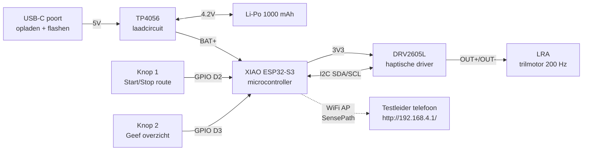

# Schakelschema → SensePath Develop 3

Dit document beschrijft hoe de elektronica in het Develop 3 handvat onderling verbonden is. Het is bedoeld om een externe bouwer toe te laten het systeem te reproduceren zonder reverse-engineering van de firmware. Zie [bom.md](bom.md) voor de stuklijst en [build_guide.md](build_guide.md) voor de bouwvolgorde.

---

## Architectuur



De XIAO ESP32-S3 is de centrale knoop. Voeding komt uit een interne Li-Po accu (1000 mAh) die via een TP4056 USB-C laadcircuit wordt opgeladen ; tijdens normaal gebruik is er dus geen kabel aan de hand. De DRV2605L hangt aan de I2C-bus, de LRA aan de DRV2605L-output. De twee POM-knoppen hangen direct aan GPIO-pinnen met de interne pull-up actief. WiFi is een access point ("SensePath") waarop de testleider tijdens Wizard-of-Oz sessies verbindt om patronen real-time te triggeren.

---

## Pinout-tabel

| Functie | Pin / Lijn | Naar | Opmerking |
|---|---|---|---|
| USB-C VBUS (5V) | TP4056 IN+ | USB-C connector | Voor opladen en firmware-flashen |
| USB-C D+/D− | XIAO USB-D+/D− | USB-C connector | Doorgelust voor flashen |
| TP4056 BAT+ | Li-Po + en XIAO BAT-pad | Batterij | Direct contact tussen BAT-circuit en MCU |
| TP4056 BAT− | Li-Po − en gemeenschappelijke GND | Batterij | Gezamenlijke massa |
| 3V3 uit | XIAO 3V3 | DRV2605L Vin | DRV werkt op 3.3V logic |
| GND | XIAO GND | DRV2605L GND, knoppen GND, TP4056 GND | Gemeenschappelijke massa |
| I2C SDA | XIAO D4 (GPIO 5) | DRV2605L SDA | I2C-pull-ups op breakout geïntegreerd |
| I2C SCL | XIAO D5 (GPIO 6) | DRV2605L SCL | Idem |
| Knop 1 | XIAO D2 (GPIO 3) | Start/Stop drukknop | Interne pull-up; sluit naar GND |
| Knop 2 | XIAO D3 (GPIO 4) | Overzicht drukknop | Interne pull-up; sluit naar GND |
| LRA + | DRV2605L OUT+ | LRA-pin 1 | Geen directe XIAO-verbinding |
| LRA − | DRV2605L OUT− | LRA-pin 2 | Idem |

> **Let op**: de huidige firmware in [sensepath_esp32.ino](../src/firmware/sensepath_esp32/sensepath_esp32.ino) gebruikt `I2C_SDA_PIN = 21` en `I2C_SCL_PIN = 22` (originele ESP32 DevKit pinout). Bij gebruik van XIAO ESP32-S3 moeten deze constanten worden aangepast naar `5` en `6` ; of de I2C-pinnen worden via `Wire.begin(SDA, SCL)` expliciet op de XIAO-mapping gezet. Dit is een open puntje voor de Deliver-fase.

---

## I2C-bus

| Eigenschap | Waarde |
|---|---|
| Bus-spanning | 3.3 V |
| Snelheid | 100 kHz standaard (Wire library default) |
| Adres DRV2605L | 0x5A (factory default, vast in chip) |
| Pull-up weerstanden | 4.7 kΩ → typisch al aanwezig op Adafruit DRV2605L breakout |

De DRV2605L heeft één vast I2C-adres dat niet via solder-jumpers wijzigbaar is. Op de I2C-bus zit dus alleen één device, geen multiplexing nodig.

---

## Power budget

| Component | Typisch verbruik | Piek |
|---|---|---|
| XIAO ESP32-S3 (WiFi AP actief) | ~80 mA | 240 mA tijdens transmit |
| XIAO ESP32-S3 (deep sleep) | ~14 µA | → |
| DRV2605L (idle) | ~2 mA | → |
| LRA tijdens trilling | ~70 mA continu | 150 mA piek (kortstondig) |
| POM-knoppen | 0 mA (passief, interne pull-up) | → |
| **Totaal actief** | **~150 mA** | **~390 mA piek** |

Batterijbudget op 1000 mAh Li-Po: bij gemiddeld 80 mA effectief verbruik (met deep-sleep tussen pulses) → ~12 uur autonomie theoretisch, ~6 → 8 uur realistisch met WiFi AP altijd actief. Opladen via TP4056 op 500 mA charge-current → volle laad in ~2 uur. Een empirische meting van de autonomie onder real-life gebruiksprofiel staat gepland voor de Deliver-fase.

---

## Knoppen-bedrading

De twee POM-knoppen zijn momentane drukknoppen, één pool naar GPIO, één pool naar GND. De XIAO interne pull-up zet de pin op 3V3 in rust; bij indrukken trekt de knop hem naar GND. Code-zijde detecteren we de neergaande flank.

```
XIAO D2 ──┐
          │
        [BTN1]   (momentaan)
          │
        GND
```

Geen externe pull-up of debounce-condensator nodig: de firmware doet software-debounce via een 20 ms time-out na een flank.

---

## LRA-aansluiting

De LRA hangt direct aan de OUT+ en OUT− van de DRV2605L. Geen polariteit-gevoeligheid (LRA is een AC-aangedreven element), maar wel beperken op de DRV2605L-zijde:

- Rated resonance frequentie: 200 Hz (komt overeen met DRV2605L default LRA-modus)
- Rated voltage: 1.8 → 2.5 Vrms (binnen DRV2605L output-bereik)

In firmware: `drv.setMode(DRV2605_MODE_INTTRIG)` voor preset effecten, of `setMode(DRV2605_MODE_REALTIME)` met `setRealtimeValue(0-127)` voor custom waveforms (gebruikt in M4/M6/M9).

---

## Visualisatie als foto (toe te voegen)

Het hierboven beschreven schema staat ook visueel in [../img/wiring_diagram.png](../img/wiring_diagram.png) (TODO: foto van geassembleerd prototype met annotaties van I2C, voeding en LRA-bedrading).
