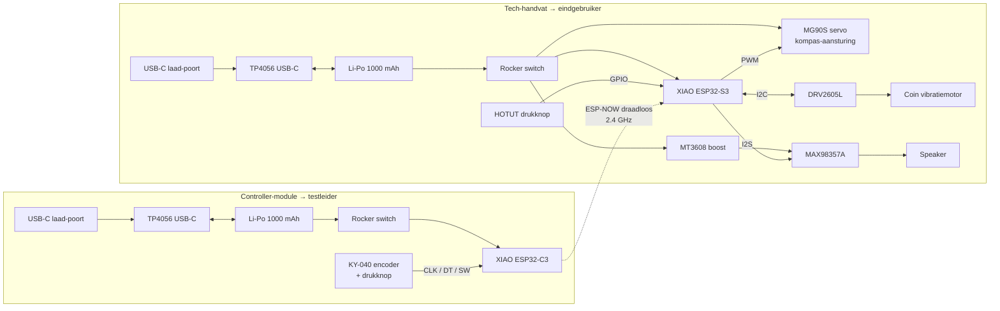
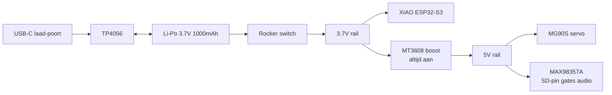

# Schakelschema → SensePath MVP-prototype

> Documentatie van **ons MVP-prototype**, niet van het beoogde eindproduct. De productie-vorm zou onder andere RTK GNSS-ontvangst, BLE-app-koppeling en ToF-obstakeldetectie toevoegen ; zie de [Deliver-sectie in de hoofdrapportage](../README.md#deliver) voor de vertaalstap.

Dit document beschrijft hoe de elektronica in het MVP-prototype onderling verbonden is. Het is bedoeld om een externe bouwer toe te laten het systeem te reproduceren zonder reverse-engineering. Zie [bom.md](bom.md) voor de stuklijst en [build_guide.md](build_guide.md) voor de bouwvolgorde.

---

## Architectuur ; drie fysieke modules

Het systeem bestaat uit **drie fysieke onderdelen** die elk een afzonderlijke rol hebben:

1. **Stok-onderstuk** (passief) → conventionele witte stok met ingebedde M3-schroef bovenaan en verwisselbare pin-tip onderaan. Geen elektronica.
2. **Tech-handvat** (eindgebruiker) → bevat de XIAO ESP32-S3, DRV2605L + coin vibratiemotor, MG90S servo voor mechanisch kompas, opt-in audio (MAX98357A + speaker), HOTUT drukknop, Li-Po batterij + TP4056 USB-C oplaad, MT3608 boost voor audio, rocker-switch voor harde aan/uit. Schroeft op het stok-onderstuk.
3. **Wizard-of-Oz controller** (testleider) → een **fysiek aparte module** met een **XIAO ESP32-C3**, een KY-040 roterende encoder, eigen Li-Po batterij + TP4056 USB-C oplaad en eigen rocker-switch. **Draadloos** (ESP-NOW peer-to-peer) verbonden met het tech-handvat.



De keten **testleider → KY-040 → ESP32-C3 → ESP-NOW → ESP32-S3 → servo → mechanisch kompas → blinde gebruiker** is de Wizard-of-Oz bridge tussen het Develop 3 prototype en een toekomstig autonoom GPS-systeem. Voor de gebruiker maakt het niet uit wie de signalen genereert; voor de testleider werkt het exact zoals een gewone fysieke knop.

> **Communicatieprotocol** ; ESP-NOW is de default (peer-to-peer WiFi, ~2 ms latency, geen router nodig). BLE 5.0 is een gelijkwaardig alternatief; beide chips ondersteunen het.

---

## Module 1 → tech-handvat (XIAO ESP32-S3)

### Pinout-tabel

| Functie | XIAO ESP32-S3 pin | Naar | Opmerking |
|---|---|---|---|
| 5V in | 5V-pad onderzijde | TP4056 OUT+ via rocker-switch | Voeding na schakelaar |
| 3V3 uit | 3V3 | DRV2605L Vin | Voor 3.3 V logic peripherals |
| GND | GND | Gemeenschappelijke massa | Alle modules delen één GND-bus binnen het handvat |
| I2C SDA | D4 (GPIO 5) | DRV2605L SDA | I2C-pull-ups geïntegreerd op breakout |
| I2C SCL | D5 (GPIO 6) | DRV2605L SCL | Idem |
| Drukknop | D3 (GPIO 4) | HOTUT knop signaal | Interne pull-up, sluit naar GND |
| Servo PWM | D9 (GPIO 8) | MG90S signaal-pin (oranje) | 50 Hz PWM, 1-2 ms duty. 3.3 V logic-level volstaat (MG90S triggert al boven ~2.5 V) |
| I2S BCLK | D6 (GPIO 43) | MAX98357A BCLK | Bit clock voor audio |
| I2S LRC | D7 (GPIO 44) | MAX98357A LRC | Left-right clock |
| I2S DIN | D8 (GPIO 7) | MAX98357A DIN | Data input |
| Servo + | 5V rail (uit MT3608) | MG90S V+ (rood) | Datasheet specificeert 4.8-6V; deelt rail met audio-amp |
| Audio amp + | 5V rail (uit MT3608) | MAX98357A Vin | Zelfde rail als servo; SD-pin laag → stand-by tot audio-fallback geactiveerd |

### Voeding



Drie rails binnen het handvat: één **3.7 V rail** rechtstreeks van de Li-Po die de XIAO voedt; één **5 V rail** uit de MT3608 boost converter die zowel de MG90S servo als de MAX98357A audio-amp voedt; en het **USB-C laadkanaal** via de TP4056. De MT3608 staat **altijd aan** (de servo heeft volgens datasheet 4.8-6 V nodig om aan spec te draaien); de audio-amp wordt apart in stand-by gezet via zijn SD-pin wanneer audio-fallback niet actief is, zodat de speaker geen stroom trekt.

### Peripherals binnen het handvat

**HOTUT drukknop** ; momentane drukknop, één pool naar XIAO D3, één pool naar GND. Interne pull-up actief; software detecteert neergaande flank met 20 ms debounce. Onderscheid single-press / double-press in firmware voor "start/stop" vs "geef overzicht".

**Rocker switch (master power)** ; SPST in de hoofd-positieve rail tussen Li-Po+ en XIAO 5V-pad. Wanneer uit: alle systemen in het handvat volledig spanningsloos. De TP4056 blijft wel actief via VBUS wanneer USB-C aangesloten.

**DRV2605L → coin vibratiemotor** ; ERM-modus, I2C-adres 0x5A, motor hangt aan OUT+/OUT-.

**MG90S servo → mechanisch kompas** ; PWM-signaal op D9 (3.3 V logic werkt direct, geen level shifter nodig). V+ op de 5 V rail uit de MT3608 boost, GND op de gemeenschappelijke massa. **Belangrijk**: plaats een **220-470 µF elco** tussen V+ en GND vlak bij de servo-stekker. De MG90S kan tot ~300 mA pieken trekken bij snelle beweging ; zonder buffercap zakt de 5 V rail kortstondig in en kan de XIAO resetten. Klassieke valkuil bij servo + microcontroller op één Li-Po. De servo ontvangt zijn doelhoek van de XIAO, die op zijn beurt het signaal krijgt **van de controller-module via ESP-NOW**, niet van een lokaal aangesloten encoder.

**MAX98357A + speaker** ; I2S audio (opt-in fallback). SD-pin via 100 kΩ pull-down naar GND voor default-standby.

---

## Module 2 → Wizard-of-Oz controller (XIAO ESP32-C3)

De controller is een **fysiek aparte module** die de testleider in de hand houdt of aan de gordel draagt. Hij stuurt via draadloos signaal de servo in het handvat aan ; voor de gebruiker is het verschil tussen "wizard met fysieke knop" en "autonoom GPS-systeem" niet voelbaar.

### Componenten in deze module

- 1× Seeed XIAO ESP32-C3 (kleinere variant van de S3, dezelfde formfactor en pinning maar met BLE 5.0 + WiFi, geen camera-interface ; voldoende voor encoder-uitlezen en draadloze verzending)
- 1× KY-040 roterende encoder met geïntegreerde drukknop
- 1× Li-Po 3.7 V 1000 mAh
- 1× TP4056 USB-C laadcircuit
- 1× rocker switch voor harde aan/uit
- 1× USB-C female laad-poort

### Pinout-tabel

| Functie | XIAO ESP32-C3 pin | Naar | Opmerking |
|---|---|---|---|
| 5V in | 5V-pad | TP4056 OUT+ via rocker-switch | Voeding na switch |
| 3V3 uit | 3V3 | KY-040 + (Vcc) | Voor encoder logic |
| GND | GND | Encoder GND, batterij GND, TP4056 GND | Gemeenschappelijke massa binnen de controller |
| Encoder CLK | D0 (GPIO 2) | KY-040 CLK (A) | Interrupt-capable input |
| Encoder DT | D1 (GPIO 3) | KY-040 DT (B) | Tweede kanaal voor rotatierichting |
| Encoder SW | D2 (GPIO 4) | KY-040 SW (drukknop) | Push-bevestiging, interne pull-up |

> Pin-mapping op de ESP32-C3 verschilt licht van de S3 (kleinere GPIO-range). De `Dx`-labels op het XIAO-board komen overeen met andere onderliggende GPIO-nummers. Werk altijd met de fysieke `Dx`-aanduiding.

### Voeding (identiek principe als het handvat, simpeler omdat geen servo of audio)


Eén enkele 3.7 V rail volstaat ; geen boost converter, geen audio. Verbruik laag (~30 mA gemiddeld) → autonomie ruim 24 uur op 1000 mAh.

---

## Draadloze link tussen modules

**Default: ESP-NOW** (peer-to-peer protocol op de 2.4 GHz WiFi-radio):

| Eigenschap | Waarde |
|---|---|
| Latency | ~2 ms typisch, <5 ms piek |
| Bereik | 50 → 100 m line-of-sight, ~10 m door muren |
| Bandbreedte | ruim voldoende voor encoder-deltas (enkele bytes per update) |
| Pairing | MAC-adres van de S3 in C3-firmware hardcoded; geen WiFi-AP nodig |
| Encryptie | optioneel via AES-128 |

**Alternatief: BLE 5.0** ; iets hogere latency maar geschikt voor de toekomst wanneer ook een smartphone-app meekoppelt op het handvat.

### Verzonden data-formaat (ontwerp)

De controller verstuurt periodiek (~50 Hz) een kort pakket:

```
struct EncoderUpdate {
    int16_t  delta;     // rotatie sinds vorige update
    int16_t  absolute;  // absolute encoder-positie (0-360°)
    uint8_t  buttons;   // bitfield: bit 0 = SW ingedrukt
    uint8_t  sequence;  // wraparound counter
}
```

In het handvat vertaalt de S3-firmware de `absolute` waarde naar een servo-hoek (0-180°) met een lineaire mapping. De `delta` is voor responsiviteit; `buttons` triggert eventueel een mode-wissel.

---

## I2C-bus (binnen het handvat)

| Eigenschap | Waarde |
|---|---|
| Bus-spanning | 3.3 V |
| Snelheid | 100 kHz standaard (Wire library default) |
| Adres DRV2605L | 0x5A (factory default) |
| Pull-up weerstanden | 4.7 kΩ → geïntegreerd op Adafruit-breakout |

Geen multiplexing nodig: DRV2605L is het enige I2C-device op de bus.

---

## I2S audio-bus (opt-in, binnen het handvat)

| Signaal | Functie |
|---|---|
| BCLK | Bit clock, gegenereerd door XIAO ESP32-S3 |
| LRC (WS) | Word select / Left-Right clock |
| DIN | Data input naar amplifier |
| GND | Gemeenschappelijke massa |
| Vin (5V) | Via MT3608 boost |

De MAX98357A heeft geen master-volume input; volume wordt softwarematig geregeld op de XIAO. Standby-modus (SD-pin naar GND via 100 kΩ pull-down) zet de versterker uit ; standaard-stand om stroom te besparen wanneer audio-fallback niet actief is.

---

## PWM-signaal voor servo (binnen het handvat)

| Eigenschap | Waarde |
|---|---|
| Frequentie | 50 Hz (standaard servo-protocol) |
| Pulsduur 0° | ~1 ms |
| Pulsduur 90° | ~1.5 ms |
| Pulsduur 180° | ~2 ms |
| Mapping in code | controller-encoder absolute (0-360°) → servo-hoek (0-180°) via lineaire mapping |

De MG90S verbruikt ~150-300 mA tijdens snelle beweging; in stilstand 5-10 mA.

---

## Power budget

### Handvat-module

| Component | Idle | Actief | Piek |
|---|---|---|---|
| XIAO ESP32-S3 (ESP-NOW actief) | ~30 mA | ~50 mA | 240 mA tijdens transmit |
| XIAO ESP32-S3 (deep sleep) | ~14 µA | → | → |
| DRV2605L (idle) | ~2 mA | ~6 mA | → |
| Coin vibration motor | 0 mA | ~80 mA (continu) | ~120 mA piek |
| MG90S servo (op 5 V uit MT3608) | ~5 mA | ~150 mA (bewegend) | ~300 mA piek |
| MT3608 boost (altijd aan, quiescent) | ~1 mA | ~3 mA (met servo-load) | → |
| MAX98357A + speaker (audio uit, SD low) | ~0 mA | → | → |
| MAX98357A + speaker (audio aan) | ~50 mA | ~250 mA | ~500 mA piek |
| HOTUT knop | 0 mA (passief) | → | → |
| **Totaal Wizard-of-Oz sessie (audio uit)** | **~40 mA** | **~250 mA** | **~550 mA piek** |

Handvat op 1000 mAh Li-Po → ~9 uur theoretisch, ~5 → 7 uur realistisch met regelmatige servo-beweging.

### Controller-module

| Component | Idle | Actief | Piek |
|---|---|---|---|
| XIAO ESP32-C3 (ESP-NOW actief) | ~20 mA | ~30 mA | ~80 mA tijdens transmit |
| KY-040 encoder | 0 mA (passief) | → | → |
| **Totaal** | **~20 mA** | **~30 mA** | **~80 mA piek** |

Controller op 1000 mAh Li-Po → ruim 30+ uur autonomie, in praktijk een hele test-dag op één lading.

---

## Visualisatie

Een volledig geannoteerd visueel schema (met beide modules en de RF-link) staat in [../Project context/sensepath_wiring_schematic.html](../Project%20context/sensepath_wiring_schematic.html). Open in browser.
