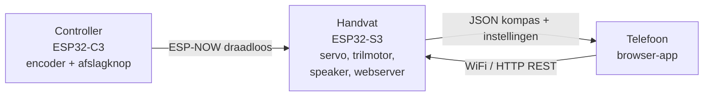

# SensePath - broncode

Deze map bevat de volledige werkende software van het SensePath-prototype: de
**telefoon-app** en de **firmware** van de twee modules (handvat en controller).

> Volledige software-architectuur met diagrammen, endpoints en datastromen:
> **[../docs/software.md](../docs/software.md)**
>
> **Live demo van de app (zonder hardware):**
> https://htmlpreview.github.io/?https://github.com/spiryns/UCD/blob/firmware/src/app/demo.html

## Het systeem in één oogopslag



Het **handvat** is het centrale knooppunt: het stuurt de fysieke feedback aan
(kompas-servo, trilpatronen, spraakclips) en serveert tegelijk de telefoon-app.
De **controller** leest de richting (encoder) en afslag-cues en stuurt die
draadloos door. De **telefoon-app** zoekt bestemmingen, toont een live kompas
(digital twin) en regelt de instellingen van het handvat.

## Structuur

```
src/
├── app/                  ← de telefoon-app (toegankelijke web-app)
│   ├── index.html            de app (bewerk dit)
│   ├── mock_server.py        test op je laptop, zonder hardware
│   └── README.md
└── firmware/             ← de twee ESP32-modules (PlatformIO)
    ├── handle/               handvat (ESP32-S3): kompas, haptiek, audio, webserver
    ├── controller/           controller (ESP32-C3): encoder + afslagknop
    ├── shared/               gedeeld ESP-NOW-berichtformaat (protocol.h)
    ├── tools/                generatoren (html2header.py, wav2header.py)
    ├── platformio.ini        build-configuratie
    └── (sensepath_esp32/, sensepath_pio/  = oude referentie, niet meer in gebruik)
```

## Configuratie en gebruik

### 1. Secrets instellen (eenmalig)

Elke firmware-module heeft een `secrets.h` nodig met de WiFi-presets (en voor het
handvat de Google Maps-key). Kopieer het sjabloon en vul je eigen waarden in:

```bash
cp firmware/handle/secrets.h.example      firmware/handle/secrets.h
cp firmware/controller/secrets.h.example  firmware/controller/secrets.h
```

`secrets.h` staat in `.gitignore` en wordt **nooit** meegecommit. Beide modules
moeten dezelfde WiFi-presetlijst hebben (alleen 2,4 GHz), zodat ze op hetzelfde
kanaal komen - dat is nodig voor de ESP-NOW-link.

### 2. Firmware flashen (met [PlatformIO](https://platformio.org/), vanuit `firmware/`)

```bash
pio run -e handle_usb     -t upload   # handvat (ESP32-S3)
pio run -e controller_usb -t upload   # controller (ESP32-C3)
```

### 3. De app

De app wordt door het handvat geserveerd; open op je telefoon
`http://sensepath.local/` (zelfde WiFi als het handvat).

```bash
# App los op je laptop testen (zonder hardware):
cd app && python mock_server.py            # http://localhost:8080/

# App gewijzigd? Regenereer de firmware-include en flash opnieuw:
python firmware/tools/html2header.py
```

## Meer lezen

- [app/README.md](app/README.md) - de telefoon-app in detail
- [../docs/software.md](../docs/software.md) - de volledige software-architectuur
- [../docs/wiring.md](../docs/wiring.md) - bedrading en pinout van de hardware
