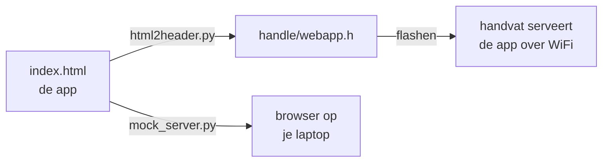

# SensePath - telefoon-app

De **telefoon-app** van SensePath: een toegankelijke web-app (HTML/CSS/JS) die de
blinde gebruiker bedient. De app wordt **door het handvat zelf geserveerd** over
WiFi - geen app-store, geen installatie, werkt in elke browser.

```
src/app/
├── index.html      ← de volledige app (HTML + CSS + JS in één bestand)
├── mock_server.py  ← test de app op je laptop, zonder hardware
└── README.md       ← dit bestand
```

## Hoe het bij de firmware past

`index.html` is de **echte broncode**. De ESP32-webserver kan geen los bestand
serveren, dus de firmware heeft er een C-versie van nodig (`handle/webapp.h`, een
PROGMEM-string). Die wordt **automatisch gegenereerd** - bewerk dus `index.html`,
nooit `webapp.h` rechtstreeks:



Na een wijziging in `index.html`:

```bash
python src/firmware/tools/html2header.py     # regenereert handle/webapp.h
```

Daarna de handvat-firmware opnieuw flashen om de nieuwe app op het toestel te zetten.

## App op je laptop testen (zonder flashen)

```bash
cd src/app
python mock_server.py
```

- App:        http://localhost:8080/
- Dev-panel:  http://localhost:8080/dev  (knop-simulatie, servo-slider, afslag-preview)

De mock-server bootst alle `/api/`-endpoints na met geheugen-state en logt elke
actie in de terminal. Edits in `index.html` zie je meteen na een browser-refresh.
De Google Maps-key wordt (indien aanwezig) uit `../firmware/handle/secrets.h`
gelezen; zonder geldige key draait de app in manuele modus (geen autocomplete).

## Belangrijkste kenmerken van de app

- **Toegankelijkheid-first**: 1 tik = label voorlezen, 2 tikken = activeren,
  lang indrukken = hint, two-finger-swipe omhoog = hele scherm voorlezen. Alle
  spraak via de Web Speech API (`nl-NL`).
- **Bestemming zoeken** via Google Maps (autocomplete, looproute, GPS-voortgang).
- **Digital twin**: een live kompas-naald die meedraait met de fysieke servo op
  het handvat.
- **Instellingen** die rechtstreeks het handvat aansturen: trilsterkte,
  afslag-trillingen (links/rechts apart), knop-acties, audio, noodcontact.

Zie [docs/software.md](../../docs/software.md) voor de volledige software-architectuur.
